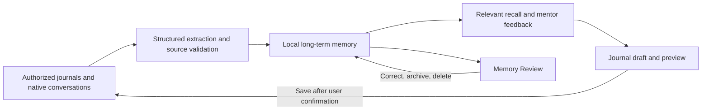

# riji-agent

[](https://github.com/doublew6/riji-agent/actions/workflows/test.yml)

[中文](README.md)

**A local-first AI companion for reflection and personal growth, built around long-term memory and multiple mentor agents.**

Keep your notes in Obsidian and talk in Feishu. `riji-agent` uses your recorded
experiences to help you reflect on the past, work through concerns, notice change,
and carry that understanding into your next conversation or action. You control
your journal, memory, and permission to write.

The project is growing from journal retrieval and confirmed writing into a
personal companion with lasting context. This README distinguishes capabilities
available on `main` from development work that has not been merged. Quick Start
uses the current `main` branch.

## From One Conversation to Ongoing Support

Recording your life creates useful context, but finding old notes, explaining
your background again, and preparing reviews still take effort.

| What you want to discuss | How a mentor can help |
| --- | --- |
| “I've been tired lately. Help me work through it.” | Listen to the current situation and connect it to past experiences when evidence is available. |
| “Why did I stop following this plan?” | Use multi-step Agentic RAG and timeline retrieval to revisit the conditions and previous attempts. |
| “How did I handle something like this before?” | Retrieve source-linked records and discuss which lessons still apply. |
| “Save what we figured out today.” | Prepare a draft, show a preview, and append it to the journal after explicit confirmation. |

Ongoing support depends on context and feedback you can check. AI supports your
own reflection and action; you can question advice, correct memories, or simply
talk without committing to a plan.

## Availability and Development Progress

As of **2026-09-10**, implementation, publication on the default branch, and
validation in real use are tracked separately.

| Capability | Status |
| --- | --- |
| Obsidian / Markdown retrieval, Agentic RAG, timelines, and source references | Available on `main`. |
| Mentor selection in one Feishu bot, separate conversations, and shared confirmed facts | Available on `main`. |
| Drafts, explicit confirmation, template append, and audit | Available on `main`; voice and calendar features require optional configuration. |
| Mem0 long-term memory, native chat capture, Memory Review, and `MEMORY.md` | Implemented in the local development version; not merged into `main`. Track [#39](https://github.com/doublew6/riji-agent/issues/39). |
| Historical journal initialization, incremental maintenance, source lifecycle, and active organization | Implemented in the local development version; memory quality and full workflow validation remain in progress. Not merged into `main`; track [#40](https://github.com/doublew6/riji-agent/issues/40). |
| Fixed mentor conversations and multi-agent comparison and debate | Local core workflow and LangGraph integration implemented; not merged into `main`. Private Feishu roundtables remain disabled and production acceptance is incomplete. |
| Separate mentor and background memory model selection, including an optional Codex adapter | Implemented in the local development version; not merged into `main`. Quick Start still uses the default model stack. |

Completing a scan, extracting memories, and understanding them accurately are
different outcomes. Automated tests and synthetic model examples do not replace
semantic review of real memories or establish retention and companionship benefits.

## Long-Term Memory: Bring the Past into the Next Conversation

The following mechanisms are part of the **development version** described above.

- **Build context from records:** extract experiences, preferences, and goals from authorized journals and native conversations; process new, edited, deleted, and subsequently added older notes.
- **Preserve time and evidence:** relate new and existing memories while distinguishing duplicates, additions, state changes, and conflicts. A recently extracted old plan is still an old plan.
- **Notice changes with evidence:** organize related experiences across batches, retain support, counter-evidence, and conditions, and label inferred patterns as observations to verify. Invalid sources stop supporting derived observations.
- **Recall across conversations:** retrieve relevant shared facts and the current mentor's private observations to reduce repeated background explanations.
- **Let users manage memory:** local Memory Review provides sources, progress, correction, review, archive, deletion, export, and recovery. `MEMORY.md` is a readable, read-only snapshot.



Original Markdown remains the source for journal records. Self-hosted
**Mem0 + PostgreSQL/pgvector** stores agent long-term memory, local FastEmbed
creates embeddings, and SQLite stores conversations, queues, and audit data.
Authorized memory capture can run in the background; changing the journal still
requires explicit confirmation.

## Multiple Agents, Distinct Perspectives

The current `main` supports four AI mentors within one Feishu bot, each with its
own conversation history:

| Mentor | Approach |
| --- | --- |
| Gentle Reviewer | Listen, acknowledge emotions, and help you notice change and growth. |
| Blunt Coach | Point out evidence-based patterns and blind spots, then discuss practical actions. |
| Future Self | Revisit goals and choices from a longer time perspective. |
| Wang Yangming Mentor | Use a philosophical framework to connect motives, understanding, and action; retrieve philosophical sources separately from journal records. |

The **development version's multi-agent orchestration** adds fixed mentor
conversations and discussions hosted by Riji with 2–4 mentors. They first form
independent views, compare disagreements, question one another, and produce a
synthesis that retains conditions and unresolved differences. Debate is bounded
to two rounds; users can add context, stop, or request an early summary.

Mentors share authorized user facts while keeping conversation histories and
private observations separate. Roundtables use only memories permitted for all
participants and material explicitly transferred by the user. Private chats are
not automatically broadcast. The new discussion path does not yet connect raw
journal tools or automatic memory capture; mentor outputs do not become user facts.

A local API connects the core discussion workflow. **Private Feishu roundtables
remain disabled** pending real integration checks for membership, history
visibility, delivery, and other platform requirements. Ordinary groups have no
journal access. Saving a discussion requires a verified private chat, a new draft
preview, and explicit confirmation.

These are AI roles and may use the same model. Agreement between roles is not
independent verification, and a historical perspective is not a real person's speech.

## Local Control and Privacy

**Local-first means you control the data and permissions; authorized snippets may
still be sent for cloud inference. This is not a zero-egress system.** Read
[Privacy](docs/privacy.md) and [SECURITY.md](SECURITY.md) before connecting real data.

- **Local storage:** the vault, index, drafts, and audit stay on user-controlled devices. The development version also keeps Mem0 memory and discussion records under user control.
- **Bounded access:** Hermes does not directly read or write the vault. Models use registered tools and bounded journal snippets; answers distinguish facts, inference, and insufficient evidence.
- **Confirmed writing:** draft → preview → explicit confirmation → atomic append, preserving existing entries. Groups cannot create or commit journal drafts.
- **Limited disclosure:** no complete vault, raw Markdown files, or local SQLite databases are uploaded. API keys stay out of model context, and `private: true` content is excluded.
- **Explicit recipients:** Feishu receives messages and replies; the configured model receives questions and authorized context. Development-version memory extraction and organization also send authorized content to the configured memory model.
- **Synchronization and copies:** user-configured iCloud sync, backups, or other sync services can retain copies. Local deletion does not erase old backups, Feishu history, or provider retention.

The development version adds `none / local / cloud` source permissions and
separate authorization for historical initialization, incremental extraction,
cloud organization, and mentor recall. Revoked sources restrict subsequent use
of derived memory. These controls are not yet released on `main`; do not rely on
them to protect data used with the current Quick Start.

## Quick Start

These commands use the current `main` and do not install the unreleased memory
and multi-agent extensions described above.

Requirements: Python 3.11+ and [uv](https://docs.astral.sh/uv/).

Clone the repository and install dependencies:

```bash
git clone https://github.com/doublew6/riji-agent.git
cd riji-agent
uv sync --extra dev
```

Try the fictional demo vault first. It does not read `.env`, your real journal,
or any real API key:

```bash
uv run riji-agent demo init --target /tmp/riji-demo-vault
uv run riji-agent chat --demo --question "launch planning"
```

The demo answer should include `[[riji/...]]` sources and exclude the sample
`private: true` note.

For the full default stack:

```bash
uv run riji-agent init --preset feishu-hermes-deepseek
# Edit .env with your journal path, DeepSeek API key, and Feishu user allowlist.
uv run riji-agent doctor
uv sync --extra dev
uv run riji-agent index    # prewarm the local index
# Validate your model key + journal retrieval end-to-end before wiring Feishu:
uv run riji-agent chat --question "本周关于发布我都记了什么？"
uv run riji-agent          # serve http://127.0.0.1:8765
```

`riji-agent chat --question "..."` runs the real agent loop and your configured
model provider against your vault over loopback — no Feishu or Hermes required —
so you can confirm the whole local path works before standing up the IM bridge.

Agent long-term memory can optionally use Mem0 Self-Hosted for shared user facts
and persona-private observations. It adds a durable capture queue, local Memory
Review UI, and generated read-only `MEMORY.md` while leaving journal writes
behind the existing explicit confirmation boundary. See
[Long-term memory and MEMORY.md](docs/long-term-memory.md).

Install riji-agent as a background user service so it restarts after login or an
accidental exit. The commands are the same on macOS (launchd), Linux (systemd
--user), and Windows (Task Scheduler); `--target` defaults to `auto` and picks
the right backend for your platform:

```bash
uv run riji-agent service install
uv run riji-agent service start
uv run riji-agent service status
```

While the machine is asleep or the user is logged out the bot cannot answer
Feishu messages; after wake/login the service manager restores the local
service. See [docs/deployment.md](docs/deployment.md#后台常驻服务macos--linux--windows)
for the per-platform details.

Open `http://127.0.0.1:8765/healthz` and expect:

```json
{"service":"riji-agent","status":"ok"}
```

`RIJI_DATA_DIR` defaults to `~/.local/share/riji-agent`; it stores local SQLite
state outside the repository. See [docs/deployment.md](docs/deployment.md) for
indexing, startup, and recovery details.

## Default Stack: Feishu + Hermes + DeepSeek

Feishu private chat reaches riji-agent through a thin Hermes-side bridge:

```text
Feishu private chat -> Hermes -> riji-agent /hermes/messages -> local tools -> DeepSeek
```

The bridge forwards message text and identity metadata to riji-agent over
loopback HTTP. It does not read the journal vault, SQLite databases, local index,
or model keys. Inside riji-agent, Feishu payloads are normalized into a neutral
IM message contract so future adapters can reuse the same gateway path.

The default Feishu Bot avatar lives at
`assets/integrations/feishu/riji-bot-avatar.png`.

```bash
uv run riji-agent hermes-bridge install
uv run riji-agent hermes-bridge status
```

Then restart `hermes gateway`. Configuration details live in
[docs/hermes-integration.md](docs/hermes-integration.md).

### Feishu Voice Replies

By default, Feishu replies are text-only. Set:

```bash
RIJI_FEISHU_VOICE_REPLY_MODE=text_and_voice
```

to keep the text reply and also generate a local audio attachment for
Hermes/Feishu.

Available TTS providers:

- `macos_say`: zero extra dependencies and fully local, but mechanical; useful
  as the fallback provider.
- `melotts`: optional local open-source TTS; install it into the same virtualenv.
- `voxcpm`: optional local open-source TTS based on VoxCPM2. It supports
  natural-language voice design per mentor without reference audio; it is
  a separate installation with substantial dependencies and model caches.

```bash
uv pip install melotts
```

Then configure:

```bash
RIJI_TTS_PROVIDER=melotts
RIJI_TTS_LANGUAGE=ZH
RIJI_TTS_VOICE=ZH
RIJI_TTS_DEVICE=auto
RIJI_TTS_SPEED=1.0
```

For more natural mentor voices, install and enable VoxCPM2:

```bash
uv pip install voxcpm soundfile

RIJI_TTS_PROVIDER=voxcpm
RIJI_TTS_MODEL=openbmb/VoxCPM2
RIJI_TTS_CFG_VALUE=2.0
RIJI_TTS_INFERENCE_TIMESTEPS=10
```

`melotts` and `voxcpm` have heavy dependency trees and model caches, so they
are intentionally not part of the default dependency lock. They may download or
prepare model cache assets on first use. Keep those assets outside the
repository and outside the journal vault. Cloud TTS providers are intentionally
not the default; future providers such as `edge_tts` or Azure Speech should be
explicit opt-ins because reply text leaves the local machine.

### Feishu Calendar

Calendar writes are disabled by default. With the Feishu provider enabled, a
private chat can prepare an event draft. The API is called only after explicit
confirmation. Today's events can append a lightweight link to today's daily
note; future events do not create future journal files early.

```bash
RIJI_CALENDAR_PROVIDER=feishu
FEISHU_APP_ID=cli_replace_me
FEISHU_APP_SECRET=replace-me
# FEISHU_CALENDAR_ID=primary
```

Check [Feishu permissions](docs/feishu-permissions.yaml) before enabling optional
voice or calendar features. Group chats remain denied private capabilities.

## Configuration And Safety

- `.env`, SQLite files, audit logs, `data/`, and accidental local journal copies
  are ignored by Git.
- `RIJI_JOURNAL_ROOT` must point to an existing journal directory.
- `RIJI_DATA_DIR` and optional `RIJI_DATABASE_PATH` must be outside the journal
  directory.
- `RIJI_IM_PROVIDER=feishu` selects the default Feishu IM adapter.
- `RIJI_AGENT_RUNTIME=hermes` selects the default Hermes agent runtime.
- `RIJI_MODEL_PROVIDER=deepseek` selects the default DeepSeek model adapter; set
  it to `openai` to use any OpenAI-compatible endpoint via the `RIJI_MODEL_*`
  variables instead.
- `RIJI_ALLOWED_FEISHU_USER_IDS` is a comma-separated Feishu open ID allowlist;
  group chats are denied by design.
- The service binds to `127.0.0.1`. Use Feishu/Hermes or a private network proxy
  for remote access; do not expose this port directly to the public internet.

## Architecture and Extensions

The default stack is **Feishu + Hermes + DeepSeek**, but it is **not the only supported architecture**.
IM, agent runtime, and model providers use separate adapters and registries.
`main` also includes a generic OpenAI-compatible adapter. See
[Module architecture](docs/architecture/modules.md).

The `personal-growth` pack brings together templates, review skills, and
automation definitions from `whit-riji-skills` and `codex-automations`. Pack loading
is capability metadata only: it does not run automations or grant access. Writes
still require a draft preview or controlled writer. See
[Capability packs](docs/architecture/packs.md).

## Development

```bash
uv run pytest
```

Smoke tests cover the main deployment path without reading real `.env`, a real
journal vault, or a real API key:

```bash
uv run pytest -m smoke
uv run pytest -m "not smoke"
uv run pytest
```
