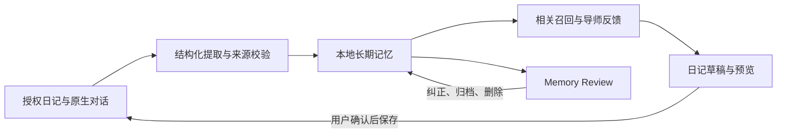

# riji-agent

[](https://github.com/doublew6/riji-agent/actions/workflows/test.yml)

[English](README.en.md)

**以长期记忆和多 Agent 导师为核心的本地优先 AI 陪伴与成长助手。**

在 Obsidian 里保留自己的记录，在飞书里随时聊聊。`riji-agent` 围绕你的真实经历，
帮助你回顾过去、梳理困扰、看见变化，把理解延续到下一次对话和下一步行动。
日记、记忆和写入权限由你掌控。

项目正从日记检索与确认式记录，发展为具有长期上下文的个人 AI 陪伴系统。
以下区分默认分支可用能力与尚未合入的开发进展；快速开始对应当前 `main`。

## 从一次对话，到持续陪伴

持续记录积累了很多个人经历，但每次对话重新交代背景、翻找旧日记、整理复盘，
仍然需要精力。我们希望让这些记录在你需要时发挥作用：

| 你想聊的事 | 导师如何提供帮助 |
| --- | --- |
| “最近总觉得很累，先陪我理一理。” | 倾听当前处境，在有依据时联系过去经历，帮助辨认变化。 |
| “这个计划我之前为什么没有坚持？” | 通过 Agentic RAG 多轮检索和时间线回看，找出当时的条件与尝试。 |
| “类似的困难，我以前怎么处理过？” | 找回带来源的记录，讨论哪些经验仍适用、哪些前提已经改变。 |
| “把今天聊出的想法记下来。” | 生成日记草稿，展示预览，明确确认后按模板追加。 |

长期陪伴的价值来自持续了解和可核对的反馈。AI 支持用户自己的反思与行动；
用户可以质疑建议、纠正记忆，也可以选择只聊聊。

## 当前能力与开发进展

截至 **2026-09-10**，代码实现、合入默认分支和真实场景验收分别记录。

| 能力 | 当前状态 |
| --- | --- |
| Obsidian / Markdown 日记检索、Agentic RAG、时间线与来源引用 | 已在 `main` 提供。 |
| 飞书单 Bot 内切换导师、独立会话、共享已确认事实 | 已在 `main` 提供。 |
| 日记草稿、预览确认、模板追加与审计 | 已在 `main` 提供；语音和日历为可选配置。 |
| Mem0 长期记忆、原生聊天捕获、Memory Review 与 `MEMORY.md` | 本地开发版本已实现，尚未合入 `main`；跟踪 [#39](https://github.com/doublew6/riji-agent/issues/39)。 |
| 历史日记初始化、增量维护、来源生命周期与主动整理 | 本地开发版本已实现，记忆质量与完整流程验收仍在推进；尚未合入 `main`，跟踪 [#40](https://github.com/doublew6/riji-agent/issues/40)。 |
| 固定导师私聊、多 Agent 参考与辩论 | 本地核心流程及 LangGraph 集成已实现，尚未合入 `main`；飞书私人圆桌未启用，未完成生产验收。 |
| 导师与后台记忆分别选择模型，含可选 Codex adapter | 本地开发版本已实现，尚未合入 `main`；当前快速开始仍使用默认模型栈。 |

扫描完成、提取完成和记忆理解准确是不同结果。自动化测试与合成模型样例不能
代替真实记忆的语义复核，也不代表已验证用户留存或陪伴效果。

## 长期记忆：让过去参与下一次对话

以下是**开发版本**的记忆机制，发布进度见上表。

- **从记录中积累了解**：从授权的历史日记及原生对话提取经历、偏好和目标；持续处理新增、修改、删除及后来补入的旧日记。
- **保留时间与依据**：关联新旧记忆，区分重复、补充、状态变化和冲突；旧计划不会仅因最近被提取就变成当前目标。
- **有证据地认识变化**：跨批次整理相关经历，保留支持、反例和条件；归纳的模式以待验证观察参与回答，来源失效后停止使用对应依据。
- **在新会话中复用**：召回相关共享事实和当前导师的私有观察，减少反复解释背景的负担。
- **由用户管理记忆**：本地 Memory Review 提供来源、进度、纠正、复核、归档、删除、导出和恢复；`MEMORY.md` 是可读的只读快照。



原始 Markdown 保留为日记事实源；自托管 **Mem0 + PostgreSQL/pgvector** 保存
Agent 长期记忆，本地 FastEmbed 负责向量化，SQLite 保存会话、队列与审计。
自动记忆捕获与日记写入是两条流程：授权范围内的记忆可以后台处理，修改日记仍需确认。

## 多 Agent：不同视角，延续各自的对话

当前 `main` 可在同一飞书 Bot 内选择四位 AI 导师，并保留各自的会话历史：

| 导师 | 陪伴与反馈方式 |
| --- | --- |
| 温柔回顾者 | 倾听、承接情绪，陪你看见经历中的变化与成长。 |
| 直率教练 | 指出有证据的模式与盲点，讨论可以采取的行动。 |
| 未来的我 | 从更长的时间尺度回看目标与当下选择。 |
| 王阳明导师 | 以心学为反思框架，连接动机、认知与行动；思想资料与日记分开检索。 |

**开发版本的多 Agent 编排**进一步支持固定导师私聊，以及主持人 Riji 组织的
2–4 位导师讨论：先独立提出判断，再比较分歧、相互质询，最后形成保留条件与
未解决分歧的综合建议。流程最多两轮辩论，用户可补充背景、停止或提前总结。

导师共享获准的用户事实，各自的会话与私有观察隔离。圆桌只使用参与导师共同
获准的记忆和用户明确转交的材料；私聊内容不会自动广播给其他导师。
新讨论路径暂未接通原始日记工具和自动记忆捕获，导师输出也不会直接成为用户事实。

目前本地 API 已接入核心讨论流程，**飞书私人圆桌仍未启用**，群成员、历史可见性
与投递等真实接入验收尚未完成。普通群仍无日记权限；保存讨论必须回到已验证的
私聊，重新预览日记草稿并确认。

这些导师是 AI 角色，可以使用同一个模型。多个角色的赞同不等于独立事实验证，
历史人物视角也不代表真人发言。

## 本地控制与隐私

**本地优先指数据与权限由用户掌控；授权的必要片段仍可能用于云端推理。**
连接真实日记前，请阅读 [隐私说明](docs/privacy.md) 和 [SECURITY.md](SECURITY.md)。

- **本地保存**：日记 vault、索引、草稿与审计留在用户设备；开发版本的 Mem0 记忆和讨论记录也由用户自管。
- **受限访问**：Hermes 不直接读写日记库；模型通过已注册工具使用必要片段，回答区分日记事实、推断和证据不足。
- **确认写入**：草稿 → 预览 → 明确确认 → 原子追加，保留已有日记内容。群聊不能创建或提交日记草稿。
- **有限出云**：不上传完整日记库（complete vault）、原始 Markdown 文件或本地 SQLite 数据库；API keys 不进入模型上下文，`private: true` 内容排除在外。
- **明确接收方**：飞书接收消息与回复，配置的模型接收问题及获准上下文；开发版本的后台记忆提取和整理也会向配置的记忆模型发送授权内容。
- **同步与副本**：用户自行配置的 iCloud、备份或其他同步可能保留副本。本地删除不等于清除旧备份、飞书历史或模型提供方留存。

开发版本还提供 `none / local / cloud` 来源权限，以及历史初始化、增量提取、
云端整理和导师召回的分别授权；来源撤权会约束派生记忆的后续使用。
这些控制尚未随 `main` 发布，不能依赖它们保护当前快速开始中的数据。

## 快速开始

以下命令使用当前 `main`，不安装上表中尚未发布的长期记忆与多 Agent 扩展。

要求：Python 3.11+ 和 [uv](https://docs.astral.sh/uv/)。

先取得源码并安装依赖：

```bash
git clone https://github.com/doublew6/riji-agent.git
cd riji-agent
uv sync --extra dev
```

先运行虚构 demo vault。它不会读取 `.env`、真实日记或真实 API key：

```bash
uv run riji-agent demo init --target /tmp/riji-demo-vault
uv run riji-agent chat --demo --question "launch planning"
```

demo 回答应该包含 `[[riji/...]]` 来源，并且不会泄漏示例中的
`private: true` 笔记。

接入自己的日记和默认栈：

```bash
uv run riji-agent init --preset feishu-hermes-deepseek
# 编辑 .env，填入日记路径、DeepSeek API key、飞书用户 allowlist。
uv run riji-agent doctor
uv sync --extra dev
uv run riji-agent index
# 在接飞书前，先验证本地模型 key + 日记检索链路：
uv run riji-agent chat --question "本周关于发布我都记了什么？"
uv run riji-agent
```

`riji-agent chat --question "..."` 会在 loopback 上运行真实 Agent loop 和
配置的模型 provider，不依赖飞书或 Hermes。建议先用它确认本地链路可用，
再接 IM。

如需查看每次真实 Agent 回答中的 LLM 与工具调用层级，可按
[私有运行时可观测性](docs/runtime-observability.md) 配置仓库外的 EvalMesh
policy，并将脱敏后的 Trace 发送到本机 Opik。

Agent 长期记忆可选接入 Mem0 Self-Hosted：共享用户事实、导师私有观察、
后台捕获队列和只读 `MEMORY.md` 快照全部由本机控制；原始日记仍严格执行
草稿预览与确认写入。部署、迁移和 Memory Review 使用方法见
[长期记忆与 MEMORY.md](docs/long-term-memory.md)。

安装为后台用户服务：

```bash
uv run riji-agent service install
uv run riji-agent service start
uv run riji-agent service status
```

macOS 使用 launchd，Linux 使用 systemd --user，Windows 使用 Task
Scheduler；`--target` 默认是 `auto`。机器睡眠或用户登出时，飞书机器人无法
回复；唤醒或登录后服务管理器会恢复本地服务。详见
[docs/deployment.md](docs/deployment.md#后台常驻服务macos--linux--windows)。

打开 `http://127.0.0.1:8765/healthz`，期望返回：

```json
{"service":"riji-agent","status":"ok"}
```

`RIJI_DATA_DIR` 默认是 `~/.local/share/riji-agent`，用于保存本地 SQLite
状态，不在代码仓库内。

## 默认栈：飞书 + Hermes + DeepSeek

飞书私聊通过 Hermes 侧的薄 bridge 到达 riji-agent：

```text
飞书私聊 -> Hermes -> riji-agent /hermes/messages -> 本地工具 -> DeepSeek
```

bridge 只把消息文本和身份元数据通过 loopback HTTP 转发给 riji-agent，不读取
日记 vault、SQLite、本地索引或模型 key。riji-agent 内部会把飞书 payload
归一化为中立 IM message contract，后续其它 IM adapter 可以复用同一条
gateway 路径。

```bash
uv run riji-agent hermes-bridge install
uv run riji-agent hermes-bridge status
```

然后重启 `hermes gateway`。配置细节见
[docs/hermes-integration.md](docs/hermes-integration.md)。

### 飞书语音回复

默认情况下，飞书回复只发送文字。若设置：

```bash
RIJI_FEISHU_VOICE_REPLY_MODE=text_and_voice
```

riji-agent 会在保留文字回复的同时，生成本地音频并交给 Hermes 发回飞书。

可用 TTS provider：

- `macos_say`：零额外依赖，完全本地，但声音较机械，适合作为兜底；
- `melotts`：可选本地开源 TTS，需要单独安装到同一个虚拟环境。
- `voxcpm`：可选本地开源 TTS，基于 VoxCPM2，支持用自然语言描述导师音色，
  不需要真人参考音频；依赖和模型缓存较重。

```bash
uv pip install melotts
```

然后配置：

```bash
RIJI_TTS_PROVIDER=melotts
RIJI_TTS_LANGUAGE=ZH
RIJI_TTS_VOICE=ZH
RIJI_TTS_DEVICE=auto
RIJI_TTS_SPEED=1.0
```

如果希望优先尝试更自然的导师音色，可以安装并启用 VoxCPM2：

```bash
uv pip install voxcpm soundfile

RIJI_TTS_PROVIDER=voxcpm
RIJI_TTS_MODEL=openbmb/VoxCPM2
RIJI_TTS_CFG_VALUE=2.0
RIJI_TTS_INFERENCE_TIMESTEPS=10
```

`melotts` / `voxcpm` 的依赖和模型缓存比较重，所以不放进默认依赖锁定范围。首次运行
可能会下载或准备模型缓存；这些资产不在代码仓库内，也不应放进日记 vault。
云端 TTS provider 不作为默认方案：若将来接入 `edge_tts`、Azure Speech 等，
应明确 opt-in，因为回复文本会离开本机。

### 飞书日历联动

日历写入默认关闭。启用飞书日历 provider 后，可以在飞书私聊中用自然语言创建
日程草稿，例如“明天下午 3 点安排一次项目复盘，提前 10 分钟提醒”。riji-agent
会先返回结构化预览；只有回复「确认创建」后才调用飞书日历 API。当天日程会把
轻量日程关联追加到当天 daily note；未来日程不会提前创建未来 daily note。

```bash
RIJI_CALENDAR_PROVIDER=feishu
FEISHU_APP_ID=cli_replace_me
FEISHU_APP_SECRET=replace-me
# FEISHU_CALENDAR_ID=primary
```

日历标题、描述和地点视为敏感内容；审计与错误回复不应包含 token、App Secret、
用户 ID 或内部请求体。群聊仍然默认拒绝私人能力。

飞书开放平台权限统一维护在 [`docs/feishu-permissions.yaml`](docs/feishu-permissions.yaml)。
启用语音、日历等可选能力前，先对照该文件开通对应权限。

## 配置与安全

- `.env`、SQLite、审计日志、`data/` 和误复制的本地日记目录都应被 Git 忽略；
- `RIJI_JOURNAL_ROOT` 必须指向已有日记目录；
- `RIJI_DATA_DIR` 和可选 `RIJI_DATABASE_PATH` 必须在日记目录之外；
- `RIJI_IM_PROVIDER=feishu` 选择默认飞书 IM adapter；
- `RIJI_AGENT_RUNTIME=hermes` 选择默认 Hermes Agent runtime；
- `RIJI_MODEL_PROVIDER=deepseek` 选择默认 DeepSeek adapter；也可以设为
  `openai`，用 `RIJI_MODEL_*` 变量接任意 OpenAI-compatible endpoint；
- `RIJI_CALENDAR_PROVIDER=off` 默认关闭日历写入；设为 `feishu` 后必须配置
  `FEISHU_APP_ID` 与 `FEISHU_APP_SECRET`；
- `RIJI_ALLOWED_FEISHU_USER_IDS` 是飞书 open ID allowlist，群聊默认拒绝；
- 服务只绑定 `127.0.0.1`。不要把本地端口直接暴露到公网。

## 架构与扩展

默认栈是 **飞书 + Hermes + DeepSeek**，但这不是唯一架构。IM、Agent runtime
和模型 provider 通过独立 adapter 与 registry 接入，可按配置替换；`main`
还提供通用 OpenAI-compatible adapter。见 [模块架构](docs/architecture/modules.md)。

`personal-growth` 能力包汇集 `whit-riji-skills` 与 `codex-automations` 的
模板、复盘技能和自动化定义。当前 pack 只是 capability metadata；加载它不会
自动运行任务或扩大访问权限，任何写入仍需 draft preview 或 controlled writer。
见 [能力包设计](docs/architecture/packs.md)。

## 开发

```bash
python scripts/privacy_scan.py --tracked
uv run pytest -m smoke
uv run pytest -m "not smoke"
uv run pytest
```

Smoke tests 使用临时 fixture 和 stub provider，不读取真实 `.env`、真实日记库
或真实 API key。
