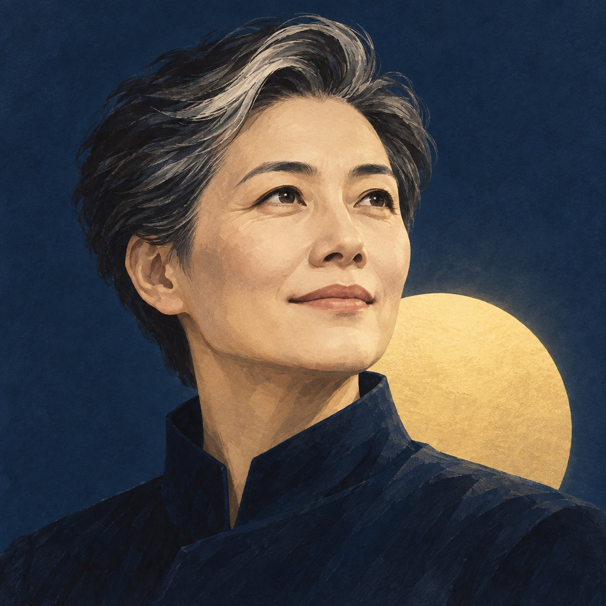
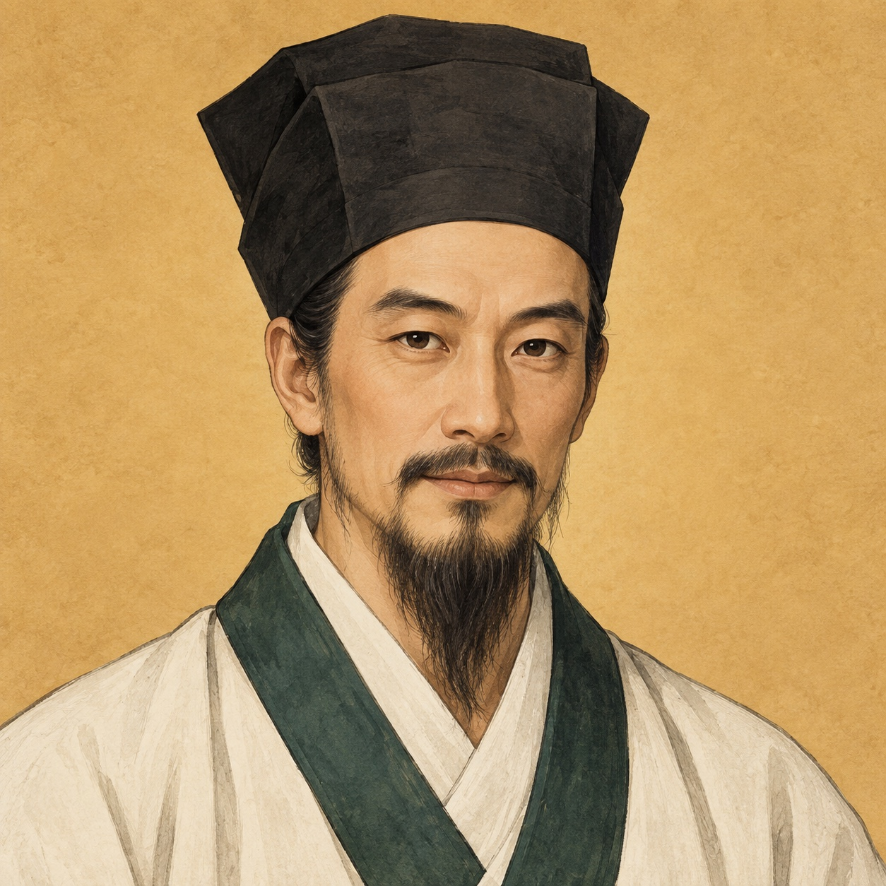

# Mentor avatars

Four original character illustrations generated with the built-in `image_gen` tool on 2026-09-11. These images depict AI mentor roles, not the user's likeness or an asserted authentic historical portrait.

| Gentle reviewer | Blunt coach | Future self | Wang Yangming-inspired mentor |
| --- | --- | --- | --- |
|  |  |  |  |

The shared visual style uses editorial portrait illustration, paper texture and a distinct background color for each role. Full generation prompts are in [prompts.json](prompts.json).

The PNG files are preserved originals. JPEG upload copies retain the original 1254 × 1254 dimensions, without cropping or added rounded corners. They were exported with macOS `sips` at JPEG quality 88 to meet the observed Feishu upload limit of less than 2 MB. File sizes and SHA256 checksums are in [upload-manifest.json](upload-manifest.json).

Live application identifiers, publication receipts and credentials belong only in the private Air runtime; they are not included in this asset directory.

## Feishu publication

All four avatars were uploaded and published as application version `1.0.2` on 2026-09-11. Each publication returned HTTP 200 with business code 0. Reloaded application pages matched the saved image resources; verification permits Feishu CDN shard changes only when the image resource is unchanged.

| Persona | Published version | Published image verified |
| --- | --- | --- |
| Gentle reviewer | 1.0.2 | Yes |
| Blunt coach | 1.0.2 | Yes |
| Future self | 1.0.2 | Yes |
| Wang Yangming-inspired mentor | 1.0.2 | Yes |

The shared display-name prefix, the existing single-owner availability scope, and disabled external group/direct-message access were preserved. The original diary bot was outside this avatar update. This asset publication does not implement persistent-group conversations or discussion-memory updates.

A final official `bot/v3/info` check succeeded for all four bots (HTTP 200, business code 0, `activate_status=2`). All returned names matched the existing prefixed names, and all returned avatar URLs matched the corresponding newly published image resources. Full receipts remain in the private Air runtime.
