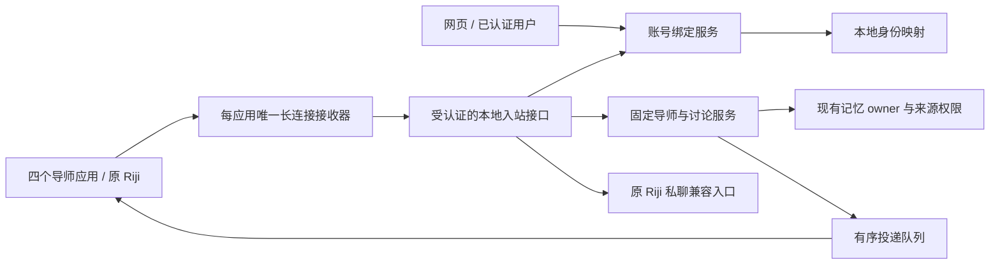

# 飞书固定导师接入实施设计

**专项验证（2026-09-11）：** Air 真实成员查询返回权限不足；原日记导师未登记为 Feishu host，现有私聊桥接在讨论路由前拒绝群消息。普通群主持仍缺独立桥接实现，不能仅记作“尚未实测”。证据及最小权限建议见[专项验证记录](../feishu-group-host-verification-2026-09-11.md)。

**需求更新（2026-09-11）：** [PRD v0.3](../product/PRD-persistent-mentor-roundtable.md)的同题多次讨论、版本化背景和 AI 日记结果已进入本地实现，新增[技术设计](persistent-mentor-roundtable.md)。只读群证据收集与主持人事件规范化已补齐代码；原日记导师真实普通群输入、历史可见性、接收所有权及事件连续性仍是生产门槛，不能按合成测试放行。

更新：2026-09-10。状态：S1 与 S2/S3 的接收和分派代码已实现；四导师应用已完成后台配置和发布，可信租户证明已齐，正式接收器已安装运行；四位已完成真实双端绑定与固定虚构问题回复验收，其他验收继续单列。跟踪 [Issue #43](https://github.com/doublew6/riji-agent/issues/43)。

本文细化[导师 PRD](../product/mentor-dialogue-and-debate.md)和[导师总体架构](mentor-dialogue-and-debate.md)，按“绑定身份 → 独立导师私聊 → 原 Riji 主持人 → 合成圆桌 → 生产验收”实施。沿用一个业务服务、一个记忆数据所有者和既有模型调度；网页与飞书只是不同入口。

## 1. 交付目标与当前缺口

目标是保留原有 Riji 应用，新增温柔回顾者、直率教练、未来的我、王阳明四个企业自建应用。每个新应用绑定固定 persona；群内由后端安排发言，再通过各应用发送。机器人无需互相读取消息或互相触发模型。

| 当前代码 | 本次处理 |
| --- | --- |
| 网页已关联原记忆 owner，跨平台重复登记会报 `identity_link_required` | 增加显式绑定，保持原 owner 不变，不迁移或复制 Mem0 |
| 接收器原先要求事件同时提供 `user_id` 和 `open_id` | S1 已允许缺少 `user_id`；必须验证应用、租户、用户类型和 `open_id`，再使用经过确认的应用级映射 |
| 接收器未读取 runtime 的独立凭据文件 | 复用已有私密文件加载器，不要求凭据出现在命令行或聊天中 |
| 接收回调同步请求业务服务和发送回复 | 改为短回调、持久化入站和后台投递；收到 SDK 事件不等于业务处理成功 |
| 原 Riji App ID 被运行时拒绝复用 | 明确标记原应用由 Hermes 独占接收，在已鉴权 Gateway 内分派讨论命令；新接收器禁止启动此应用 |
| `create_room` 硬关闭，`inspect_room` 返回未验证 | 先补合成环境探针；证据不足不能直接改成允许 |

上述缺口是代码现状，不应把已有 SDK 封装描述为完成接入。

## 2. 组件与数据边界

业务层继续使用 `principal_id`、`persona_id`、`conversation_id`，不接受外部文本声明 owner 或导师身份。App Secret 和应用 transport token 只在受控 runtime 中使用；Review token 只用于本地网页鉴权，不发给机器人。传输进程不读取业务数据库或日记 vault；它可以拥有仅用于接收可靠性的独立、受限 spool。

讨论和记忆的权威数据保存在本地。飞书消息经过飞书服务；获准背景和问题经过当前模型供应商。用户自选 iCloud 同步、飞书历史留存和模型服务的数据处理分别披露，不能合并称为“完全不出本机”。

## 3. S1：网页与飞书账号绑定

### 3.1 身份键

- 应用由已鉴权连接确定：`(platform, tenant, app_binding_id)`。
- 外部账号使用 `(platform, tenant, app_binding_id, open_id)`；同名、同头像或不同应用下碰巧相同的字符串不能自动合并。
- 可信事件提供非空 `user_id` 时，另记录 `(platform, tenant, user_id)` 的一致性约束。已有不同 principal 归属必须拒绝，不覆盖映射。
- 缺少 `user_id` 的应用通过独立绑定完成接入，不把 `open_id` 填入 tenant subject。首版对每个新应用都要求完成绑定，不因另一个应用已绑定而自动开放。
- `Principal.account` 保留原始登记来源；新增绑定写映射，不修改 `legacy_owner_key`，不初始化新 Mem0 owner。

### 3.2 用户流程

1. 用户以现有私人访问令牌打开网页，选择已配置的导师应用，点击“连接飞书导师”。
2. 本地生成 256 位随机一次性绑定凭据，有效期 10 分钟，限定当前 principal 和目标应用。网页显示 `/绑定 <凭据>`；凭据只在该响应和浏览器内存出现，服务端只保存散列。
3. 用户把这条命令发送到目标导师的私聊。服务验证事件来源后冻结该 `open_id`、可用的 `user_id` 和私聊 ID，返回 8 位核对码。此时尚未开放任何记忆或历史。
4. 用户回到已认证网页，输入刚在导师私聊收到的核对码，确认“将这个飞书账号连接到我的记录”。只有双端完成才写入身份和私聊映射。
5. 用户可以取消或重新生成；同 owner、同应用的新凭据作废旧请求。过期、取消和确认失败达到 5 次的请求不可继续使用。

绑定命令由确定性解析器优先处理，不进入模型、会话历史、长期记忆捕获或普通日志。未绑定用户的其他消息只收到绑定引导，不读取个人内容。机器人发送者和群消息不能领取绑定；分享链接、文本中声明的用户 ID 和应用 ID 不构成验证。

同一凭据被第二个账号领取时拒绝；同一原事件重送可以返回同一核对码，但不重复执行身份写入。确认和冲突检查在同一 SQLite 事务中完成。确认 API 对相同的已成功请求幂等；取消已经完成的绑定请求不会隐式解绑账号。首版不提供自动合并或自动解绑，避免留存历史归属被静默改写。

### 3.3 本地 API

所有接口使用既有 `/api/mentors/v1`。浏览器仅可用 Review token，入站 `/messages` 仅可用各应用 transport token，二者不可互换。

| 接口 | 内容 |
| --- | --- |
| `GET /connections` | 列出当前已配置的飞书应用、固定导师及本人绑定状态；不返回 App Secret 或他人身份 |
| `POST /identity-links` | 参数只有目标 `application_id`；返回请求 ID、一次性命令、截止时间 |
| `POST /identity-links/{id}/confirm` | 参数为核对码；只允许创建请求的网页用户确认 |
| `POST /identity-links/{id}/cancel` | 作废本人的未完成请求 |
| `POST /messages` | `/绑定` 先进入绑定服务；其他消息走既有身份与讨论服务 |

身份映射不等于分享许可。私聊仍只加载当前导师可用的共享事实及该导师获准观察。跨导师私聊、群背景和新用途继续按原分享/来源规则处理。跨渠道继续同一个问题使用显式选择/转交，不能自动拼接所有窗口历史。

S1 同时修正渠道选择：网页发起问题明确使用 local 应用；圆桌应用集合按发起窗口的平台/租户筛选，不按 principal 的最初登记渠道推断。飞书创建圆桌在业务入口也明确拒绝，避免已关联的网页 principal 意外走本地适配器。S4 开放群路径前，还须将群成员的 external identity 校验与原始 `Principal.account.subject` 解耦，使用实际目标渠道的已验证身份。

## 4. S2：四个独立导师私聊

每个应用使用官方 `lark-oapi==1.7.3`，一个长连接所有者，不复制四套模型 runtime。应用绑定固定 persona；消息中的“切换导师”不能修改它。事件须校验 header App ID、tenant、sender type、有效消息 ID、chat type 与文本格式。

以下可靠性已在代码中实现并通过合成测试，正式接入后仍须验证真实收发：

1. SDK 回调只执行有界验证及入站持久化；不能等待模型。spool 写入失败须明确失败，不能把消息确认成成功。
2. 入站幂等键包含应用、聊天、消息和 action；相同键不同正文报冲突。spool 和 HTTP 客户端禁止记录绑定凭据及个人正文到普通日志，loopback 客户端显式 `trust_env=False`。
3. 接收回执与生成结果分别有固定投递 ID、状态和返回 message ID。发送超时结果未知时保留记录，不以新 UUID 盲目重发。平台去重窗口须实测。
4. 非文本消息返回有限、可理解的提示；不伪造完成多模态支持。导师应用收到群事件副本直接忽略，不调用业务服务或触发模型。
5. 私聊能够开始问题、补充、停止、查看历史，并通过各自应用发送结果。一次消息只能推进一个固定导师的问题。

## 5. S3：原 Riji 兼容与主持人

实施调整：保留原 App ID 和现有 Hermes 接收器。已核对的 bridge 将消息原样交给 `/hermes/messages`，可以在该 Gateway 内完成命令分派，因此本阶段不需要把原应用切换给新长连接。这减少了对现有日记入口的改动，同时满足每个应用只有一个接收者的要求。

配置为每个应用增加 `receiver`：四个新导师采用 `dedicated`；原 Riji 可采用 `hermes`，且必须是 `host`、`platform=feishu` 并与现有 `FEISHU_APP_ID` 完全相同。该主持人不生成新 transport token，也不能启动 `mentors.receiver`。不得把其他应用声明为 Hermes 所有者来绕过隔离。部署仍须核对实际 Hermes 配置和进程；文件锁不证明其他主机没有连接。

Gateway 先验证原共享密钥、私聊和用户白名单，再分派明确的讨论命令：绑定、圆桌参考/辩论、历史、讨论控制和转交。普通私聊、原导师选择及日记预览/确认继续走原处理方法。原 `/切换` 保留为导师选择；讨论切换采用 `/切换问题`，讨论帮助采用 `/讨论帮助`。进入讨论服务的 open_id、聊天 ID 和事件 ID 来自原已验证消息，不接受正文指定的身份。群请求仍在分派前拒绝。绑定命令不进入旧事件日志或模型；未配置时返回有限提示。

旧 Gateway 继续拥有严格日记确认语义。新圆桌只产生 handoff；必须在绑定的 Riji 私聊展示新预览后再确认。讨论命令使用新业务幂等记录，不复制到旧事件缓存。异常返回安全提示，不能失败后再交给旧模型重做。测试覆盖原单 Bot 会话、导师选择、确认、鉴权/群拒绝、错误原应用配置及新接收器禁止接管。

若后续群主持需要接收普通群消息，当前 Hermes 私聊入口不能直接放开。届时另做经过验证的群接收路由和接收权迁移；迁移仍须先排空并停止旧连接，再开启新连接，失败按相反顺序恢复。本阶段不通过修改旧群白名单来提前启用 S4。

## 6. S4：群能力探针与私人圆桌

基本建群可行：官方 SDK 的 `CreateChatRequestBody` 含 `user_id_list` 和 `bot_id_list`。这只证明存在多机器人参数，不能证明该租户具有所需权限，也不能证明私人历史可隔离。[官方 SDK 源码](https://github.com/larksuite/oapi-sdk-python/blob/v2_main/lark_oapi/api/im/v1/model/create_chat_request_body.py)

探针只用固定虚构内容、专用测试群和明确的测试成员，不能从业务记忆生成素材。探针报告保存操作 ID、权限结果、字段是否完整、分页是否结束、幂等/超时结果和人工客户端观察；默认报告不含真实群 ID、用户 ID 或消息正文。需要定位时另存私有运维记录。

| 门槛 | 实测内容 | 失败处理 |
| --- | --- | --- |
| FG-01 | 五应用可发送；主持人收到普通用户群消息；导师副本不推进状态 | 不开真实圆桌 |
| FG-02 | 完整的人类与机器人集合；分页/权限截断；成员加入、退出与连接中断期间的变化 | 未知暂停，确认成员变化永久关闭旧桌个人投递 |
| FG-03 | 邀请/分享/管理限制；新成员历史查看设置可读回且与客户端一致 | 继续关闭群个人内容，不用 `join_message_visibility` 替代历史权限 |
| FG-04 | 创建超时核对、稳定 UUID、发送回执、去重窗口外的未知结果 | 不重复创建或盲目重发 |
| FG-05 | 移动端名称/头像/顺序/停止/追问/总结可读可用 | 修正交互后复测 |

当前锁定 SDK 中可见 `join_message_visibility`、`restricted_mode_setting` 等字段；仅凭字段名不足以判断新成员是否能读取历史。本次不宣称飞书绝对无法满足，而是把可靠证据列为启用前提。若官方 API 和真实测试无法满足原 PRD，需要另作产品决策；既有网页圆桌继续可用。

完成探针后才实现通过验证的建群、成员快照、变更事件和投递前校验。合成探针的成功结果不能直接生成生产 `audience_grant`；每桌仍需本人明确确认分享范围。成员查询与发送之间存在非原子窗口，不能承诺平台级零风险。

## 7. 飞书后台配置与分工

已通过 Air 会话中的浏览器登录开发者后台，成功创建温柔回顾者、直率教练、未来的我、王阳明四个应用。四个带“日记导师·”统一前缀的 `1.0.1` 版本均已发布审核通过，机器人能力、长连接后台验证及 `im.message.receive_v1` 已配置并保存。可用范围弹窗均已核验为部分成员且恰好只选本人，对外群及外部私聊能力关闭。App Secret 仅保存在 Air 权限为 `0600` 的私密文件中，不通过聊天或仓库传递。

当前每个应用仅有 `im:message.p2p_msg:readonly` 与 `im:message:send_as_bot` 两个 scope。四份可信测试私聊证明已齐且租户一致，临时 SDK 探针全部停止。证明已用于配置作用域核验，不能代替每个应用的双端身份绑定。

导师私聊最小配置：机器人能力、长连接、`im.message.receive_v1`、读取机器人单聊消息和以应用身份发送消息。先核对 `im:message.p2p_msg:readonly`、`im:message:send_as_bot`，按平台实际报错补充所需的最小范围；每次修改后发布版本并核对可用范围。显式绑定路径不要求为了识别用户而获取全员通讯录。

主持人还需核对建群、群信息/成员读取和普通群消息权限。不同 API 的允许权限可能是多选一，精确权限以该接口官方文档和当前应用的权限页为准；不把旧技能中的宽泛权限表整体授予四位导师。未通过群验收前，导师无需获取任意普通群正文。

参考入口：[接收消息事件](https://open.feishu.cn/document/server-docs/im-v1/message/events/receive)、[创建群](https://open.feishu.cn/document/server-docs/group/chat/create)、[官方 Python SDK](https://github.com/larksuite/oapi-sdk-python)。核对日期 2026-09-10；部分官方文档为动态页面，本次静态工具无法提取正文，真实应用配置时须在开发者后台再次核对，不能把页面访问成功作为权限实测。

### 7.1 本次命名与本人访问要求

四个导师应用的目标显示名统一为“日记导师·温柔回顾者”“日记导师·直率教练”“日记导师·未来的我”“日记导师·王阳明”。前缀只用于界面辨认；改名不改变固定 persona、应用绑定、历史归属或权限。鉴权仍依据可信连接中的 app/tenant 和逐应用已确认的 open_id 绑定，显示名相同或含此前缀不构成身份依据。

本次个人生产部署仅允许一个既有 owner 使用导师对话。飞书应用可用范围必须限定本人，外部私聊及对外群能力保持关闭；业务层还须验证发送者绑定到该 owner，其他人或未知身份不得进入模型、读取日记/记忆/历史，或自动登记为新 owner。平台可见范围不能替代服务端鉴权，普通群与未通过 S4 的群路径继续关闭。

首条“连接测试”只形成可信应用/租户/私聊身份的待核验依据，不能按首个发言者自动认领 owner，也不能开放个人内容。每个应用仍须按 §3.2 完成已认证网页和目标私聊的双端确认。本节定义持续适用的配置与验收要求；改名和安装的实际进度见 §11，不能据此跳过双端绑定。

## 8. 交付顺序、测试与部署

| 阶段 | 完成标准 | 外部依赖 |
| --- | --- | --- |
| S1 | 双端绑定、作用域冲突检查、网页入口、凭据加载修复，合成 HTTP/SDK 测试通过 | 无；实际绑定需应用可收消息 |
| S2 | 持久接收、受控投递、独立导师私聊、重启/重复/超时测试通过 | 四应用凭据与已发布事件配置 |
| S3 | 原 Riji 继续由 Hermes 独占接收、明确分派、旧私聊与确认回归 | 原应用配置及真实私聊验收 |
| S4 | 合成 FG-01..05 通过，完成可验证的群适配 | 测试群、成员操作及客户端观察 |
| S5 | Air 部署、真实私聊、共享记忆范围、移动端和关闭演练 | 前面全部阶段通过 |

S1 必测：绑定前不可访问记忆；双端确认；错误网页用户/应用/租户/群/机器人/核对码；过期、取消、重复、并发抢占；外部账号冲突事务回滚；缺少 user_id；同名或跨租户不合并；重启后映射保留；原 owner 与导师历史隔离；绑定凭据不进普通历史、导出或模型。

部署只在已核验的 Air：开发全量测试 → rsync dry-run → 备份受影响文件 → 定向同步 → Air runtime 相关测试 → 必要配置/依赖变更 → doctor → 同一 service executable 管理 → health/飞书/网页验证。保持 8765 loopback，不新增公网入口，不更改 Mem0 provider 或重启共享容器运行时。

每一步将代码、测试和待实测项回填 Issue。单元或合成 HTTP 测试通过只代表代码契约，真实应用连接、群隐私和手机体验分别记录，不能一次性勾选完成。

## 9. S1 代码与验收记录

本轮新增 `identity_links.py`、`identity_api.py` 和网页绑定交互，接入真实 runtime/ingress；在独立 `codex/issue-43-feishu-mentors` 工作分支实现。它依赖现有尚未提交的导师核心和记忆代码；未把其他工作一并提交或推送。

确定性验收覆盖双端证明、逐应用授权、无 user_id、冲突回滚、并发抢占、过期/取消/尝试耗尽、重复事件、重启恢复、鉴权分离和绑定凭据不进历史/模型。合成运行时额外验证两个飞书导师读取同一个旧记忆 owner、保持私聊上下文隔离，并分别向正确应用和私聊投递。适配器用测试替身发送，未连接真实飞书或调用真实模型。

最终全量回归：**928 项，924 通过、4 跳过、0 失败/错误**；导师相关测试 48 项全部通过，网页 JavaScript 语法检查通过。首轮中两项发布扫描测试遇到本机 Git 的 Xcode 许可问题，改用项目规定的 CommandLineTools Git 后重跑全量通过，没有为此修改认证或跳过测试。

以上是 S1 时点的记录，后续变更见下节；S1 代码验证不能视为机器人已上线。

## 10. S2/S3 实现与运维边界

`receiver_spool.py` 提供每应用独立 SQLite 接收队列，目录 `0700`、数据库 `0600`，位于 vault 外。SDK 回调只验证、落盘和唤醒；后台串行执行 loopback HTTP 及回执发送。已安装 SDK 1.7.3 在事件处理器抛错时生成 500 响应；磁盘或容量错误只抛固定安全代码，不吞掉错误后假装接收成功。无效外部消息、机器人消息及导师群副本不进入业务队列。

普通排队正文最长保留 24 小时，待处理容量 200；终态元数据最多保留 7 天且限制为最近 2000 条。处理开始前持久写入 `processing` 并清除正文；发送前写入 `sending`；成功记录固定 UUID 对应的消息 ID。重启只恢复尚未处理的普通消息，处理/发送中的消息改为 `unknown`。超时、服务错误、缺少发送 message ID 和 SDK 未确认结果均不盲目重放。去重窗口由实测决定，目前不能仅凭 UUID 承诺无限期平台去重。

绑定命令是例外：仅在进程内存短暂排队，数据库只保存事件摘要和状态，不保存绑定凭据；10 分钟过期或接收器重启后需要重新生成绑定命令。队列不缓存含个人内容的回复。来源权限仍由业务服务在处理和既有生成 outbox 投递时检查；网络队列落盘不等于业务已接受命令或冻结问题上下文。

运维可给接收器原命令增加 `--status`，只读状态计数，检查 `unknown`、`expired`、`rejected`；此查询不会触发重启恢复或输出消息正文/账号。遇到未知结果先核对网页历史与原聊天，不能自动重新执行保存/确认。暂未提供未知结果的图形化核对界面。

非文本消息返回“目前只支持文字消息”的确定性提示，不调用模型。SDK 日志统一转换为固定事件代码，避免异常包含连接 URL 或外部响应正文；具体故障通过私有状态和受控探针核对。localhost HTTP 显式禁用代理继承。

S3 保留现有 Hermes 所有权；代码新增 `legacy_route.py`，在旧鉴权之后分派讨论命令。四个固定导师应用已完成后台创建、最小权限、凭据私密保存、事件配置和发布审核。正式业务配置及四个接收器安装已完成，四位双端绑定与固定虚构问题的真实回复已验收，群能力门槛保持关闭。

确定性测试与生产部署证据见[本次 Air 交付记录](../feishu-mentor-air-2026-09-10.md)：开发机 957 项中 953 通过、4 跳过；Air 172 项相关回归全部通过。此为基础代码部署时的历史证据；最新配置、接收器安装与本轮回归见下节。

## 11. 四应用发布后的接入进度

四个带“日记导师·”前缀的 `1.0.1` 版本已发布审核通过；发布前逐应用核验部分成员范围只包含本人，外部私聊和对外群关闭。官方 tenant token API 与 `GET bot/v3/info` 均为 HTTP 200、`code=0`、`activate_status=2`，新完整显示名匹配。四份可信测试私聊证明已齐、租户一致并已导出至私密记录；临时探针全部停止，不再与正式接收器竞争同一应用。

正式安装完成，主服务保留 5 个 local 应用及唯一既有 owner、Review 凭据，并加载 4 个 Feishu 导师。四个接收任务均运行，PID/命令参数/工作目录归属、各自锁和 `0600` spool 已核验；安装就绪时各有一条 ESTABLISHED TCP，日志和收件为 0。网络连接不能代替 SDK 认证、双端绑定或真实回复验收。安装核验未自动认领身份、发送消息或调用模型。

使用既有 production executable 重启主服务后，doctor 通过，健康检查与导师页面 HTTP 200；未认证 connections 为 401，原 owner 认证后可见四应用。安装前数据库核验只有一个 principal，匹配唯一 configured owner；当时四个新应用的私聊/外部身份绑定、已确认链接及已绑定 owner 数均为 0，没有他人的历史绑定。绑定后 Air 只读 API 四项 connected=true；数据库唯一 owner、四份外部身份绑定、四份私聊绑定和四份已确认链接映射一致。owner 配置、account 与 legacy_owner 与安装前备份一致；待确认请求为 0，无额外应用、账户或私聊绑定。共享记忆归属一致已核验，此证据不代表真实内容共享或隔离实测通过。Hermes、Mem0 未重启，群能力门槛未改变。

本轮开发机 957 项中 953 通过、4 跳过；Air 本轮 154 项相关回归全部通过，与历史 172 项分开记录。身份探针 61 项、安装材料 34 项在开发机与 Air 的准备阶段合成检查均通过，仍各自独立，不合并计数或替代真实验收。

四位均已按 §3.2 经真实本机 Feishu 用户客户端发送绑定命令、对应机器人返回 8 位码、同一 owner 在已认证网页确认，网页四项均为“已连接”。随后四个正确应用对同一固定虚构读书拖延问题均返回“已收到新问题”和独立导师答案，客户端已逐一确认。此项仅证明真实绑定与回复链路；完整质量、独立共享事实、私聊隔离及重启恢复尚未验收。S4 FG-01..05、手机端和原 Riji 新增讨论入口也仍待真实验收。详细交付状态见[Air 记录](../feishu-mentor-air-2026-09-10.md)。
