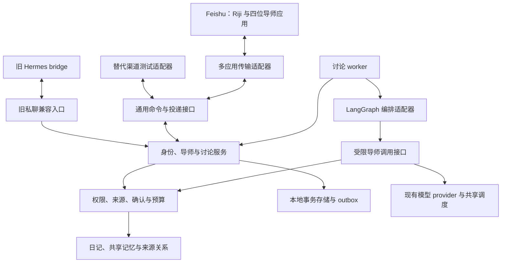
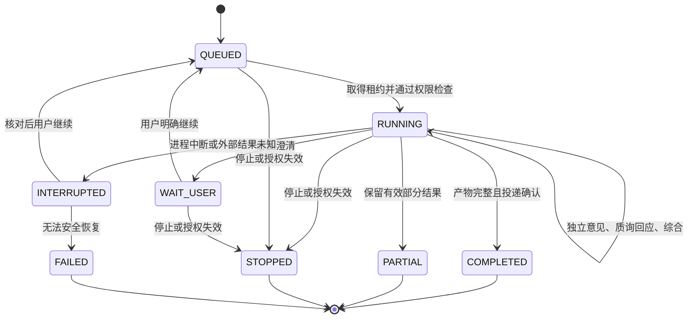

# 导师沟通与多导师辩论技术设计 v0.1

**需求更新（2026-09-11）：** [PRD v0.3](../product/PRD-persistent-mentor-roundtable.md)已授权开发。群/问题与讨论关系、分场预算、摘要及 AI 日记来源契约由[常驻问题技术设计](persistent-mentor-roundtable.md)补充替代；本地实现和验证不等于生产群已开放。其余身份、来源授权与私聊确认边界继续适用。

对应 [PRD v0.2](../product/mentor-dialogue-and-debate.md)。用户已确认产品方向：导师独立私聊入口、私人圆桌群、产品与技术分离，以及可迁移的渠道架构。本文固定实现单元之间的契约，并给出首版实现方案；**本地框架与讨论核心已部署到 Air，飞书合成群和移动端验收仍待执行**，当前能力及缺口见 [实现与验收记录](../mentor-implementation.md)。

本文包含已实现和待验收契约，上线范围以部署记录为准。相对 [MVP 架构](mvp-architecture.md)，新增多应用渠道适配和显式授权的私人圆桌读取/展示路径；旧 `/hermes/messages` 继续仅接受私聊，群内仍不得创建或提交日记草稿。导师交付独立于 Issue #40；用户已另行授权本次 Air 部署，真实日记权限不因此扩大。

飞书接入的具体实现顺序、双端账号绑定及接收器切换契约见[接入实施设计](feishu-mentor-integration.md)，跟踪 [Issue #43](https://github.com/doublew6/riji-agent/issues/43)。S1 代码已实现但未部署；原 Riji 复用与群能力仍需后续阶段验收。

## 1. 实现现状与必须补齐的边界

| 代码现状 | 可复用部分 | 本增量必须新增或收紧 |
| --- | --- | --- |
| [通用入站消息](../../src/riji_agent/im/models.py)、[运行时接口](../../src/riji_agent/agent/runtime.py) | 已有 platform/user/chat/text 归一化 | 应用与租户身份、发送者类型、通用多消息出站；运行时返回类型仍依赖 Hermes |
| [Gateway](../../src/riji_agent/hermes/gateway.py)、[bridge](../../src/riji_agent/integrations/hermes_bridge.py) | 单 Bot 私聊路由、身份检查、兼容入口 | 实例锁覆盖同步回答；不能把整场圆桌塞进该锁或一次 HTTP 回复，需命令入队与后台执行 |
| [导师配置与上下文](../../src/riji_agent/personas/context.py) | 固定角色、按用户/导师/聊天取历史和记忆 | 圆桌专用上下文；现有上下文含当前导师私有观察，禁止直接广播 |
| [模型接口](../../src/riji_agent/models/types.py)、[AgentRunner](../../src/riji_agent/agent/loop.py) | 模型可替换、受限工具循环、发送前重验 | 圆桌级总预算、结构化发言、取消/修订检查；“独立发言”不要求并行请求 |
| [工具注册表](../../src/riji_agent/agent/tools.py) | 来源版本复核、受限检索实现 | 当前 allowed tools 过滤 schema，但 invoke 未按本次 capability 再拦截；必须增加执行时校验 |
| [草稿服务](../../src/riji_agent/drafts/service.py) | 原子认领、模板追加、写后校验 | 当前 commit token 可选且接口不接收目标会话；显式 draft_id 路径不能直接充当跨应用安全确认，须绑定私聊和预览版本 |
| [会话存储](../../src/riji_agent/memory/store.py)、[事件日志](../../src/riji_agent/hermes/events.py) | 本地持久化与旧历史 | 旧复合会话字符串、event_id 单键不足以表达多应用身份、问题和多条投递 |
| [Codex 调度](../../src/riji_agent/models/codex_schedule.py) | 前台优先、进程内单槽 | 保留容量约束，新增圆桌公平排队；不得每位导师各建一个调度器绕过单槽 |

这些是接口与代码检查结果，不是对失败路径的运行验证。尤其工具执行权限、跨窗口草稿绑定和统一来源预算，必须在开放多应用/圆桌前验证，不能只在 prompt 中声明已受保护。

## 2. 架构决策与依赖规则

采用 **hexagonal modular monolith（端口与适配器的模块化单体）**。业务服务拥有导师、问题、讨论和权限；Feishu、Hermes、LangGraph 与模型供应商均位于可替换边界。首版仍使用单个 riji-agent 数据所有者，不引入每导师一套数据库或独立 Agent 服务。



### AD-1 — 业务不依赖渠道或编排框架 [ADOPTED]

- **Binds:** 所有新增模块，MD-FR-23。
- **Prevents:** 更换 Feishu 或框架时重写导师、权限和历史。
- **Rule:** 业务层只依赖内部身份、命令、内容和权限端口。Feishu SDK、Hermes 类型和 LangGraph 状态类型不得出现在业务对象或公共服务返回值中；依赖由 wiring 注入。模型与工具仍走项目已有受限接口。

### AD-2 — 内部身份为唯一业务身份

- **Binds:** 身份、会话、记忆、渠道与确认服务。
- **Prevents:** 不同应用 open_id 把同一个人拆开，或同名用户被误合并。
- **Rule:** 用户、问题与圆桌使用本地标识；`persona_id` 保留 PersonaRegistry 的稳定导师键。外部身份通过带平台/租户/应用作用域的已验证映射关联。渠道聊天绑定与业务问题分开，一段私聊可选择多个历史问题，一桌群只绑定一个问题。模型、用户文本或显示名称不能声明身份。外部 app 绑定固定导师，消息不能改写绑定。

### AD-3 — 一个讨论服务修改状态

- **Binds:** Gateway、worker、管理界面、LangGraph 和投递器。
- **Prevents:** 多机器人同时推进轮次，或旧任务覆盖新补充。
- **Rule:** 所有控制变成有幂等键的命令。讨论服务在本地事务内更新版本与执行状态；每桌同一时刻只有一个有效执行租约。输入版本、状态版本、取消代次和租约代次各有独立含义，按 §6 检查；已验证目标的停止/删除不能因后台进度使状态版本过期而被忽略。初始参考与至多一次转辩论的所有 run 共用同桌预算池，重试/修订不清零。模型结果、工具和投递都检查输入版本、取消代次与租约。外部请求期间不持有数据库事务或全局 Gateway 锁。

### AD-4 — 每次副作用均重新授权

- **Binds:** 模型发送、工具执行、群投递、私聊转交、历史重放。
- **Prevents:** 只校验初始请求，随后排队、摘要或重试绕过撤权。
- **Rule:** 本地生成的 capability 绑定用户、场所、用途、导师集合、来源/授权版本和有效期。执行端逐次验证；群场所永远无草稿/提交能力。只过滤模型工具 schema 不算权限执行。未知工具、来源、版本或场所失败关闭。

### AD-5 — 本地持有背景，框架只控制步骤 [ADOPTED]

- **Binds:** 编排、导师调用、记忆与模型适配器。
- **Prevents:** 框架自带 memory 或自动摘要创建第二份不可管理的个人画像。
- **Rule:** 角色来自现有 PersonaRegistry，内容来自本地存储和授权检索。框架 checkpoint 只存内部 ID、版本、阶段和游标，不存正文、prompt、token 或凭据。关闭外部 tracing/自动上传；不启用框架的独立长期记忆或通用文件、Shell、网络工具。

### AD-6 — 业务记录权威，checkpoint 可重建

- **Binds:** LangGraph、步骤记录、outbox 与恢复服务。
- **Prevents:** 图节点重放造成重复模型调用、发言或保存。
- **Rule:** 每个逻辑步骤有稳定 step_key，已提交产物从业务存储复用。产物、阶段推进和待投递事件同事务提交；checkpoint 只在之后记录执行位置。结果未知的模型调用或群操作先转中断待核对，不盲目重放。框架 checkpoint 不决定授权或副作用是否已成功。

### AD-7 — 一个逻辑输入，一个可控发言序列

- **Binds:** 多应用接收器、讨论服务与投递器。
- **Prevents:** 同一用户消息被多个 Bot 处理，机器人互相触发无限讨论。
- **Rule:** 圆桌群仅主持人应用拥有业务输入路由权；导师应用处理各自私聊，群消息副本不推进讨论。编排在后端直接传递产物引用，各导师用各自应用发送。业务事件按序号投递，未知投递阻止后续依赖发言；不依赖 Bot 互相 @。

### AD-8 — 私人圆桌是显式授权的特殊场所 [ADOPTED]

- **Binds:** 群绑定、分享、来源权限和渠道发送，MD-FR-20..22。
- **Prevents:** 将普通群伪装成私聊，或只验证发送者而忽略其他阅读者。
- **Rule:** 仅本服务登记且验证的私有圆桌可用新路径；成员须等于本人和本桌受管应用集合。群创建、源权限和本桌展示授权分别检查。确认成员/管理条件变化则永久封闭旧桌群的个人投递；仅查询失败时暂停，完整复核证明配置和成员未变并由用户继续后才可恢复。旧接口继续拒绝群，不能把 chat_type 改为 p2p 绕过校验。

### AD-9 — 共享内容继承全部输入限制

- **Binds:** 背景组装、发言、总结、转交、缓存和导出。
- **Prevents:** 某导师读了私有来源，再通过不带引用的总结泄露给其他人。
- **Rule:** 共同背景只取所有参与导师均获准的部分；默认排除所有导师的私聊历史、私有观察及未确认候选。每个生成产物继承其实际输入的全部来源和用途依赖，不能只相信模型写出的引用。依赖失效时，产物、摘要和待投递正文同步停止使用。

### AD-10 — 日记确认只在绑定的私聊生效 [ADOPTED]

- **Binds:** 群转交、DraftService、旧/新 Gateway 与确认存储。
- **Prevents:** 群内赞同、跨应用草稿 ID 或旧预览造成未授权写入。
- **Rule:** 群只创建 handoff，不创建可提交草稿。已验证私聊中展示并绑定新草稿的用户、会话、渠道应用、预览版本与一次性确认；30 分钟失效。提交端必须验证这些字段及确认事件，不能只检查 owner 后从库中取 token。修改预览须使旧确认失效。

### AD-11 — 删除同时覆盖派生运行数据

- **Binds:** 记录、checkpoint、缓存、队列、搜索、备份恢复。
- **Prevents:** 删除正文后由摘要、恢复或旧 worker 重建。
- **Rule:** 先递增取消代次并写删除墓碑，再移除正文、摘要、索引、checkpoint 与未发送负载；保留不含正文的幂等/抑制标识。所有恢复先检查墓碑。转交副本和另存日记/记忆独立列明；凭据和有效授权不进入可迁移导出。

### AD-12 — Air 单实例与渐进启用 [ADOPTED]

- **Binds:** 部署、配置、旧入口兼容和关闭开关。
- **Prevents:** 在开发机启动生产或为每导师复制 runtime/记忆库。
- **Rule:** 沿用 Air runtime 和固定端口；新增功能默认关闭。每个应用只能有一个有效接收器所有者。旧私聊在新功能关闭时继续工作，恢复不要求回滚已写日记。实施按独立 Issue 交付，遵守现有 Air 备份、测试和发布顺序。

## 3. 编排选型与版本基线

**本设计选择 LangGraph 作为首版编排适配器。** 固定导师继续由项目 PersonaRegistry 管理；图节点调用项目封装的导师接口。选择属于工程方案，用户确认的是产品方向，不将此选型描述为用户指定。

| 方案 | 适配情况 | 本版处理 |
| --- | --- | --- |
| CrewAI + Flows | role/goal/backstory 能表达固定导师；Flows 也有状态持久化、分支和人工反馈，可直接编排普通方法 | 有效候选。采用 Agent/Crew 时需映射既有角色和权限；单用 Flows 也可复用现有调用。本版偏向 LangGraph 的显式图和中断接口 |
| LangGraph | 显式阶段、条件转移、持久化和人工介入，节点可封装现有函数 | 采用；用本地业务存储和受限调用接口控制副作用 |
| 全部自行编排 | 最少外部概念，可沿用当前 Python 代码 | 暂不采用；恢复、分支与中断需要自行维护完整执行机制 |

上述框架能力分别核对了 [CrewAI Agents](https://docs.crewai.com/en/concepts/agents)、[CrewAI Flows](https://docs.crewai.com/en/concepts/flows) 和 [LangGraph 概览](https://docs.langchain.com/oss/python/langgraph/overview)。选择理由是与本代码库的衔接判断，不是对框架质量的排名。

| 新增依赖验证目标 | 本次检索到的稳定版本 | 处理 |
| --- | --- | --- |
| LangGraph | [1.2.11](https://pypi.org/project/langgraph/1.2.11/) | 编排适配器候选锁定版本 |
| langgraph-checkpoint-sqlite | [3.1.1](https://pypi.org/project/langgraph-checkpoint-sqlite/3.1.1/) | 本地游标 checkpoint；与上项组合须先验证 |
| lark-oapi | [1.7.3](https://pypi.org/project/lark-oapi/1.7.3/) | 官方多应用传输 SDK 验证目标 |
| CrewAI（比较项，不安装） | [1.15.21](https://pypi.org/project/crewai/1.15.21/) | 记录选型时版本，不增加依赖 |

核对日期为 2026-09-10。当前项目声明 Python >=3.11，原 FastAPI/Pydantic/模型依赖沿用锁文件。上述版本存在不代表依赖可共同解析或运行；实施第一个包须在隔离测试环境完成依赖解析和契约验证，再把精确版本纳入可选 extra 及锁文件，不在生产中自动追随 latest。

## 4. 内部身份、命令与出站契约

### 4.1 身份与场所

新用户、问题、圆桌、执行记录和渠道绑定采用不含用户信息的 UUID；`persona_id` 继续使用 PersonaRegistry 的稳定字符串键，保留原角色、授权和记忆隔离关系。字段显式传递，不通过拆分冒号字符串恢复身份。`principal_id` 标识人，`conversation_id` 标识一段私聊问题或圆桌，`roundtable_id` 标识本桌，`run_id` 标识一次执行记录，并引用预算池而非自行重置预算。主持人的执行者身份是服务角色，不能伪装成获准集合外的新导师。

渠道映射最少包含 `(platform, tenant_scope, app_binding_id, external_user_id)` → `principal_id` 和 `(platform, tenant_scope, app_binding_id, external_chat_id)` → `channel_chat_binding_id`。后一绑定表示传输窗口，不直接等同问题。私聊绑定可关联多个 conversation，当前选择按 `(principal_id, channel_chat_binding_id, persona_id)` 保存；切换/新建问题只更新此指针，命令接收时冻结目标 conversation 与 revision。旧 Riji 窗口先按兼容导师选择路由，固定导师窗口由 app 绑定决定。圆桌的多个 app 聊天绑定必须归到同一 room 和唯一 conversation，不能各建一桌。

私聊回复已知历史消息时，优先通过同一已验证聊天绑定的 delivery 找到原 conversation，并明确提示正在继续的原问题；无引用才使用当前问题指针。同一已授权圆桌群中，Riji 可通过本桌各导师的 delivery 解析跨应用回复，只核验原桌范围，不重复要求分享确认。跨问题、场所或扩大接收方的引用，不能凭外部 message_id 自动复制上下文，须走范围核验与转交预览。冻结的命令目标不随之后的窗口选择改变。

私聊后续轮次创建新的 `run_id`，但同一问题的可见上下文按 `conversation_id` 延续。
`private_context.py` 核对原私聊绑定，只选该问题的用户原话，以及由固定导师向同一应用、
同一私聊窗口成功投递的回复；未发送、发送中、未知、失败和已取消回复均不进入上下文。
保留每条 Artifact 的用户/AI 类别、时间、引用及来源依赖，排除已失效记录；历史依赖必须
仍属于该问题的冻结来源集合，并由既有策略在模型发送前和渠道投递前重新核验。

私聊历史最多保留最近 24 条，`previous` 列表按实际 JSON 序列化计量，含元数据、分隔符，
上限为 18000 字符。超限时省略最早的完整记录，不截断正文或改写来源；不能容纳最新
单条记录时中断并报告 `private_history_too_large`。完整档案不变。此预算仅针对历史，
当前问题和已授权背景仍受各自既有边界约束；较早资料可能不在本轮模型上下文中，
本修复不提供全档案检索或私聊摘要。圆桌仍按当前 run 选取历史，独立观点阶段不接收
同伴发言。Issue #44 的受控回归覆盖四位导师，真实模型复测必须使用新批次，保留首轮失败。

Feishu 同一人的 open_id 随应用不同；user_id 属租户，union_id 属开发商。只接受已验证事件/官方身份接口提供的关联依据，并保留作用域；缺少依据时通过已验证旧私聊与新私聊的一次性关联流程完成，不按名字合并。[官方身份说明](https://www.feishu.cn/content/120913464308)

`app_binding_id` 来自受认证的接收连接，不信任消息正文传入；绑定关系为 Riji→主持/兼容入口，导师应用→固定 persona。应用凭据只在传输进程中保存。用户第一次接入每个导师时完成身份关联和可用性核验；权限缺失明确提示，不能退化为匿名共享记忆。

### 4.2 通用端口（拟议契约）

以下为设计数据形状，不是已发布 HTTP API。首版通过进程内类型或 loopback 内部接口实现，保持同一校验语义。

```text
IncomingEnvelope
  schema_version, delivery_id, message_key_or_action_key, principal_binding_ref
  channel_binding_ref, sender_kind, event_kind, occurred_at
  text_or_action, mentioned_actor_refs, reply_to_delivery_ref

DiscussionCommand
  command_id, principal_id, conversation_id, expected_revision
  kind, payload_ref, origin_binding_ref

CommandReceipt
  command_id, accepted, current_revision, status, safe_error_code

OutboundEvent
  event_id, conversation_id, sequence, actor_ref, kind
  content_ref, content_revision, dependency_set_ref, audience_grant_ref
  operation_kind, target_delivery_ref, expected_delivery_revision

DeliveryReceipt
  event_id, channel_binding_ref, status, provider_message_ref
  attempt_id, attempted_at, safe_error_code
```

命令类型包括开始私聊问题、准备/授权圆桌、开始参考/辩论、补充、点名追问、提前总结、停止、继续、建立转交、删除。开始/停止等明确控制文字和卡片 action 由本地确定性解析，正文歧义才澄清；模型分类不能创建授权或确认保存。

出站 kind 包括接收/排队、阶段状态、导师发言、分歧、综合、转交入口和安全错误。内容持久保存在本地受管理存储，传输器只在实际发送前取本次获准内容，不自行缓存整场讨论。安全错误不含正文、来源路径、凭据或其他用户信息。

## 5. Feishu 多应用接入与私人群

### 5.1 接入所有权

新增可选官方 SDK 多应用适配器，负责事件订阅、身份归一化、群操作和发送。它是传输层，不能读取 vault、业务 SQLite 或直接调用模型；经本地受认证端口请求业务服务。多应用可由独立传输子进程管理连接，使用同一服务管理器管理，业务仍只有一个数据所有者。

Riji 主持人接收获准圆桌内的人类消息，需普通群消息权限才能支持不 @ 的补充；导师应用只将本人的私聊交给业务服务，群事件副本不驱动讨论。主持人缺少必要权限或离线时暂停该桌，不能临时让其他应用接管后重复执行。SDK 重连只恢复接收，不自动重跑中断模型任务。

旧 Hermes bridge 与新适配器对同一个 app 必须互斥。Issue #43 的私聊阶段保留原 Riji 的 Hermes 接收者，在已有鉴权后的 Gateway 内分派讨论命令；四个新导师使用独立接收器。原应用显式声明 `receiver=hermes`，不会获取新接收器 token。若未来群能力要求迁移 Riji，须先停止旧接收路由再启用新连接，旧 HTTP 契约仍保留为兼容 adapter。旧 `/导师` 与 `/切换` 行为保留，讨论选择采用 `/切换问题`。其他 Hermes 能力不随圆桌选型整体替换，不启动五套 Hermes 推理进程。具体实施见[飞书接入设计](feishu-mentor-integration.md)。

### 5.2 创建流程与权限门

1. 在已验证的 Riji 私聊创建 `room_intent`；问题和背景只保存在本地。用户确认参与导师、摘要及本桌记忆用途后，才调用建群。确认同时显示群消息的外部留存与后来阅读风险。
2. 主持人创建中性名称的私有群，添加本人及选定受管应用。保存创建操作记录和返回群映射；超时结果未知则进入 `PROVISION_UNKNOWN`，核对原操作，禁止换新键重复建群。
3. 核验群类型、全部人类与机器人、发言权限和成员管理条件。分页未完成、权限截断、数量不一致或机器人清单未知均不视为通过。设置并核验邀请/分享限制及新成员历史消息权限；不把 `join_message_visibility` 当成历史权限。
4. 生成本桌 `audience_grant`，绑定用户、群映射、受管 app 集合、导师集合、群安全配置及摘要版本。源权限/模型授权与此授权同时有效才可读取相关记忆。
5. 所有参与应用在获准场所就绪后，才发送问题与开场。部分失败保留私聊准备内容，群只允许中性配置状态；不提前发布个人化群名、问题或来源标题。

仅主持人可配置的封闭群是首版目标。禁止自动采纳任意用户已有群，禁止新参与者复用旧桌历史。旧群成员或管理状态确认改变，即使随后恢复，也不能重新获得个人投递权限；已完成内容可在重新核验的本人私聊查看，若要群内继续则创建新桌。只有查询暂时失败且未发现变化时进入可恢复的 `VERIFICATION_PAUSED`，之后须完整证明当前状态与原授权一致并取得用户继续；无法证明期间是否变化则封闭旧群。

**平台能力不构成原子隐私保证。** 本次未发现“核验成员并发消息”的原子 API，成员事件也可能延迟。必须在每次模型发送和每次渠道投递前核验，并在成员变更事件到来时立即封闭投递；这降低后续披露风险，不能撤回已经发出的消息。若无法验证完整机器人名单或历史/成员管理条件，真实个人内容群功能保持关闭，只能用合成资料完成探针；不能静默放宽成普通群。

### 5.3 官方已证实与待验证项

| 能力 | 依据 | 首版使用/验证边界 |
| --- | --- | --- |
| 多机器人同群、建群邀请 app | [官方 SDK 的建群模型](https://github.com/larksuite/oapi-sdk-go/blob/v3_main/service/im/v1/model.go#L8468) | bot_id_list 使用 app_id，调用 Bot 自动入群；主持人加 2–4 导师可表达，应用发布和租户权限仍须验证 |
| 普通群人类消息和 @ 消息 | [飞书权限说明](https://www.feishu.cn/content/article/7602519239445974205) | 主持人需 `im:message.group_msg`；只有 `im:message.group_at_msg:readonly` 不足以承诺普通补充都能接收 |
| 群用户触发不含 Bot 消息 | [官方消息触发器说明](https://www.feishu.cn/content/c2rqo9sj) | 后端编排不依赖 Bot-to-Bot 投递是否可触发事件 |
| 成员分页、截断信号 | [官方成员响应模型](https://github.com/larksuite/oapi-sdk-python/blob/v2_main/lark_oapi/api/im/v1/model/get_chat_members_response_body.py) | has_more 和安全截断须处理；人类列表是否覆盖所有机器人不能凭字段假定 |
| 新成员能否看历史 | [飞书帮助中心](https://www.feishu.cn/hc/zh-CN/articles/048084320256) | 客户端有设置；API 能否设置/可靠核验、关闭后实际可见范围是发布前探针 |
| 发送/回复 uuid | [官方发送模型注释](https://github.com/larksuite/oapi-sdk-go/blob/v3_main/service/im/v1/model.go#L12727) | 同 uuid 在 1 小时内至多成功一条，不能承诺跨时间窗 exactly-once |
| 话题回复 | [官方回复模型](https://github.com/larksuite/oapi-sdk-python/blob/v2_main/lark_oapi/api/im/v1/model/reply_message_request_body.py) | reply_in_thread 存在；跨 Bot 同话题的权限和手机效果未实测，所以首版一桌一群，不依赖话题能力 |

官方动态 API 页的正文提取不完整，表中以官方 SDK/帮助中心补证；实现前以锁定 SDK 和真实租户的合成场景复核，而非把分支源码永久当成 API 保证。

### 5.4 去重与投递

入站两层去重：接收层按 `(platform, app_binding_id, event_id)` 去重投递；普通消息在业务层按主持人收到的 `(tenant_scope, external_chat_id, message_id, event_kind)` 映射一次命令。各 app 的 event_id 不假定相同；缺少可稳定识别的消息 ID 则失败关闭，不能用正文哈希误合并两次有意相同的输入。

卡片操作单独使用经验证的回调事件标识，并核验操作者、动作和目标版本；源卡片 message_id 只是定位信息，不能作为点击去重键。同一卡片上的补充、停止与继续是不同操作；同一回调的重投递只执行一次。具体回调字段须在 FG-01 锁定 SDK 探针中验证；无可靠事件标识时禁用该卡片动作，保留已验证的文字控制。

卡片消息引用与操作结构分离的依据见[官方卡片回调模型](https://github.com/larksuite/oapi-sdk-python/blob/v2_main/lark_oapi/event/callback/model/p2_card_action_trigger.py)。

出站采用本地 outbox，唯一键 `(event_id, channel_binding_id)`，同一投递固定 app、目标和 uuid，不在重试时更换。发送前重验权限/来源/取消代次；拿到返回 message_id 才记 `SENT`。明确未发送可有界重试；超时或断连记 `DELIVERY_UNKNOWN`，在已核验的一小时去重窗内使用原 uuid 核对/重试，超窗未决时停止自动发送并私聊提示核对。应用本地有界幂等不等于渠道无限期 exactly-once。

同一桌的可见发言按 sequence 发送；未知投递先暂停后续依赖消息。概览由主持人更新自己的消息，各导师只更新自己的发言；首次发送和编辑都经相同披露校验。断网恢复先重验群，再处理 outbox，不能把离线期间积累的敏感消息一口气补发。

`operation_kind` 区分 create/reply/edit。上述 uuid 与返回新 message_id 的规则只用于发送/回复；编辑不假定存在平台 uuid 或返回新消息 ID。编辑绑定已有 delivery、目标 message_id 和 expected_delivery_revision，同一消息串行更新，明确成功回执推进本地显示版本；未知编辑暂停该消息后续更新并读回核对，不能盲目重放旧版本覆盖新内容。若平台不能可靠读回目标内容/版本，则中断该次编辑；需替代展示时另发明确的新概览，并在授权检查后标明旧状态。FG-04 必须覆盖此路径。

编辑与发送的接口差异见[官方 patch 请求](https://github.com/larksuite/oapi-sdk-python/blob/v2_main/lark_oapi/api/im/v1/model/patch_message_request_body.py)、[patch 响应](https://github.com/larksuite/oapi-sdk-python/blob/v2_main/lark_oapi/api/im/v1/model/patch_message_response.py)和[更新请求](https://github.com/larksuite/oapi-sdk-python/blob/v2_main/lark_oapi/api/im/v1/model/update_message_request_body.py)。

## 6. 讨论状态与生成流程

**比较归因补充（Issue #46）：** 新比较必须按[归因契约](../mentor-comparison.md)
保存有界的双方逐字证据、共同条件及关系分类，只有比较阶段可以决定是否需要辩论。
结构核验和一次预算内修复由本地 worker 执行；引用存在不等于语义关系正确，真实
分歧、互补建议与少数观点仍需独立内容评测。旧记录兼容读取，不自动补造依据。

群准备状态与模型运行状态分开，不能把群创建成功当成讨论完成。`room_status` 为准备、创建中、创建结果未知、已就绪、核验暂停、已封闭、已结束；`run_status` 为排队、运行、等用户、中断、停止、完成、部分完成或失败。关闭与删除是本地命令，不由模型宣告。



生成步骤：

1. **背景冻结**：记录问题 `input_revision`、共同来源和分享摘要的版本。需要澄清则停止新发言，等用户补充；不把等待时间当作模型运行时间。
2. **独立意见**：每位导师只加载同一共同背景、自己的角色与获准思想资料；不加载任何其他导师意见或原私聊上下文。可先顺序执行，仍然保持判断输入独立。
3. **参考摘要**：主持人读取已完成的独立意见，生成差异摘要。参考模式到此交付；用户可明确选择一次转入辩论，同版本有效意见可复用。新执行 run 仍引用同桌初始预算池，展示累计用量与剩余额度，不自动续跑或重置上限；重复转换命令只返回已有状态。
4. **辩论**：主持人选择焦点，应用安排回应顺序和被回应发言。每份回应含目标主张、理由/反例、立场变化及来源。未回答的直接质询优先安排；回合耗尽仍未回答则明确为未解决，不能称已反驳。
5. **综合**：产生建议、共识、分歧、条件、依据和行动。结构/引用失败最多一次有界修复；修复仍失败则给真实部分结果。结果发布通过来源和群检查后进入 outbox。

结构化产物最少包含 `artifact_id/kind/actor/round/input_revision`、`claims`、`responds_to`、`stance_change`、`source_refs`、`uncertainties`、`next_steps`。这些字段不代表内部思维过程；来源有效性及实际输入依赖由本地验证，不由模型自证。模型无权改变成员、增加导师、增大轮次、调用任意工具或确认草稿。

**版本与控制规则：** `state_revision` 在状态推进时递增，仅用于观察和有条件状态更新；`input_revision` 仅在用户背景、问题或本次选用材料发生变化时递增；`cancel_epoch` 在停止、删除、撤权或使旧工作失效的补充时递增；`lease_generation` 每次重新认领时递增以拒绝旧 worker。不能用任意阶段进度变化冒充输入修订，也不能只检查租约到期时间。

命令中的 expected_revision 默认为预期输入版本。已通过 owner、场所和冻结目标核验的停止/删除对该目标幂等执行，不因版本落后而拒绝；来源撤权同样优先。补充先核对其目标问题再按接收顺序写入新的输入版本；指向陈旧问题的选择不自动套到当前问题。分享、恢复、转入辩论及草稿确认则严格比较其输入/授权/预览版本，过期时重展当前状态，不能把旧确认迁移到新内容。

**补充与停止的竞态规则：** 本地短事务更新上述版本并作废旧版本未发送 outbox。调用开始前、排队后、结果落库前和投递前均比较输入版本、取消代次与租约代次。已发网络调用尽力取消，不能承诺供应商停止计费；迟到结果可保留最小状态用于对账，正文不进入当前讨论。新补充若只是背景更新，重新评估受影响意见，仍消耗同桌预算池的剩余额度；不因修订清零。停止后不生成综合；提前总结只允许在剩余预算内综合。

已结束桌的明确追问新建 `followup` run，仅由点名导师或主持人生成一份答复，按现有单导师单次请求预算计量并保留旧结论；整桌累计用量仍可查询。它不能重新运行全桌；需要完整重新辩论时创建新桌并预览转交。`room_status=已结束` 允许获准的回看与单次追问，但不开放新一场全桌执行；`已封闭` 禁止任何个人群投递。

## 7. 持久化与恢复契约

新增业务表由 riji-agent 的讨论存储负责，使用本地 SQLite 事务；以下为最小逻辑实体，具体 DDL 由实现 Issue 定稿，不创建第二套长期记忆权威库。

| 实体 | 关键约束 |
| --- | --- |
| identities / channel_bindings / active_conversations | 外部身份及聊天作用域唯一、验证状态、内部 principal；窗口与问题为一对多，当前选择按用户/窗口/导师保存；不存 token |
| conversations / roundtables | owner、模式、固定参与者、绑定群、输入版本、room_status、取消代次 |
| audience_grants / handoffs | 目标场所及成员/配置版本、来源授权指纹、确认摘要版本；转交不携带旧可执行 token |
| commands / runs / steps / budgets | 幂等命令、共享预算引用、租约、明确成功/失败/未知状态；稳定 step_key 唯一；初始参考与辩论共用同桌预算池 |
| artifacts / dependencies | 正文与结构化产物、作者、版本和全输入来源依赖；任何摘要仍有依赖链 |
| outbox / deliveries | 发言序号、目标 app/场所、固定 uuid、状态和返回 message_id；正文不放普通日志 |
| tombstones / export_manifest | 删除抑制、数据 schema 版本、文件校验和、恢复计划；不导出有效授权和凭据 |

`step_key = (run_id, input_revision, stage, round_index, actor_ref)`。同一步的重试用新的 attempt 记录，但不能生成第二份逻辑成功产物。结果、依赖、步骤成功、状态推进与 outbox 在一个业务事务内提交。

LangGraph checkpoint 使用单独本地 SQLite，只含允许字段。业务事务和 checkpoint 不构成分布式事务：先提交业务结果，后记录 checkpoint。重放节点先查 step_key，若已成功则返回产物引用；若业务版本与 checkpoint 不符，按业务状态重新构建执行位置。其可恢复和人工介入机制参考 [LangGraph persistence](https://docs.langchain.com/oss/python/langgraph/persistence) 与 [interrupts](https://docs.langchain.com/oss/python/langgraph/interrupts)，但实际副作用恢复由本节契约负责。

进程在 `CALL_SENT` 后退出而无明确结果时，记录中断，保留用量占用并等待用户决定重试，不以图节点可重放推断请求未发生。每次 side effect 前先持久化 attempt；有记录不代表必然已发，也不能把所有未知计为免费未发。导入/恢复记录默认全部停止，重新关联渠道并授权后才有新调用。

## 8. 来源、权限与记忆接入

共同背景授权计算为：当前用户可用范围 ∩ 本桌分享范围 ∩ 每位导师允许范围 ∩ 当前模型接收方/用途授权 ∩ 来源最新版本限制。主持人只使用这个交集。没有获准日记时，当前用户主动问题仍可用于本桌，但群 audience 检查照常执行。

所有 persona-private 观察、候选和历史会话默认不参与圆桌。转交摘要来自用户明确选定内容，并保留原作用域与派生来源；授权分享不是清除 `private/local/none` 的方法。王阳明资料通过其注册的检索权限读取，其他导师只能看到允许分享的引用论点，不因此获得知识库检索能力。

新增 `ExecutionContext` 在内部替代对裸 `feishu_user_id` 的业务依赖，包含 principal、conversation、actor、run、purpose、capability 和 budget handle；旧调用通过明确 legacy 映射转入，不能把群伪装成旧私聊上下文。工具处理器在 schema 校验之外，对注册工具名、actor、purpose、资源范围逐次鉴权。圆桌拒绝 `session_search` 旧私聊查询、草稿工具及任何写入工具，只有被批准的只读能力可执行。

抽取现有 before_send/source-version guard 为所有 provider 共用的本地守卫。用于模型的 guard 检查来源和输入授权；用于渠道的 guard 再检查当前接收群、可见范围和正文依赖。每个产物依赖取**所有实际输入材料**的并集，不能只取模型列出的 source_refs；这样即便结论省略引用仍会在来源撤权时失效。缓存、checkpoint 重建、历史解释和 outbox 均走同一依赖判定。

圆桌及主持人发言不进入原生聊天捕获队列，用户群消息首版也不自动捕获。单导师只捕获满足原规则的用户原话；模型观点、推演、示例和用户引用他人意见不因转交而成为已确认事实。另存日记后是否提取仍由既有日记授权控制，不另开后台处理用途。

## 9. 日记转交与旧数据兼容

### 9.1 绑定私聊的新预览

群内保存意图先创建带 owner、来源产物版本及目标 Riji 私聊的 handoff。发送私聊前核验用户映射和源权限；用户可在私聊重选/删改内容，之后才创建草稿与 patch 预览。handoff 不是 draft confirmation，不能用于提交。

拟议提交接口接受 `ConfirmationContext`：principal、private conversation、channel/app binding、draft_id、preview_hash、用户确认事件及一次性确认凭证。字段可封装成单个不可伪造的本地上下文对象。服务端校验同用户、同目标私聊、已展示的同版预览、30 分钟有效期及未使用状态，然后沿用原子认领和模板追加。

现有 commit 接口缺少会话字段，不能直接绕过这一层使用；旧 Gateway 同样通过新确认验证器，合法旧单 Bot 确认保持可用。旧未确认草稿缺少新绑定时，保留草稿并要求重新预览，不静默补齐凭证。已经提交的日记不迁移、不重写、不重复追加。

### 9.2 身份与历史的可逆迁移

增加映射表而非重写所有历史 key。为每个已验证 legacy 用户登记唯一 `principal_id` 与 `legacy_memory_owner_key`，兼容适配器在本地边界将新身份映射到原记忆 owner；不把同一人的不同 open_id 分别初始化成新 Mem0 用户。冲突或无法证明关联的记录保留原样并停止自动合并。

旧 `user:persona:chat` 历史保持原键、原导师和原聊天范围。新问题使用独立 conversation 存储；用户选择继续旧问题时建立可审阅的范围引用/摘要转交，不将所有聊天合并成一个历史列表。`session_search` 新实现必须约束到该问题获准范围；原字符串解析仍仅用于 legacy 数据，不能解析新 UUID 元组。

新的渠道映射不能自动扩展日记导师授权。模型/接收方变化仍使原授权失效；后台记忆 owner 兼容不等于新群展示授权。关闭圆桌时保留新增映射和只读历史，旧私聊仍可读原有记忆，不要求回滚数据库 schema。

## 10. 用量、取消与调度默认值

下列是从 PRD 移入的 **工程假设**，首轮合成负载验证后锁定，可通过受控配置调整并记录于 run；不是供应商性能保证。

| 参数 | 首版验证值 | 口径 |
| --- | --- | --- |
| 圆桌模型请求上限 | 24 次/初始圆桌预算池 | 参考及至多一次转辩论共用；澄清、导师工具循环、主持人、修复和重试均计入，最后一个请求额度只供无工具的综合使用 |
| 活跃处理时限 | 600 秒/初始圆桌预算池 | 包括各 run 的排队和网络等待，排除显式 WAIT_USER 及参考结束后等用户选择的时间；重启/继续不清零 |
| 单步骤自动修复/重试 | 最多 1 次 | 仅明确可重试的失败且剩余预算允许；未知外部副作用不自动重试 |
| 生成并发 | 每桌先顺序执行；Codex 继续共享单槽 | 独立立场通过输入隔离保证，不靠并发保证 |
| 队列公平性 | 可运行的前台会话按步轮转，控制命令优先 | 单导师与圆桌都不得连续霸占所有前台机会；等待中的记忆调用仍遵守原调度规则 |

budget handle 绑定用户、roundtable、budget_id 和当前 run；所有初始参考/辩论 run 引用同一预算池。模型排队前原子预留请求次数，实际发送前再次检查权限及期限；预留阶段确定未发可释放，结果未知不得退款清零。超时、次数耗尽或账号额度不足保留已有产物，无法综合时返回部分结果。结束后用户明确发起的单次追问使用单导师请求预算，不恢复圆桌额度。后台历史初始化的无限日批次例外不适用于圆桌。

**活跃执行续租（Issue #51）：** 执行租约仍为 180 秒；仅一次模型生成调用活跃期间，独立心跳每 30 秒核验当前执行、来源与观众后尝试续租。事务内再次核验 run、input revision、cancel epoch、lease generation、owner、running 状态、未过期租约及预算，才延长至当前时刻后 180 秒。过期租约不能复活，新持有者不能被旧请求续租、失败回执或迟到的来源检查覆盖。心跳不调用模型，不增加请求数或来源字符用量，不重置账本。

生成结束或抛错时设置结束事件并等待心跳线程退出；事务中的最终检查也拒绝已经结束的调用继续续租。停止 worker、取消、修订、撤权或预算耗尽后不再续租。同步模型调用可能仍等待其传输返回；返回后重新核验权限和预算，最终产物与 outbox 的同一提交事务再检查原有 120 秒单导师／600 秒圆桌时间预算。预算耗尽不接纳迟到成功响应；进程崩溃没有心跳，仍按原租约与 reconciliation 机制处理。

失败回执只可写入匹配的完整执行。为保留明确停止或修正后的显式恢复，另允许同 owner/run/lease generation、输入版本未倒退、取消序号已递增、状态已不活跃且租约清零的旧 `call_sent` 记录结束诊断；只更新旧执行的稳定 step key，不修改当前 conversation、budget、blocked 或 outbox，不覆盖新输入的 step 或 `succeeded`。运输结果未知仍记为 `unknown` 并要求核对。

新领取的执行与投递凭据均绑定 `owner_id`，续租、提交、失败回执及迟到的权限封锁共用该身份检查；旧内部 `Execution` 输入可缺省此字段。此改动不迁移 SQLite 表，也不新增所有者转移入口，用于补全内部并发防线。

原文单片段 900 字符、同来源版本累计 4000 字符及既有用途预算是继承的约束；现有聊天检索不能被宣称已经全程强制满足，需在新统一出口验证。跨导师共享同一来源计数，重发和摘要都保存来源账本；记录实际模型发送字符与 provider token（可用时），分别记录 Feishu 投递量，不将一次多渠道传输冒充一次模型调用。日常后台记忆每 UTC 日 100000 字符的账本不被圆桌改名或清零。

## 11. 删除、导出与隐私运维

删除先封闭讨论并作废 outbox，再清理 artifact 正文、摘要、来源派生缓存、FTS、checkpoint、失败队列负载和框架日志；保留最小墓碑和幂等标识阻止恢复重建。SQLite 的 WAL/空闲页及旧备份可能含旧内容，维护工具须列明并安全轮转/压缩，不能仅删除主表一行就宣称物理抹除。普通运行日志仅记录阶段、内部标识、字符/次数、耗时和安全错误码。

结构化导出包含 schema_version、导师配置版本、问题、发言/结论、作者、时间、来源/派生关系、状态、删除抑制和校验和；不包含 API Key、应用秘密、有效 token、活跃租约或可直接复用的 audience_grant。导入先 dry-run 校验归属、ID 冲突和来源映射，未找到或已撤权来源保持不可用；不自动发送、恢复任务、合并用户或写日记。

云端 tracing、框架独立 memory、外部向量库不作为本设计默认组件。LangGraph checkpoint 和讨论库放在现有受控 runtime 数据目录，权限与备份沿用本地数据策略。iCloud 或其他用户自选同步不等于本项目云端推理授权，备份及云端留存限制继续如实展示。

## 12. 实施包、验证与启用

以下是待创建的实施包，不是已领取 Issue，也不代表本次会发布 GitHub 内容。

| 包 | 交付 | 完成前提 |
| --- | --- | --- |
| MD-01 | 通用身份、固定 app→导师映射、命令/出站端口；补齐工具执行权限和私聊确认绑定 | 新旧接口失败路径通过，旧单 Bot 合法行为回归 |
| MD-02 | 多应用适配器、接收所有权、私人群准备/授权和 outbox | 只用虚构资料完成群能力探针；未知结果恢复可控 |
| MD-03 | LangGraph 适配、独立参考、实际辩论、结构化综合和用户控制 | exact dependency set 可解析；稳定步骤/预算/取消与恢复测试通过 |
| MD-04 | 记录管理、转交保存、导出/恢复、第二渠道契约验证 | 身份与历史范围不扩张，删除覆盖所有派生路径 |
| MD-05 | 真实模型质量评估、Air 灰度和关闭演练 | 前述门槛通过；按 Air 既有部署规则另行执行 |

### 12.1 确定性验证

- 覆盖 PRD 的全部 MD-AC；以合成消息/日记和受控模型验证，不读取真实 vault。
- 身份与授权：跨 app 同人、同名异人、未知租户、伪造 persona、群伪装私聊、工具名伪造、缺失 capability、来源撤回及缓存旧版本。
- 状态与副作用：同事件重复、多个 app 副本、租约过期、并发补充/停止、调用前后崩溃、业务已提交而 checkpoint 未落盘、投递未知、删除后迟到返回。
- 草稿：错误私聊/app、缺失凭证、旧 preview_hash、过期和重复确认；群中要求写入不能触发任何草稿或提交处理器。
- 使用内存传输测试 adapter 重跑私聊、圆桌、停止、分享和保存契约，验证业务未 import Feishu/Hermes/LangGraph；更换编排假实现时原权限和数据不变。

### 12.2 飞书合成群发布门槛

| Gate | 必须实测的事实 | 未通过时 |
| --- | --- | --- |
| FG-01 | 5 个应用身份、固定导师私聊、主持人接收普通人类群消息；多应用副本只产生一个命令 | 不启用真实圆桌 |
| FG-02 | 完整人类和 Bot 成员可核验，权限截断可识别，加入/退出事件与再次查询行为可观察 | 群个人内容功能关闭，不用用户列表替代 Bot 验证 |
| FG-03 | 邀请/分享限制、新成员历史访问设置可可靠核验；客户端实际可见性与配置相符 | 群个人内容功能关闭，不能把 join_message_visibility 误当历史权限 |
| FG-04 | 创建超时恢复、固定 uuid 重试、返回 message_id、超过去重窗的未知投递处理 | 不自动重建群或重发未知消息 |
| FG-05 | 手机端各 Bot 名称头像、发言顺序、概览编辑及文字控制可辨认 | 调整展示后再验收，不靠主题群能力假定通过 |

这些是可执行的验证任务，当前均未完成。全部通过后仍须说明成员核验与发送之间存在非原子窗口；用户接受既定群展示范围也不意味着平台保证历史永不可见。

### 12.3 Air 与关闭路径

开发机只编辑、验证文档和代码，生产仅通过已验证的 `air` SSH 入口操作。部署按现有规则完成全量测试、rsync dry-run、备份、排除秘密/运行数据同步、Air runtime 测试，再变更依赖和重启。沿用 8765 本地业务端口；传输器用出站连接，不为每个导师新增公网端口。Mem0/共享 Colima 不因本功能重建或重启。

新功能使用独立开关，每个 app 只有一个接收所有者。当前私聊阶段原 Riji 始终由 Hermes 接收，无需切换；若后续群版本迁移所有权，关闭时须停止认领新 run、封闭未发 outbox、保留已完成数据，再将 Riji app 的接收权切回已验证的旧路由，不能同时加载两个接收器。失败回退保持旧私聊和严格日记确认可用，不逆向删除新增表或回滚用户已经确认的日记。

## 13. 仍需验证与延期边界

依赖组合、群全成员/历史权限核验和跨应用投递是发布前技术验证项，已在 MD-01..03、FG-01..05 指定责任范围及失败行为；它们不阻止完成文档，但阻止未经验证的真实数据启用。若飞书无法满足成员可验证性，须回到产品层决定替代圆桌载体，不能自行降级隐私要求。

跨 Bot 同一话题、一个群承载多个问题、动态加入导师、逐导师不同模型和独立 Web UI 延期；首版契约已经固定独立 conversation 与渠道映射，因此这些延期不改变共享数据所有者。迁移新渠道的登录/交互实现可以后做，内部身份、导出和发送授权边界本版必须落地。
