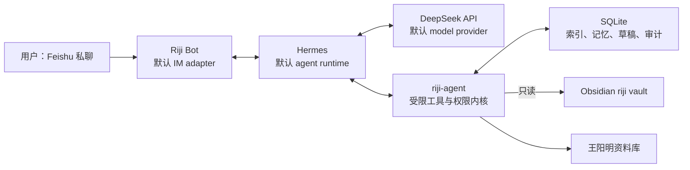
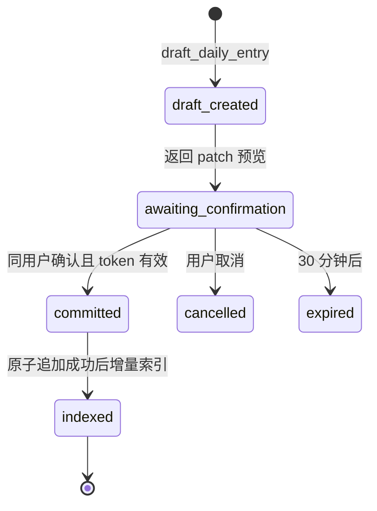

# MVP 架构设计：默认 Feishu + Hermes + DeepSeek 栈

**状态**：已确认设计（2026-06-24）  
**对应**：[MVP-00](https://github.com/doublew6/riji-agent/issues/11)  
**范围**：阶段 1 MVP。Feishu、Hermes、DeepSeek 是默认选项，而不是架构上唯一支持的实现。

## 1. 已确认决策

| 决策 | 结论 |
| --- | --- |
| IM 入口 | 默认使用一个 Feishu `Riji` Bot；用户在同一 Bot 内通过命令或按钮切换导师。 |
| 推理与编排 | 默认由 Hermes 使用 DeepSeek 执行多轮 agent 推理、工具调用、Feishu 会话路由与定时任务。 |
| 数据边界 | riji-agent 是唯一可读写日记、记忆、草稿和审计库的本地服务；Hermes 不直接拥有 vault 权限。 |
| 记忆 | 日记与已确认长期记忆共享；导师会话历史和未确认工作记忆隔离。 |
| 内容排除 | `private: true` 日记不得出现在检索结果或 `read_note` 出云内容中。系统坚持最小片段出云，不上传完整 vault。 |
| 日记写入 | 结构化 patch → 飞书预览 → 用户确认 → 按日记模板的目标区块追加；绝不覆写已有内容。 |

## 2. 系统边界与职责



| 组件 | 负责 | 明确不负责 |
| --- | --- | --- |
| Feishu / Riji Bot | 接收私聊、展示导师选择和草稿预览；默认 IM adapter | 存放日记、持有模型密钥 |
| Hermes | 默认 agent runtime：内置 Feishu 接入、路由、会话、DeepSeek 多轮调用、cron/skills | 直接读写 vault、保存权威长期事实 |
| riji-agent | 工具实现、权限、本地索引、草稿状态机、原子写入、审计 | Feishu 协议、任意终端或任意文件读取 |
| SQLite | 索引元数据、会话映射、草稿、已确认记忆、审计事件 | 原始 vault 的替代副本 |
| DeepSeek | 默认 model provider：规划检索、调用已注册工具、基于证据回答 | 访问完整 vault、任意路径、未注册工具 |

Hermes 与 riji-agent 默认在同一台主机上通信。riji-agent 默认只监听 localhost，且以 `RIJI_JOURNAL_ROOT` 配置的 vault 路径只读打开日记源。Feishu + Hermes + DeepSeek 是 default stack, not the only supported architecture；后续 adapter 可以替换 IM、agent runtime 或 model provider。

## 3. 单 Bot、多导师与记忆

### 3.1 导师切换

MVP 只注册一个飞书 Bot：`Riji`。用户通过 `/导师 王阳明`、`/导师 直率教练` 或导师选择按钮切换。当前导师是用户偏好；每条消息可临时显式指定导师。

会话键：

```text
{feishu_user_id}:{persona_id}:{feishu_chat_id}
```

切换导师即切换会话历史；切回时恢复该导师自己的历史。

### 3.2 数据归属

| 数据 | 范围 | 其他导师可见 |
| --- | --- | --- |
| 日记、周记、月报 | 共享事实 | 是 |
| 已确认长期记忆、稳定偏好 | 共享事实 | 是 |
| 聊天历史 | 导师私有 | 否 |
| 临时观察、记忆候选 | 导师私有 | 否，确认前不可共享 |
| 王阳明思想资料 | 独立知识库 | 仅王阳明导师默认使用 |

建议最小数据表：`users`、`personas`、`sessions`、`confirmed_memories`、`memory_candidates`、`drafts`、`audit_events`、`documents`、`chunks`。

## 4. 工具契约

Hermes 向 DeepSeek 注册工具；工具实现只存在于 riji-agent。每个调用都携带：`feishu_user_id`、`persona_id`、`session_id`、`request_id`。riji-agent 根据这些字段执行能力检查和审计。

只读工具：

- `search_journal(query, date_from?, date_to?, tags?, top_k?)`
- `read_note(source_id)`
- `list_periods(kind?, date_from?, date_to?)`
- `timeline(topic, date_from, date_to, granularity)`
- `find_before_after(date, days, topic?)`
- `search_yangming(query, top_k?)`（仅王阳明导师默认可用）

写入工具：

- `draft_daily_entry(content, target_date?, persona_id)`：生成草稿与结构化 patch，**不写文件**。
- `commit_draft(draft_id, confirmation_token)`：仅同一用户的、未过期且待确认草稿可提交。

所有工具结果都带 `request_id` 与稳定来源 ID。最终回答引用 `[[riji/daily/YYYY-MM-DD]]`，并区分日记事实、王阳明资料引用与模型推断。

## 5. 日记草稿与模板追加



### 5.1 Patch 是唯一的写入意图

模型不能返回整篇日记或任意文件路径，只能生成受限 patch：

```json
{
  "target_date": "2026-06-24",
  "operations": [
    {"section": "Evening", "mode": "append_bullet", "content": "与团队讨论了……"},
    {"section": "Daily Learning/AI", "mode": "append_bullet", "content": "梳理了 agent 架构。"}
  ]
}
```

riji-agent 校验 patch、生成 diff、显示预览并负责执行；不信任模型提供的路径或 Markdown 结构。

### 5.2 与 `riji/templates/daily.md` 对齐的追加规则

标题是唯一锚点。内容按下表归类：

| 内容 | 区块 |
| --- | --- |
| 早晨计划、当日意图 | `🌅 Morning` 或 `🎯 Most Important Task (MIT)` |
| 待办、习惯 | `📋 Today's Tasks` |
| 运动数据 | `💪Workout` 表格 |
| 晚间事件、状态、工作记录 | `🌆 Evening` |
| 反思、情绪、原则复盘 | `🪞 Self Reflection` |
| AI / Quant / 其他学习 | `📚 Daily Learning` 的对应项 |
| 无法可靠归类的自由记录 | `🧠 Notes` |

- 目标日期已存在：读取最新文件，在目标标题所属区块末尾追加，不更改其他文本。
- 目标日期不存在：基于 `riji/templates/daily.md` 实例化当天文件，再追加 patch。
- 找不到目标标题或内容无法安全写入表格：拒绝提交，保留草稿，要求人工调整；不猜测位置。
- 写入通过临时文件和原子替换完成。成功后记录 `before_hash`、`after_hash`、区块和 `request_id`，再触发增量索引。

确认 token 绑定 `draft_id + feishu_user_id + session_id`，30 分钟失效且只能使用一次。群聊永远不可创建或确认草稿。

## 6. 隐私、最小化与审计

这是 **not a zero-egress system**：Feishu 消息会经过 Feishu/Lark 服务；DeepSeek 会收到问题、系统提示和检索命中的 bounded journal snippets。complete vault、原始 Markdown 文件、本地 SQLite 和 API keys 不上传。带 `private: true` 的日记内容不得出云。

强制措施：

1. 限制每次工具结果的条数、单片段长度和总字数；`read_note` 仅在已有检索证据时允许。
2. 不使用云端文件上传、云端向量库或云端持久会话。
3. API Key 仅在本机环境变量；飞书端没有密钥。
4. 审计记录调用元数据、来源 ID、摘要哈希、出云片段计数和结果；不复制完整敏感文本。
5. 飞书仅允许白名单用户私聊；以事件 ID / `request_id` 去重。

## 7. 故障策略

| 情况 | 处理 |
| --- | --- |
| DeepSeek 超时 | 返回简短失败说明；不自动创建写入，不重试提交。 |
| 检索无结果 | 明确说明“日记中未找到足够证据”，不臆测。 |
| 索引过期 | 先检测源文件变更，必要时增量更新再回答。 |
| 飞书重复事件 | 以事件 ID / `request_id` 幂等去重。 |
| 草稿重复确认 | DB 级原子认领 `AWAITING→COMMITTING`，仅一个 worker 写入；多 worker 部署亦安全。 |
| 写入冲突 | 重新读取最新文件，重新生成 diff，要求再次确认。 |
| 模板解析失败 | 不写文件，保留草稿并请求人工处理。 |

## 8. 模块边界与实施顺序

开源版本的长期模块边界应围绕本地日记 core 和可替换 adapter 组织。默认栈仍是 Feishu + Hermes + DeepSeek，但这些默认选项不应成为 core 的编译期或运行时前提。

```text
src/riji_agent/
  core/          # journal index, retrieval, drafts, audit, privacy gates
  im/            # Feishu default; future Telegram/Slack/CLI/Web adapters
  agent/         # Hermes default; future native loop or other runtimes
  models/        # DeepSeek default; OpenAI-compatible/provider adapters
  personas/      # persona config, tool permissions, source boundaries
  config/        # settings, init, doctor, safe validation
  integrations/  # optional glue code and installers
```

### 8.1 依赖规则

- Core must not depend on Feishu, Hermes, or DeepSeek.
- IM adapters only map external chat payloads into riji-agent's internal message contract and send replies back through the transport.
- Agent runtimes only orchestrate registered tools; they do not read the vault, SQLite files, or arbitrary local paths.
- Model providers only adapt model APIs; they do not know journal paths, IM payload shapes, or write semantics.
- `personas` may define prompts and tool permissions, but concrete IM/runtime/provider adapters must be injected from the outside.
- `integrations` may patch or bridge third-party software, but it remains optional glue over stable local contracts.

### 8.2 current code to target modules

| Current code | Target module | Notes |
| --- | --- | --- |
| `journal/`, `retrieval/`, `drafts/`, `audit/`, `memory/`, `yangming/` stores | `core/` | These modules own local data, privacy gates, indexing, draft state, and audit metadata. |
| `hermes/models.py`, Feishu chat fields in `hermes/*` | `im/feishu/` plus a neutral internal message model | Feishu remains the default IM adapter, but the gateway should consume platform-neutral chat messages. |
| `hermes/gateway.py`, `hermes/api.py`, `hermes/responder.py` | `agent/hermes/` or `agent/runtime/` plus a generic gateway service | Keep `/hermes/messages` compatible while extracting runtime-neutral authorization, routing, and idempotency. |
| `llm/deepseek.py`, `llm/types.py` | `models/deepseek.py`, `models/types.py` | DeepSeek remains default; provider contract should stay OpenAI-compatible where practical. |
| `integrations/hermes_bridge.py`, `integrations/hermes_installer.py` | `integrations/hermes/` | Optional installer and bridge code; never required by core. |
| `config.py`, CLI setup in `main.py` | `config/` and CLI commands | Future `init` and `doctor` commands should validate the default stack without printing secrets. |

### 8.3 迁移顺序

1. 先冻结本文档作为模块化基线，不在同一个 PR 中大规模移动代码。
2. 迁移模型层：把 DeepSeek 变成默认 `models` adapter，并保留现有 provider contract。
3. 迁移 IM 层：抽象 Feishu 消息为内部 message contract。
4. 迁移 Agent runtime 层：保留 Hermes 入口兼容，同时提取 runtime-neutral gateway。
5. 增加 `init` / `doctor` / demo quickstart，让默认栈开箱即用。

实施按 #1 → #2/#3/#4 → #5 → #6 → #7/#8/#9 → #10 推进；所有 Issue 以本文档为共同基线。
