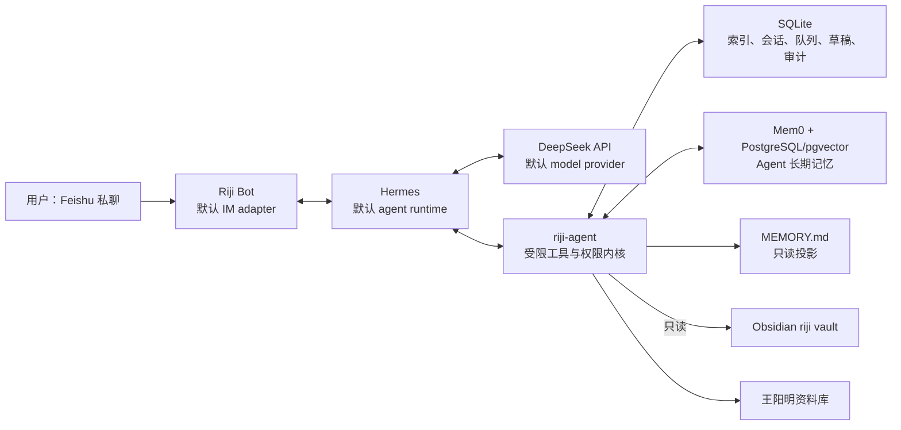
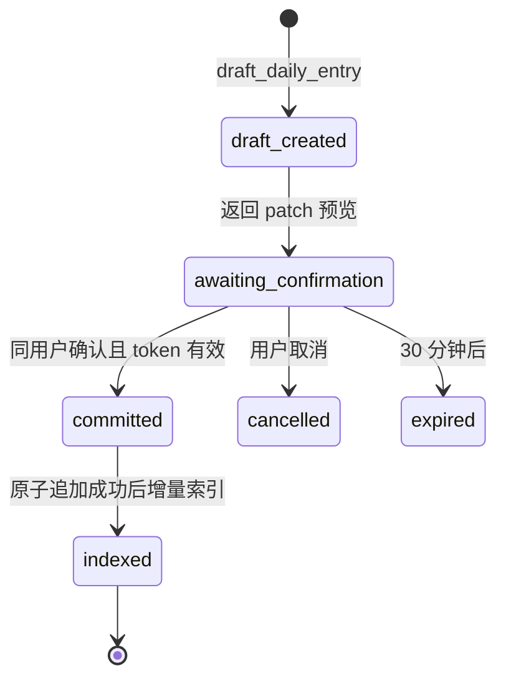
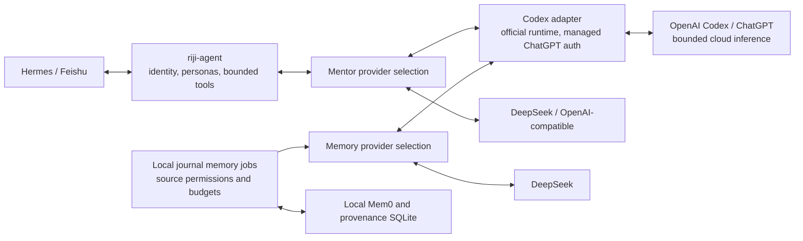

# MVP 架构设计：默认 Feishu + Hermes + DeepSeek 栈

**状态**：已确认设计（2026-06-24）  
**对应**：[MVP-00](https://github.com/doublew6/riji-agent/issues/11)  
**范围**：阶段 1 MVP。Feishu、Hermes、DeepSeek 是默认选项，而不是架构上唯一支持的实现。

**导师增量（2026-09-10）**：[导师沟通与多导师辩论技术设计](mentor-dialogue-and-debate.md)对应 [PRD v0.2](../product/mentor-dialogue-and-debate.md)。通用身份、讨论编排和本地渠道已实现并部署到 Air；飞书多应用与私人群仍待真实接入验收。本文的单 Bot 与私聊限定继续作为旧入口运行基线；新设计不允许把群请求伪装成私聊，群内日记草稿与提交仍禁止。

## 1. 已确认决策

| 决策 | 结论 |
| --- | --- |
| IM 入口 | 默认使用一个 Feishu `Riji` Bot；用户在同一 Bot 内通过命令或按钮切换导师。 |
| 推理与编排 | 默认由 Hermes 使用 DeepSeek 执行多轮 agent 推理、工具调用、Feishu 会话路由与定时任务。 |
| 数据边界 | riji-agent 是唯一可读写日记、记忆、草稿和审计库的本地服务；Hermes 不直接拥有 vault 权限。 |
| 记忆 | 日记与共享长期事实跨导师可用；导师观察和会话历史隔离。Agent 长期记忆可自动捕获，日记写入仍必须确认。 |
| 内容排除 | `private: true` 日记不得出现在检索结果或 `read_note` 出云内容中。系统坚持最小片段出云，不上传完整 vault。 |
| 日记写入 | 结构化 patch → 飞书预览 → 用户确认 → 按日记模板的目标区块追加；绝不覆写已有内容。 |

## 2. 系统边界与职责


```mermaid
flowchart LR
  U["用户：Feishu 私聊"] --> F["Riji Bot\n默认 IM adapter"]
  F <--> H["Hermes\n默认 agent runtime"]
  H <--> D["DeepSeek API\n默认 model provider"]
  H <--> R["riji-agent\n受限工具与权限内核"]
  R <--> S["SQLite\n索引、会话、队列、草稿、审计"]
  R <--> M["Mem0 + PostgreSQL/pgvector\nAgent 长期记忆"]
  R --> K["MEMORY.md\n只读投影"]
  R -->|"只读"| V["Obsidian riji vault"]
  R --> Y["王阳明资料库"]
```

| 组件 | 负责 | 明确不负责 |
| --- | --- | --- |
| Feishu / Riji Bot | 接收私聊、展示导师选择和草稿预览；默认 IM adapter | 存放日记、持有模型密钥 |
| Hermes | 默认 agent runtime：内置 Feishu 接入、路由、会话、DeepSeek 多轮调用、cron/skills | 直接读写 vault、保存权威长期事实 |
| riji-agent | 工具实现、权限、本地索引、草稿状态机、原子写入、审计 | Feishu 协议、任意终端或任意文件读取 |
| SQLite | 索引元数据、会话映射、运行偏好、捕获队列、草稿、审计事件 | Agent 长期记忆权威库、原始 vault 的替代副本 |
| Mem0 + PostgreSQL/pgvector | 共享用户事实和导师私有观察 | 日记原文、会话历史、API 密钥 |
| `MEMORY.md` | Mem0 当前有效记忆的人类可读投影 | 权威数据源、反向导入入口 |
| DeepSeek | 默认 model provider：规划检索、调用已注册工具、基于证据回答 | 访问完整 vault、任意路径、未注册工具 |

Hermes 与 riji-agent 默认在同一台主机上通信。riji-agent 默认只监听 localhost，且以 `RIJI_JOURNAL_ROOT` 配置的 vault 路径只读打开日记源。Feishu + Hermes + DeepSeek 是 default stack, not the only supported architecture；后续 adapter 可以替换 IM、agent runtime 或 model provider。

## 3. 单 Bot、多导师与记忆

### 3.1 导师切换

MVP 只注册一个飞书 Bot：`Riji`。用户通过 `/导师 王阳明`、`/导师 直率教练` 或导师选择按钮切换。当前导师是用户偏好；每条消息可临时显式指定导师。

会话键：

```text
{feishu_user_id}:{persona_id}:{feishu_chat_id}
```

切换导师即切换会话历史；切回时恢复该导师自己的历史。

### 3.2 数据归属

| 数据 | 范围 | 其他导师可见 |
| --- | --- | --- |
| 日记、周记、月报 | 共享事实 | 是 |
| Mem0 用户事实、稳定偏好 | 共享事实 | 是 |
| 聊天历史 | 导师私有 | 否 |
| 导师长期观察 | 导师私有 | 否 |
| 王阳明思想资料 | 独立知识库 | 仅王阳明导师默认使用 |

Agent 长期记忆的权威存储为本地 Mem0 Self-Hosted（PostgreSQL/pgvector）；SQLite 保留会话、运行偏好、捕获队列和追加式变更日志。`MEMORY.md` 仅是自动生成的只读快照，不参与双向同步。

`memory_organization_runs` 保存主动整理请求、输入 ID/版本清单和带证据报告。
捕获及人工变更后入队，worker 空闲时执行有界、按用户与导师隔离的模型归纳。
报告的内容版本决定展示有效性；分类和语义比较不改变 Mem0 正文。已标注为
阶段性且 90 天未复核的有效记忆在候选内排序后移，仍可召回。用户复核更新
`reviewed_at` 并记录 `RECONFIRM`，归档和恢复继续走原有审计接口。

## 4. 工具契约

Hermes 向 DeepSeek 注册工具；工具实现只存在于 riji-agent。每个调用都携带：`feishu_user_id`、`persona_id`、`session_id`、`request_id`。riji-agent 根据这些字段执行能力检查和审计。

只读工具：

- `search_journal(query, date_from?, date_to?, tags?, top_k?)`
- `read_note(source_id)`
- `list_periods(kind?, date_from?, date_to?)`
- `timeline(topic, date_from, date_to, granularity)`
- `find_before_after(date, days, topic?)`
- `search_yangming(query, top_k?)`（仅王阳明导师默认可用）
- `session_search(query, top_k?)`（同一用户、导师和聊天中的历史用户原话；
  每段最多 400 字符、合计 1500 字符，使用 `conversation/<id>` 来源）

写入工具：

- `draft_daily_entry(content, target_date?, persona_id)`：生成草稿与结构化 patch，**不写文件**。
- `commit_draft(draft_id, confirmation_token)`：仅同一用户的、未过期且待确认草稿可提交。

所有工具结果都带 `request_id` 与稳定来源 ID。最终回答引用 `[[riji/daily/YYYY-MM-DD]]`，并区分日记事实、王阳明资料引用与模型推断。

## 5. 日记草稿与模板追加


```mermaid
stateDiagram-v2
  [*] --> draft_created: draft_daily_entry
  draft_created --> awaiting_confirmation: 返回 patch 预览
  awaiting_confirmation --> committed: 同用户确认且 token 有效
  awaiting_confirmation --> cancelled: 用户取消
  awaiting_confirmation --> expired: 30 分钟后
  committed --> indexed: 原子追加成功后增量索引
  indexed --> [*]
```

### 5.1 Patch 是唯一的写入意图

模型不能返回整篇日记或任意文件路径，只能生成受限 patch：

```json
{
  "target_date": "2026-06-24",
  "operations": [
    {"section": "Evening", "mode": "append_bullet", "content": "与团队讨论了……"},
    {"section": "Daily Learning/AI", "mode": "append_bullet", "content": "梳理了 agent 架构。"}
  ]
}
```

riji-agent 校验 patch、生成 diff、显示预览并负责执行；不信任模型提供的路径或 Markdown 结构。

### 5.2 与 `riji/templates/daily.md` 对齐的追加规则

标题是唯一锚点。内容按下表归类：

| 内容 | 区块 |
| --- | --- |
| 早晨计划、当日意图 | `🌅 Morning` 或 `🎯 Most Important Task (MIT)` |
| 待办、习惯 | `📋 Today's Tasks` |
| 运动数据 | `💪Workout` 表格 |
| 晚间事件、状态、工作记录 | `🌆 Evening` |
| 反思、情绪、原则复盘 | `🪞 Self Reflection` |
| AI / Quant / 其他学习 | `📚 Daily Learning` 的对应项 |
| 无法可靠归类的自由记录 | `🧠 Notes` |

- 目标日期已存在：读取最新文件，在目标标题所属区块末尾追加，不更改其他文本。
- 目标日期不存在：基于 `riji/templates/daily.md` 实例化当天文件，再追加 patch。
- 找不到目标标题或内容无法安全写入表格：拒绝提交，保留草稿，要求人工调整；不猜测位置。
- 写入通过临时文件和原子替换完成。成功后记录 `before_hash`、`after_hash`、区块和 `request_id`，再触发增量索引。

确认 token 绑定 `draft_id + feishu_user_id + session_id`，30 分钟失效且只能使用一次。群聊永远不可创建或确认草稿。

## 6. 隐私、最小化与审计

这是 **not a zero-egress system**：Feishu 消息会经过 Feishu/Lark 服务；DeepSeek 会收到问题、系统提示和检索命中的 bounded journal snippets。complete vault、原始 Markdown 文件、本地 SQLite 和 API keys 不上传。带 `private: true` 的日记内容不得出云。

强制措施：

1. 限制每次工具结果的条数、单片段长度和总字数；`read_note` 仅在已有检索证据时允许。
2. 不使用云端文件上传、云端向量库或云端持久会话。
3. API Key 仅在本机环境变量；飞书端没有密钥。
4. 审计记录调用元数据、来源 ID、摘要哈希、出云片段计数和结果；不复制完整敏感文本。
5. 飞书仅允许白名单用户私聊；以事件 ID / `request_id` 去重。

### 6.1 检索证据范围（Issue #48）

AgentRunner 在默认与自定义人设系统提示后都追加同一证据边界；生产
AgentResponder 的自定义提示路径也适用。五个日记读取工具的成功观测保留原字段，
额外提供 `evidence_scope`：包含选择范围、`journal_completeness=not_established`
及解释。关键词/主题/日期/标签过滤、可见性、结果数量和片段限制都可能留下缺口。
`empty_periods` 仅指该主题没有返回证据的时间桶；`truncated=false` 不证明结果穷尽。
单条命中不证明唯一事件，空结果不证明当天没有日记或事件。正文读取仅支持对该来源
实际可见内容的判断，元数据列表不能替代事件正文。

五个工具成功返回的 `date_basis` 明确 `date=journal_note_metadata`：日期取自日记
元数据（frontmatter 优先、文件名回退），不是提取出的事件日期。
`event_dates_and_relations=require_returned_content_evidence` 表示事件日期和前后关系
应依据返回正文；元数据没有确定事件日期，不等于正文中的明确事件日期不可使用。

`find_before_after.query_anchor` 从已解析并由检索服务返回的 `pivot/days` 构造，含
规范 ISO 日期、窗口半径、`kind=retrieval_window_center` 和记录日期比较方式。
`before/on/after` 比较的是记录日期与此检索中心；`event_date=not_established_by_query`
明确查询没有证实中心日期为事件日期。`timeline.query_window` 同样使用服务返回的
日期范围和粒度，按记录日期分桶；周/月桶不是事件日。模型额外传入的同名参数不能
覆盖这些字段，错误或未授权调用不产生这些成功元数据。

回答应逐条保留记录日期和所述经历，再比较变化。同主题的多条记录可能是不同次事件，
不能仅由分组推成同一次事件的前、中、后。正文明确的另一事件日期仍可单独引用；
优先使用有依据的绝对日期，相对天数须核算日历差。原 `date`、片段、正文及来源性质
字段保持不变，不增加事件日期提取器，也不伪造未知日期。

这项约束不增加扫描、来源读取或权限，也不按关键词改写最终回答。新增观测仍参与
既有发送前重验。离线测试只验证请求、工具观测、来源和权限契约；模型是否持续遵守
表述边界须用原合成检索题的新批次重复调用并独立复核内容，不能用工具成功率代替。

## 7. 故障策略

| 情况 | 处理 |
| --- | --- |
| DeepSeek 超时 | 返回简短失败说明；不自动创建写入，不重试提交。 |
| 检索无结果 | 明确说明“日记中未找到足够证据”，不臆测。 |
| 索引过期 | 先检测源文件变更，必要时增量更新再回答。 |
| 飞书重复事件 | 以事件 ID / `request_id` 幂等去重。 |
| 草稿重复确认 | DB 级原子认领 `AWAITING→COMMITTING`，仅一个 worker 写入；多 worker 部署亦安全。 |
| 写入冲突 | 重新读取最新文件，重新生成 diff，要求再次确认。 |
| 模板解析失败 | 不写文件，保留草稿并请求人工处理。 |

## 8. 模块边界与实施顺序

开源版本的长期模块边界应围绕本地日记 core 和可替换 adapter 组织。默认栈仍是 Feishu + Hermes + DeepSeek，但这些默认选项不应成为 core 的编译期或运行时前提。

> 面向贡献者的、已落地的模块边界与「如何新增 adapter」步骤见 [modules.md](modules.md)。本节是设计基线，modules.md 是实现现状。

```text
src/riji_agent/
  core/          # journal index, retrieval, drafts, audit, privacy gates
  im/            # Feishu default; future Telegram/Slack/CLI/Web adapters
  agent/         # Hermes default; future native loop or other runtimes
  models/        # DeepSeek default; OpenAI-compatible/provider adapters
  personas/      # persona config, tool permissions, source boundaries
  config/        # settings, init, doctor, safe validation
  integrations/  # optional glue code and installers
```

### 8.1 依赖规则

- Core must not depend on Feishu, Hermes, or DeepSeek.
- IM adapters only map external chat payloads into riji-agent's internal message contract and send replies back through the transport.
- Agent runtimes only orchestrate registered tools; they do not read the vault, SQLite files, or arbitrary local paths.
- Model providers only adapt model APIs; they do not know journal paths, IM payload shapes, or write semantics.
- `personas` may define prompts and tool permissions, but concrete IM/runtime/provider adapters must be injected from the outside.
- `integrations` may patch or bridge third-party software, but it remains optional glue over stable local contracts.

### 8.2 Agent runtime contract

The default runtime adapter is `agent/hermes.py`, which exposes Hermes as `HermesAgentRuntime` and keeps the existing `/hermes/messages` router compatible. A non-Hermes runtime should call the same local boundary:

1. Normalize transport input into `im.models.IncomingChatMessage`.
2. Pass the message to an `agent.runtime.AgentRuntime` implementation.
3. Let riji-agent perform shared-secret verification, allowlist checks, idempotency, persona routing, registered tool orchestration, and draft confirmation.
4. Return only the gateway reply to the transport.

`integrations/hermes_*` remains optional installer/bridge glue for the default stack; it is not required by core, IM adapters, model providers, or future agent runtimes.

### 8.3 current code to target modules

| Current code | Target module | Notes |
| --- | --- | --- |
| `journal/`, `retrieval/`, `drafts/`, `audit/`, `memory/`, `yangming/` stores | `core/` | These modules own local data, privacy gates, indexing, draft state, and audit metadata. |
| `hermes/models.py`, Feishu chat fields in `hermes/*` | `im/feishu/` plus a neutral internal message model | Feishu remains the default IM adapter, but the gateway should consume platform-neutral chat messages. |
| `hermes/gateway.py`, `hermes/api.py`, `hermes/responder.py` | `agent/hermes/` or `agent/runtime/` plus a generic gateway service | Keep `/hermes/messages` compatible while extracting runtime-neutral authorization, routing, and idempotency. |
| ~~`llm/deepseek.py`, `llm/types.py`~~ (removed) | `models/deepseek.py`, `models/types.py`, `models/registry.py` | Done: the `llm/` shim is gone. DeepSeek is the default over a generic `OpenAICompatibleProvider`; selection goes through `models/registry.py`. |
| `integrations/hermes_bridge.py`, `integrations/hermes_installer.py` | `integrations/hermes/` | Optional installer and bridge code; never required by core. |
| `config.py`, CLI setup in `main.py` | `config/` and CLI commands | Future `init` and `doctor` commands should validate the default stack without printing secrets. |

### 8.4 迁移顺序

1. 先冻结本文档作为模块化基线，不在同一个 PR 中大规模移动代码。
2. 迁移模型层：把 DeepSeek 变成默认 `models` adapter，并保留现有 provider contract。
3. 迁移 IM 层：抽象 Feishu 消息为内部 message contract。
4. 迁移 Agent runtime 层：保留 Hermes 入口兼容，同时提取 runtime-neutral gateway。
5. 增加 `init` / `doctor` / demo quickstart，让默认栈开箱即用。

实施按 #1 → #2/#3/#4 → #5 → #6 → #7/#8/#9 → #10 推进；所有 Issue 以本文档为共同基线。

## 9. Journal-derived memory extension (#40)

The approved journal-memory increment adds source discovery, durable fragment jobs,
structured extraction, relation validation and evidence-gated retrieval on top of
the existing Mem0 backend. `journal-memory.sqlite3` owns provenance, relationships,
budgets, suppression and recovery state; Mem0 remains authoritative for memory text.
The local wrapper validates source permissions and versions on read and before/after
write. The pinned Mem0 API extension supplies idempotent explicit writes, operation
lookup, complete export and targeted history erasure. No diary path is mounted into
Mem0 or exposed to Hermes. See [the detailed design](journal-memory.md) and
[the operating guide](../journal-memory.md). Air deployment is a separate acceptance
step; the current development checkout is not the production runtime.

## 10. Codex provider extension (2026-09-09)

The optional Codex adapter sits behind the existing `LLMProvider` contract.
`RIJI_MODEL_PROVIDER` selects the foreground mentor provider independently from
`RIJI_MEMORY_MODEL_PROVIDER`, which selects extraction, reconciliation, native
chat capture and organization. Defaults remain DeepSeek. Mem0, local embeddings,
source lifecycle and journal draft semantics do not depend on either selection.


```mermaid
flowchart LR
  H["Hermes / Feishu"] <--> R["riji-agent\nidentity, personas, bounded tools"]
  J["Local journal memory jobs\nsource permissions and budgets"] --> E["Memory provider selection"]
  R <--> P["Mentor provider selection"]
  P <--> C["Codex adapter\nofficial runtime, managed ChatGPT auth"]
  E <--> C
  P <--> D["DeepSeek / OpenAI-compatible"]
  E <--> DS["DeepSeek"]
  C <--> O["OpenAI Codex / ChatGPT\nbounded cloud inference"]
  J <--> M["Local Mem0 and provenance SQLite"]
```

The official `codex exec` runtime owns authentication and refresh. A dedicated
persistent `RIJI_CODEX_HOME` (default `RIJI_DATA_DIR/codex`) requires its own first
official login and is shared by mentor and memory calls. Personal Codex config,
credentials and global AGENTS are not copied or linked into that directory.
The adapter
requires ChatGPT-managed authentication and never extracts tokens, implements a
private ChatGPT HTTP client, or falls back to an API key. Each model call uses an
`--ephemeral` context; application-owned history is selected by user, mentor and chat
before transmission. Existing personal Codex threads are never resumed.

An optional `RIJI_CODEX_PROXY_URL` secret configures an existing local proxy for
Codex child processes when SSH or LaunchAgent does not inherit macOS system proxy
settings. Validation accepts only HTTP(S), a loopback host and an explicit port,
without userinfo, application paths, query or fragment. Unset preserves the
existing allowed proxy-environment inheritance; an explicit value overrides only
the child environment and restricts its `NO_PROXY` to local addresses. The parent
process, system proxy, Feishu and Mem0 settings are untouched. This changes the
transport route to the same OpenAI destination, not model tool permissions or
journal consent scope. Diagnostics must not expose the secret proxy URL.

Codex has no general shell, file, browsing, connector or coding-tool capability.
The adapter passes only application-approved context and receives structured
answer/tool-intent output. Tool execution stays in the local gateway, with the
existing identity, allowlist, retrieval, budget and draft-confirmation checks.
Unexpected server requests or unsupported isolation settings fail closed; an
empty working directory or read-only sandbox alone is not the isolation boundary.
Only the verified CLI versions `0.153.4` and `0.153.0-alpha.5` are accepted by this
release. Unknown versions fail closed until their actual tool and instruction
isolation is revalidated; neither client nor model selection upgrades implicitly.

A shared in-process call scheduler gives waiting mentor calls priority over
waiting background work without interrupting an active call. Bounded execution
and classified errors retain local job recovery; quota/authentication failures
never silently select another paid provider. This does not reserve account quota
against the user's other Codex clients.

Before each actual send, including after queue wait and runtime startup, the
foreground loop revalidates selected memory context and every retained read-tool
result. Source checks re-read current permission and full content hashes rather
than trusting the index. Local memory/observation material, persona constraints
and preferences must still match; coverage counters and retrieval scores alone
do not invalidate an otherwise permitted context. These guards and the provider
request deadline are scoped to a single mentor request across all model rounds.

Extraction and recall destinations and model IDs are part of the journal consent
binding and visible Review state. A provider/model change invalidates the old
binding. Native messages and Feishu transport remain separate disclosed data
flows. Ephemeral contexts do not imply zero cloud retention, and ChatGPT data
controls must not be represented as API data controls.

The release gate includes protocol/output validation, forbidden-tool requests,
auth/quota/timeouts, mentor isolation, strict write confirmation, consent changes
and Air synthetic-model checks before real historical initialization. Runtime
versions, test results and actual coverage belong in the deployment record; the
approved design is not evidence that these checks have passed. See
[Codex operations](../codex-provider.md) and [PRD acceptance](../PRD.md#164-新增验收).
