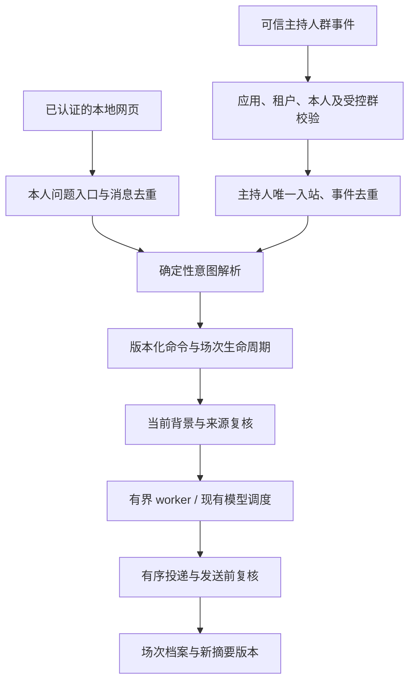

# 常驻导师问题、分场讨论与 AI 日记结果技术设计

更新：2026-09-11。对应 [PRD v0.3](../product/PRD-persistent-mentor-roundtable.md)，承接 [Issue #43](https://github.com/doublew6/riji-agent/issues/43)。**Air 已部署，生产飞书常驻群仍受能力门禁限制。** 本文件记录代码契约；验收证据分别见[本地验证记录](../persistent-mentor-roundtable-acceptance.md)与[Air 部署记录](../persistent-mentor-roundtable-air-2026-09-11.md)，部署完成不代表生产群已开放。

旧[导师总体设计](mentor-dialogue-and-debate.md)中的身份、最小来源、模型调度与严格私聊确认继续适用。本增量替代其中“一次完整讨论等于一个群”、结束后只支持单次追问、无类型讨论转日记的部分。生产配置、接收器所有权和既有私人记忆不在本轮自动迁移。

## 1. 问题、场次与可见范围

一个 `Conversation(kind=roundtable)` 表示持续存在的问题，持有固定 `room_id`、owner、分享授权和完整群成员对应的 `personas`。新的 `DiscussionRun` 表示一次有界运行。两者分离后，结束、补充、插问、新一场参考/辩论均不创建新群。

| 对象 | 关键字段 | 契约 |
| --- | --- | --- |
| Conversation | owner_id、personas、room_id、run_id、run_personas、run_number、summary_id/version、correction_version、suspended_run_id | owner 与完整可见范围固定；当前运行指针可以推进 |
| DiscussionRun | id、number、kind、mode、personas、summary_version、input_revision、status、reanalyze | 保存实际发言者、运行所用摘要和终态；单次主持人或点名回应也留记录 |
| Artifact | run_id、origin_kind、input_revision、source_refs、dependencies | 不依靠群消息顺序重建历史；已展示内容保留来源和所属运行 |
| WorkingSummary | version、input_revision、correction_version、covered_artifact_ids、items、pending_artifact_ids | 当前版本与历史版本分开，不能用落后的摘要覆盖纠正 |
| SummaryItem | kind、text、artifact_ids、dependencies、occurred_at | 原话、计划、反馈、AI 建议、待验证事项分别带回溯依据 |

网页新建圆桌固定四位导师可见，用户勾选本次 2–4 位发言者；`personas` 与 `run_personas` 分别传入创建接口。全部在群机器人都属于接收范围，未发言并不减少资料授权要求。现有只含两位导师的旧问题不自动扩群。

同群多主题、动态增减成员、其他真人协作仍不属于本版。新问题由明确新建流程处理；不能从一条背景补充自行猜测切换主题。

## 2. 输入与执行



自然输入由 `mentors/group_dialogue.py` 做有界、确定性解析；模型不能选择命令或伪造 owner。普通群输入的前置身份和群权限仍由入口核验。mention 名称仅用于选择四个固定角色，不是身份认证依据；未知、多个或与正文冲突的点名先澄清。

| 输入 | 命令/行为 |
| --- | --- |
| 普通补充 | `supplement`；空闲时主持人回应一次，活跃讨论中接收背景并暂停旧前提任务，等待明确恢复 |
| “收到”“谢谢”等 | 简短确定性回应，不请求模型、不保存日记 |
| 点名一位导师并提问 | `followup`，仅该导师回答一次 |
| “请几位导师分别给我参考” | `start_run(mode=reference)`，沿用本题上次发言者 |
| “请大家就这个分歧辩论一下” | 已完成参考且未另开新场时 `debate`；其他可开始状态按新场处理 |
| “请四位重新讨论” | `start_run(mode=debate)`，明确新场；“重新”本身不删除旧 AI 前提 |
| “重新分析” | 主持人单次 `reanalyze`，只用当前用户背景；不自动召集全桌 |
| “请四位重新讨论，不沿用旧结论” | 新完整场次 + `reanalyze=true` |
| “继续上次” | `continue`；有中断任务时不能隐式重启，另用恢复入口处理 |
| “停止讨论”／“先总结” | `stop`／`summarize`；停止不额外生成总结 |
| 归档／恢复问题 | `archive`／`restore`，群和档案保留 |
| “把这次结果记到日记里” | 选择最新有效结果，产生私聊转交意图，不创建群内草稿 |

否定、引号中的命令、代码和转述不能启动全桌；不能明确识别的普通句子只进入主持人路径。自然语言解析不是开放式任意表达分类器，页面提供确定按钮作为补充。

`DiscussionIngress.receive_owner` 对网页自然消息按 owner、问题、请求 ID 保存原始文本指纹和结果。重试先读取原结果，再考虑当前 input revision；相同 ID 携带不同文本拒绝。已留下处理标记却无结果的请求进入核对状态，重启后不盲目重放。飞书入口沿用应用、群、message/action 的持久去重。控制命令仍由 `Command.expected_revision` 防止旧页面修改新状态。

活跃完整讨论中的指定导师插问会暂停并保存原场次，新建一次短回应；完成后只有显式 `resume` 恢复原场次和原剩余额度。旧 execution 的 `cancel_epoch`、输入版本及租约不再有效，未展示的旧结果取消。结果未知或投递状态未知时要求核对，不能靠“新一场”自动重试。

模型生成期间使用每 30 秒的执行心跳维持原 180 秒租约，续租必须在事务内确认同一 run/input/cancel epoch/lease generation、仍有权限且原租约未过期；调用结束后停止并回收心跳。心跳不会增加模型请求或恢复预算，单次追问仍限 120 秒、完整圆桌仍限 600 秒，迟到结果必须通过提交事务内的时间检查。旧执行的迟到失败与权限检查也受完整身份约束，不能污染已切换的新场次。细节见[导师编排架构的预算与续租契约](mentor-dialogue-and-debate.md)。

## 3. 预算与状态

完整讨论上限沿用每场 24 次请求、600 秒，预留最后一次收束；单次主持人/指定导师回应沿用 7 次、120 秒。参考、比较、辩论、综合共享同一个完整场次账本；`debate` 不创建新账本。显式新完整场次才分配新账本，普通补充、时间经过、重试和服务重启不刷新额度。所有场次累计请求在网页显示。

旧初始运行继续使用原 conversation ID 对应账本，避免升级后重复领取额度。新完整运行和短回应使用各自 run ID。暂停与恢复累计实际用时，不能重置已消耗请求。原有日记片段 900 字符、每来源版本累计 4000 字符以及上层授权和用途预算继续执行。

`completed/partial/stopped` 可以接话或明确开新场；`archived` 为只读状态，恢复后重新核对问题与渠道；删除是独立命令。`waiting_user/interrupted` 与 `suspended_run_id` 表示尚需用户明确继续的工作，不自行连续执行。

## 4. 工作摘要与记忆

当前实现采用**确定性来源摘录**：保留未被纠正替代的用户原话，附上最近一次有效综合/比较/回应的 AI 建议、结构化不确定性和行动建议；不再把完整聊天档案逐次送给模型。每项均关联原 artifact，发生时间字段表示消息记录时间，不能据此把用户描述的事件日期改成消息日期。

本轮未引入模型语义压缩。摘要上限 48 条、18,000 字符，超过上限将版本标为 `pending` 并阻止依赖它的新讨论；保留完整原文和待处理 ID。用户可在页面选择原话纠正，或明确用整理后的背景替换全部当前背景，再继续。不能静默截掉新事实或反复请求模型压缩。

用户自然原话默认标为 `user_statement`，不凭关键词升级为事实。页面/命令可显式声明 `user_plan` 或 `user_feedback`；模型仍需区分原话中的假设、引语、未执行计划与实际反馈。自动语义分类、跨日质量与摘要压缩仍需要单独模型验收。

纠正必须给出要替换的用户 artifact ID，或明确 `replace_background=true`，不得把“更正：……”隐式解释为清空全部背景。更新增加 `correction_version`；旧原话与依赖旧背景的 AI 结果标为 superseded，档案可查但不作为有效前提。后台输出仍要重验执行版本。重新分析过滤摘要与跨问题转交背景中的旧 AI 建议、混合或不明性质片段，不删除历史，也不撤销用户明确陈述的计划。转交来源新增 content_kind；纯用户陈述、计划和反馈仍可在获准范围内使用。

长期记忆仍是独立层。圆桌结束、导师一致意见、主持人重述、保存 AI 结果都不触发长期事实自动捕获。群的所有接收者须对所用记忆获准，不能拼接四位导师的私聊观察。

来源变更/撤回时，历史摘要及发言隐藏依赖正文，下一次模型调用和尚未发送内容拒绝使用它。跨问题转交也必须重新验证原 artifact 的有效性，不能靠既有接受记录继续引用已被纠正的结论。用户已经确认保存的日记和独立导出副本不是自动删除对象，需独立管理。

## 5. 保存与来源类型

保存流程为：选定同一场次结果 → 创建不可变转交 → 已注册本人主持人私聊预览 → 用户明确确认 → 按既有模板锚点原子追加。

本地 `POST /conversations/{id}/handoffs` 只接受 1–5 个有效选项，可附带用户计划/反馈，不能混选不同 AI 场次。该接口只创建保存意图。群文字保存默认选择最新有效综合结果，不在群中展示个人日记 patch。旧群不可访问时，经过本地本人鉴权的档案与导出仍可用，保存仍必须在有效私聊完成。

转交固定：问题、run、artifact 列表及哈希、摘要版本、纠正版本、结果记录时间、发言导师和来源。开启另一场独立讨论不使原选定预览失效；内容纠正、所选结果过时、来源撤回、问题删除或预览过期会要求重新预览。重复保存事件和重复确认不追加第二份。

私聊语法：

```text
/接收转交 <handoff-id>
/修改转交 <handoff-id> | 修订后的保存正文
/转交日期 <handoff-id> YYYY-MM-DD
/确认转交 <handoff-id>
```

修改内容/日期生成新的转交 ID 与差异预览，旧确认 ID 失效；已保存版本保留，新版本另行确认追加，不覆盖既有日记。草稿的确认绑定本人、应用、私聊、所展示版本及事件，网页令牌不能绕过这条链路。

`DraftOperation` 增加 `content_type` 和 `provenance`，旧两字段记录兼容 `personal_journal`。会话消息 SQLite 增加带默认值的 content_type 列，已有普通会话保持兼容；已引用 AI 的派生回复持久保存该类型，重启不丢失。AI 结果使用 `ai_discussion_result`；正文按 `🧠 Notes` 追加独立“AI 导师讨论结果”callout，机器可读 JSON 边界携带来源，显示本地档案链接。找不到锚点拒绝写入，不能降级为无类型散文。保存确认仅证明用户允许写入，不证明建议已采纳或执行。

`journal/content.py` 在完整正文解析类型区间，再由索引/检索切分并保留 `content_spans`。缺失或损坏标记按 `unknown_ai` 处理，不因标题被切掉就变成本人事实。日记记忆提取在切片前排除 AI 区间，并在提取入口再次拒绝 AI 类型/来源。

常规检索、时间线、回顾和 read_note 默认只返回个人内容。只有可信用户明确提出“参考历史讨论……”等请求才启用 AI 历史检索；模型参数不能打开它。允许引用时，工具 JSON 携带区间类型和来源，系统提示要求明确标示 AI 建议。

本轮读取到 AI 资料后，普通模型日记工具及 Gateway 自动草稿回退均须阻止将其改写为个人记录；会话派生回复也保留内容类型，防止下一轮从历史中剥掉来源。专用结果保存仍可执行，用户独立提供新个人原文的原有记录流程仍可使用。

## 6. 本地页面与 API

页面 `/admin/mentors` 新增：固定问题列表、主持人默认回应、当前与历史摘要、原文回溯、场次与本次/累计用量、选择导师开新场、重新分析、选择原话纠正、归档恢复、选择 AI 保存结果。保存稿只提供本人私聊操作入口。`#discussion-<id>` 在登录后定位对应档案，链接不携带令牌。

新增自然输入接口 `/conversations/{id}/messages` 与保存选择接口 `/conversations/{id}/handoffs` 使用本人 Review token；原 `/messages` 是传输应用 token，两类凭据不互换。控制命令增加 `personas/mode/rounds/supersedes/statement_kind/replace_background/reanalyze`。界面使用 DOM textContent，令牌只在页面内存，CSP 保持同源请求和内联内容哈希。

导出格式升级到 v2，包含类型化产物、摘要、场次和来源版本；恢复兼容 v1，要求同账户校验，恢复为 sealed/stopped 的只读档案，不恢复授权、群关系、未确认写入或自动运行。旧讨论字段使用兼容默认值，并惰性建立摘要，不重新分配初始额度。

## 7. 飞书生产启用门槛

`FeishuRoomInspector` 本轮提供有界的只读证据收集：真人成员分页和截断检查、每个已知机器人以自身 token 查询是否在群、人数核对、群设置前后比较。主持人群消息可规范化为内部 Envelope，四导师的群副本及机器人消息不进入业务队列。

这些证据仍不足以把现有测试群开放为个人生产群，代码保持失败关闭：

- 已检查 SDK 的 GetChat 模型未提供足以证明新成员历史可见性的字段，`join_message_visibility` 不是历史消息读取权限。
- 真人成员分页不能替代机器人清单；要逐应用核验自身成员身份，并与 bot_count 核对未知额外机器人。
- 群设置两次相同、WebSocket 重连成功或 ping 正常，不能证明断连期间没有遗漏成员变化；当前没有可证明完整性的恢复游标。
- 原日记导师仍由 Hermes 独占接收；不得再开相同应用的并行长连接。普通群输入必须通过其唯一连接的专用、已核验桥接，或有序迁移接收权。原私聊 Gateway 不能仅放宽 chat_type。
- 真实普通群输入、成员映射、历史权限和持续管理约束仍需在 Air 与飞书后台完成验证，不能用人工 boolean 或合成 snapshot 代替。

官方 SDK 依据（代码基线固定 `lark-oapi==1.7.3`；链接为上游模型/实现，配置时仍须以已安装版本及真实平台探针核对）：[群信息字段](https://github.com/larksuite/oapi-sdk-python/blob/v2_main/lark_oapi/api/im/v1/model/get_chat_response_body.py)、[成员分页字段](https://github.com/larksuite/oapi-sdk-python/blob/v2_main/lark_oapi/api/im/v1/model/get_chat_members_response_body.py)、[当前应用成员身份查询](https://github.com/larksuite/oapi-sdk-python/blob/v2_main/lark_oapi/api/im/v1/model/is_in_chat_chat_members_request.py)、[长连接实现](https://github.com/larksuite/oapi-sdk-python/blob/v2_main/lark_oapi/ws/client.py)。本轮没有把无法提取正文的权限网页当作 scope 已验证证据。

## 8. 验证与后续交付

本地开发阶段以合成临时 vault、身份、模型和渠道验证，不访问真实日记，不向飞书发消息。后续 Air 升级检查及单个真实模型隔离样本见部署记录。验收分别记录业务状态机、API/页面、来源与草稿确认、模型质量及真实渠道；不能把合成模型或单个参考样本通过标为完整辩论质量通过。

生产部署仍严格以 Air 为唯一目标：确认 `ssh air` 主机型号、比对与备份、排除秘密和运行数据同步、Air runtime 测试通过后才变更依赖或重启。不能把开发机 8765 隧道或本地测试服务当作生产验收，也不修改共享 Colima。
