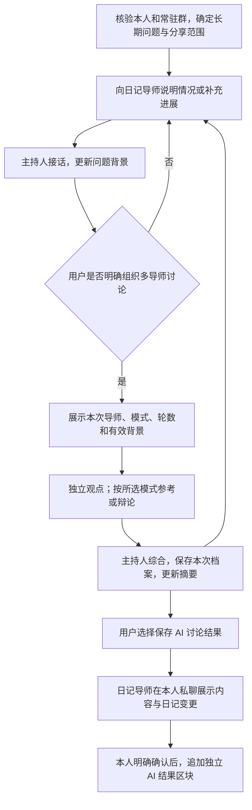

# 常驻导师群、讨论记忆与日记保存 PRD v0.3

## 1. 概要

用户长期保留一个私人导师群，围绕同一个问题持续沟通，由原有“日记导师”主持，并按需组织四位固定导师参考或辩论。系统更新这个问题的工作摘要，保留历次讨论；用户选择写入日记时，结果单独标为“AI 导师讨论结果”，与本人经历区分。

**状态：Air 已部署，生产飞书常驻群仍受能力门禁限制。** 本地业务验证、Air 升级检查及单个真实模型隔离样本已完成；生产群主持、真实渠道及完整模型质量验收仍待完成。代码契约见[技术设计](../architecture/persistent-mentor-roundtable.md)，交付证据见[本地验证](../persistent-mentor-roundtable-acceptance.md)及[Air 部署记录](../persistent-mentor-roundtable-air-2026-09-11.md)。本文是[导师 PRD v0.2](mentor-dialogue-and-debate.md)的后继增量，未修改的独立私聊、真实辩论、来源授权和严格日记确认要求继续适用。框架、接口、存储结构、接收器和具体预算参数由技术设计另行说明。

| 已确认决定 | 本版要求 |
| --- | --- |
| 保留固定群，讨论固定问题 | 同题追问、补充和全桌重新讨论均复用原群；每次讨论独立记录 |
| 原日记导师可以主持 | 负责接话、澄清、安排发言、总结、维护问题摘要和转交保存意图；原私聊记日记能力继续可用 |
| 记忆能够延续和刷新 | 完整档案、问题工作摘要、已授权长期记忆分层使用 |
| 日记区分 AI 与本人 | 独立显示“AI 导师讨论结果”，保存来源性质，不把 AI 建议当作用户事实 |
| 导师容易辨认 | 保留“日记导师·”共同前缀、固定角色与对应头像；仅本人可以使用 |

## 2. 参与角色

| 角色 | 责任 |
| --- | --- |
| 个人使用者、需求确认者 | 提出问题、选择参与导师、纠正情况、决定是否采纳和保存 |
| 日记导师（原 Riji） | 主持讨论与整理记录；不能代替用户决定或确认写入 |
| 温柔回顾者、直率教练、未来的我、王阳明导师 | 按固定角色提供观点、回应质询，并说明判断条件 |
| 产品与实现维护者 | 维护需求、技术设计和交付证据；分别验证功能、模型质量及生产表现 |

本文不记录真实账号、群标识、凭据或私人问题。示例均为虚构内容。

## 3. 背景与现状

四个独立导师机器人已经能够私聊，并在真实测试群中展示各自观点；这说明多人格的展示形式可行。用户希望把它用于一个长期问题，而不只是看一次性演示：隔几天反馈进展时，导师应能接住此前讨论，也能根据新情况修正判断。

当前存在三处产品缺口：一次完整圆桌与群的生命周期绑定过紧；没有面向长期问题的最新摘要和历史版本体验；讨论转日记仍缺少贯穿保存与记忆使用的 AI 来源区分。

| 当前证据 | 不能据此宣称完成的能力 |
| --- | --- |
| 四位导师独立身份、绑定和固定虚构问题私聊已验证；角色头像已更新 | 原日记导师的生产群主持与普通群消息入口 |
| 测试群已展示四位导师的观点 | 完整群输入、真实质询回应、持续成员核验和完整移动端体验 |
| 现有核心能保存讨论产物并转交记录意图 | 长期问题摘要刷新、跨次重评、独立 AI 日记内容类型及其记忆排除 |

现状依据：[飞书交付记录](../feishu-mentor-air-2026-09-10.md)、[群探针记录](../feishu-roundtable-probe-2026-09-11.md)、[头像交付记录](../../assets/mentor-avatars/2026-09-11/README.md)。测试群不是已启用的生产群输入入口，群能力门槛仍须完成验收。

## 4. 目标与成功标准

目标是在少重复背景的前提下，持续获得有区别、有条件、能跟随后续事实修正的建议，并把有价值的结果可靠保存。

以下为发布验收及发布后首轮两周试用的目标，尚不是测量结果：

| 目标 | 衡量方式 |
| --- | --- |
| 同题持续沟通无需反复建群 | 至少 3 次跨日续聊及 2 次显式全桌重评均使用原群，能辨认每次结果 |
| 记忆使用正确且可解释 | 纠正事实、改变计划、补充执行反馈的验收样本全部使用最新有效信息，旧结论条件可回看 |
| 多导师讨论有增益 | 5 个虚构试用问题中，至少 4 个被用户评价为增加了有用视角、条件或反例；不要求导师必须争论 |
| 讨论记录不污染本人事实 | AI 建议、模拟未来、保存确认被误记为已发生经历的验收结果为 0 次 |
| 用户能控制发言与保存 | 普通补充不自动启动全桌；停止后不推送迟到结果；有效保存确认只追加一次 |
| 结果可核验 | 第 8 节全部 P0 场景通过，代码测试、真实模型试用、飞书与日记实机验证分别留证 |

反馈自愿、本地保管。不以讨论长度、共识率、用户同意率或日记保存率作为成功目标。

## 5. 使用者与场景

本版面向当前自托管产品的单个已核验本人，不引入其他真人协作。

| 用户任务 | 主要困难 | 期望体验 |
| --- | --- | --- |
| 持续梳理一个困扰 | 每次重复背景，得到泛泛建议 | 主持人接住进展，必要时邀请导师 |
| 多次评估同一个选择 | 现实条件会变，旧建议容易被当作当前结论 | 新旧条件和结论分开，支持重新分析 |
| 从建议走向行动并复盘 | 想过、决定做和真正做过容易混淆 | 分别记录建议、采纳计划与实际反馈 |
| 保存有价值的讨论 | AI 总结容易混入本人日记 | 独立区块、明确来源、确认后追加 |

## 6. 用户价值

用户在熟悉的群里继续同一个问题，可以看到讨论如何随事实变化。四位导师拥有可辨认的身份和不同关注点，主持人负责控制节奏，减少无序发言和重复背景。

讨论档案保留过程，最新摘要帮助继续思考，日记保存经过本人挑选的结果。三者各自有用途，保存讨论不会自动扩充导师可访问的私聊、日记或长期事实。

## 7. 产品方案

### 7.1 核心概念与首版范围

| 概念 | 用户能理解的含义 |
| --- | --- |
| 常驻群 | 长期保留的私人交流入口，默认为本人、原日记导师和四位固定导师 |
| 长期问题 | 这个群持续关注的主要问题，可补充目标、限制与执行反馈 |
| 一次讨论 | 用户明确发起的一次参考或辩论，有自己的计划、上限和结果；同题可以多次发起 |
| 一轮辩论 | 本次讨论中，每位参与导师围绕焦点最多回应一次；不含首次观点和最后综合 |
| 当前摘要 | 这个问题目前的有效背景和进展，有更新时间、覆盖范围及历史版本 |
| 讨论档案 | 用户原话、导师可见观点、质询回应、总结及来源状态的本地记录，不包含模型内部思维过程 |

本版一个常驻群固定一个长期问题，同一时间最多进行一次全桌讨论。四位导师均可在群内；本次可选择其中 2–4 位发言，未指定时沿用该问题上次的选择，首次默认四位。默认最多 2 轮辩论，可选 1 轮；这些是本版建议默认值，允许试用校准。

**所有群成员都属于群消息的可见范围。** 只请两位导师发言，不代表其余在群导师无法看到内容，也不缩小分享范围。共享背景须对主持人和群内全部导师均获准；希望只与一位交流时使用对应私聊。

首版不做同群多主题并行、自动切题、动态增减群成员、其他真人入群、无人触发的自动辩论或回访。另起不相关问题沿用独立问题流程，不自动替换当前主题或搬运旧背景。固定成员情况下，同题补充、跨日续聊、改变讨论模式和全桌重评都不要求新群。

### 7.2 使用流程

**PG-FR-01：首次准备与复用。** 日记导师可以引导建立新的受控群，或核验并登记已有群。现有测试群只有完成同样的成员、历史可见性和群输入验收后才可采用，不能凭群名或“已经测试过”自动认定安全。首次展示主要问题、全部群成员、资料共享范围及普通消息处理方式；已明确的选择不反复询问。以后每次继续仍核验群状态，但有效且未变的共享授权不要求重复确认。

**PG-FR-02：原日记导师主持。** 群内负责澄清、安排发言、维护当前摘要和综合结果，不作为第五位有投票权的导师，不冒用某位导师身份。四个导师各用自己的身份发言。原日记导师私聊中的普通沟通、原导师选择和严格日记保存保持兼容。

**PG-FR-03：普通发言与触发。** 在已核验且启用的专属群中，本人的普通文字默认交给主持人，必要时回应一次或记录为补充；不需要每句话都 @，也不自动引发全桌讨论。问候或“收到”等无需生成长回复。点名某位导师的明确问题只由该导师回答一次；其他机器人消息不形成新的用户请求。普通群、未登记群及非本人消息不能进入这套个人讨论能力。

以下是产品交互示例，要求支持相应明确意图，不是声称已有这些命令；具体按钮和文字语法在技术设计中确定。

| 用户表达 | 系统行为 |
| --- | --- |
| “上周试过了，有一点进展。” | 主持人接住反馈，更新问题背景，不启动四位导师 |
| “请几位导师分别给我参考。” | 在原群开启一次参考，先独立判断再比较，不自动辩论 |
| “请大家就这个分歧辩论一下。” | 在原群开启或按已有计划转入辩论，说明本次范围与上限 |
| “直率教练，你为什么建议这样做？” | 直率教练回答一次，不触发其他导师接龙 |
| “继续上次。” | 展示当前问题和最新摘要；平时继续由主持人接话，存在中断任务时明确指出是否恢复该任务 |
| “根据现在的情况重新分析。” | 主持人说明本次不沿用旧 AI 结论；未明确请多导师时不自动启动全桌 |
| “请四位重新讨论。” | 同题同群开启新一次有上限的讨论，旧结论保留可查 |
| “先总结”／“停止讨论” | 有界收束／停止新的生成与推送；不等整场完成才响应 |
| “把这次结果记到日记里。” | 转交至本人日记导师私聊预览，不在群内生成或提交日记草稿 |

**PG-FR-04：歧义与打断。** 无法判断是补充、追问还是要开启全桌时，主持人只澄清影响动作的一处，不猜测启动多个导师。活跃讨论中收到另一条全桌发起意图时，不并行开第二场、不自动排队无限讨论；提示先停止或完成当前讨论。用户提出新事实或纠正时，按 PG-FR-09 更新背景，尚未展示的旧前提结果不能继续发布。

### 7.3 多次讨论与结果

**PG-FR-05：每次讨论独立有界。** 开始前显示本次参与导师、参考或辩论模式、轮数、所用摘要版本，以及当前用量/可用额度提示。独立观点、比较、辩论和综合属于本次整体过程；参考转辩论不重置本次上限。用户明确要求新一次全桌讨论才产生新的单次额度，时间过去、普通补充、重试和服务重启都不能自行刷新额度。问题累计用量可查看，既有账号、来源、日常用途限制继续生效。

**PG-FR-06：讨论有内容，也能结束。** 沿用旧版真实分歧、定向质询、回应与立场修订要求。首次观点使用同一版本的共同背景，不参考其他导师的本次首次观点。没有实质分歧时检查共同假设后收束。结束保留当前建议、共识、关键分歧、依据与不确定性、1–3 个可选行动；失败或缺少回应时如实标明部分结果，不能伪造完整辩论。

**PG-FR-07：结束、归档和重开可区分。** “结束本次讨论”回到主持人日常接话，不解散群或清除摘要。“归档这个问题”保留只读记录并停止以它自动接话；用户明确“恢复这个问题”后重新核对当前情况和权限。删除使用独立入口，不能把结束或归档解释成删除。

### 7.4 记忆分层与刷新

**PG-FR-08：三层信息各有用途。** 记忆刷新指下一次回应读取最新有效资料，由本地服务维护，不依赖机器人保留模型会话，也不依赖重新建群。

| 层次 | 保存什么 | 下一次如何使用 |
| --- | --- | --- |
| 完整讨论档案 | 本问题每次讨论、用户补充、可见发言、结果、时间和来源状态 | 用户可回看；需要时只取相关且仍获准的片段，不每次发送全部群历史 |
| 当前问题工作摘要 | 目标与限制、用户自述事实、导师观点、用户采纳计划、实际反馈、分歧和待验证事项 | 主持人与参与导师读取同一有效版本，加上摘要尚未覆盖的近期消息 |
| 已授权长期记忆 | 原有有效用户事实、偏好，以及用户另行明确保存的事实或计划 | 仅取与本题相关且全部接收方获准的内容，不自动拼接各导师私聊 |

当前摘要中的每项重要判断都能回到对应用户消息或讨论记录，并区分“用户自述”“导师建议/推断”“明确采纳的计划”“用户报告的执行结果”。主持人的重述本身不能升级为已确认事实。

**PG-FR-09：更新时点与版本。** 每次讨论收束、用户补充关键情况或纠正事实后，更新当前摘要。显示更新时间和覆盖到的消息；旧版本留档，新版本成为默认背景。正在生成的摘要若落后于已接收的补充，不能被标为最新或覆盖更新的纠正。下一轮必须纳入新信息；无法完成可靠更新时暂停依赖它的全桌讨论，说明待处理内容，允许重试或基于用户重新提供的明确背景继续。

事实改正后，相关旧判断标注过时或待复核。例如原先“每周可投入五小时”，后来用户纠正为“两小时”，后续判断按两小时进行；旧建议仍可回看当时条件，但不作为现行安排。停止后不自动追加一轮模型总结；已接收的用户补充可以先标为“待整理”，再次继续时再完成有界刷新。

**PG-FR-10：继续与重新分析。** “继续上次”使用最新有效摘要与新增反馈。“重新分析”保留当前用户事实、目标和限制，但本次不把旧 AI 建议及假设注入为判断前提；旧档案不删除。用户已明确采纳的计划仍以计划身份保留；用户要求连同某项计划重新考虑时，将其标为待重评。新的全桌讨论均需明确发起，单次追问不借此重启全桌。

**PG-FR-11：长期事实不由圆桌自动升级。** 首版不因群聊天、导师一致赞同、讨论结束或保存讨论摘要而自动捕获长期用户事实。工作摘要可以自动更新；跨问题长期使用仍需用户明确的记忆保存意图及原有管理/确认流程。“我准备每天练习”是计划，“我昨天练习了二十分钟”才是用户报告的结果；结果也须保留发生时间与用户来源。单导师原有普通聊天捕获规则继续适用，不能借主持人转述绕过圆桌边界。

### 7.5 保存为独立 AI 讨论结果

**PG-FR-12：日记中的独立内容。** 日记预览和最终 Markdown 必须显示独立的“AI 导师讨论结果”块，不能融入本人叙述或改写成无来源的第一人称经历。结果块包含：问题、讨论时间与保存日期、本次发言导师、综合建议与保留分歧、明确采纳的计划及其确认情况、实际反馈、完整讨论的本地回看入口。未采纳、未执行或无反馈时直接标明，不能补写。

完整讨论默认保存为本地讨论档案；写日记是可选的独立动作。首版默认在既有 `🧠 Notes` 锚点内追加一个清晰隔开的 AI 结果块，不修改顶层模板或重排既有日记。找不到可靠锚点时拒绝写入并保留草稿，不能退回普通散文追加。展示形式可在后续设计中调整，独立内容性质不可丢失。

虚构的保存预览示例：

> **AI 导师讨论结果**\
> 问题：如何在阅读与练习之间安排时间？\
> 讨论时间：某次晚间讨论；保存日期：用户选择的日记日期\
> 参与导师：温柔回顾者、直率教练、未来的我、王阳明\
> AI 建议：先做一个小练习，再针对遇到的问题阅读。\
> 保留分歧：先建立基础知识还是先动手，取决于当前任务难度。\
> 我明确采纳的计划：尚未确认。\
> 实际反馈：尚无执行反馈。\
> 完整讨论：本地讨论档案入口。

**PG-FR-13：只在本人私聊确认写入。** 群内保存请求只转交意图，日记导师在已核验的本人私聊重新展示所选讨论版本和日记变更。用户可选择内容、删改和指定保存日期，再明确确认。沿用原确认的用户、会话、内容版本、有效期及一次性规则；群内“确认”、导师赞同、私聊“有道理”均不能代替。接收私聊未核验时不向猜测对象发送正文。保存成功返回可核验的日记位置与结果。

**PG-FR-14：保存版本固定，重复不追加。** 保存预览绑定被选中的那次讨论和内容版本。之后的新讨论不能静默改变已经展示的保存稿；内容更新需要新预览，旧确认失效。来源撤权或用户纠正使旧稿失效时，先更新预览再确认；单纯新增独立讨论不自动改写旧日记。同一次保存操作的重复确认只产生一个结果块。用户明确另存另一版本时展示差异与已有保存信息，再走独立预览确认。

**PG-FR-15：来源性质贯穿全程。** “AI 导师讨论结果”是独立内容类型，草稿、日记、索引、摘要、检索、导出及以后支持的重新导入都必须保留它；不能只在标题里提醒一次。这个结果块默认不进入本人事实自动提取，即使日记的 Notes 区域已授权提取。被拆成片段、去掉标题或再次总结后，来源性质仍不能消失。

用户主动要求参考历史讨论时可以按“讨论资料”检索它，必须保留 AI 来源和当时条件，并继续遵守来源与接收方授权。要把其中一项计划或事实用于跨问题长期记忆，需用户单独明确该项内容，保留来源关系，不能把整段 AI 结果转成用户事实。历史旧格式不做静默批量改写或重新提取；来源不明的旧导师材料不得自动升级为本人事实，迁移方案另行设计。

### 7.6 权限、删除与渠道延续

**PG-FR-16：常驻不代表授权永久有效。** 每次访问先核对本人、资料范围、来源版本及对应用途授权；用于群讨论的生成和投递，还须核对完整群成员、相关群设置及本次接收方。主持人和全部在群导师只能使用共同获准材料；旧私聊、私有观察、未确认候选默认不进入群，包括日记导师自己的原私聊。跨私聊或渠道转交仍须预览所选摘要，不能因使用同一记忆所有者而合并历史。

旧群失效或无法查询时，暂停群讨论与投递，但本人仍能通过已核验的本地入口查看、管理和导出有权访问的档案；本地阅读不依赖旧飞书群可用。重新发送给模型或其他入口时，按新的使用目的和接收方重新核验授权。

成员或历史可见范围发生变化时暂停，在本人私聊通知。已确认发生变化的旧群不继续承载个人讨论，即使后来恢复；用户选择继续时迁往新核验群并确认转交范围。这是群安全异常下的例外，不是日常续聊的建群流程。仅查询暂时失败也先暂停，重新完整核验且用户明确继续后才能恢复。

**PG-FR-17：纠正、撤权、删除覆盖派生内容。** 用户纠正事实后，所有依赖旧事实的当前摘要、检索结果和待发结论同步停止作为现行依据；历史可见地标注已更正。撤权后相关原文、摘要、旧结论及缓存均停止作为模型或群背景。删除问题时清理讨论、摘要、派生索引和待处理内容，后台恢复不能重新生成。已经另存的日记、其他已确认转交、导出与备份副本明确列出，单独管理；不默默改写用户日记。旧 AI 日记副本仍受 PG-FR-15 的事实提取排除。

**PG-FR-18：数据由本地服务持有，渠道可以替换。** 讨论档案、问题、摘要版本、导师身份和来源性质不以飞书群为唯一标识。导出支持用户选择范围并保留上述信息，不包含凭据、无关私聊或完整日记库。未来 Web 或其他入口可在核验本人、资料范围及接收方后继续同一问题；首版不承诺新建完整跨渠道界面。

本地持有不等于零出云：群消息经过飞书，获准的上下文与摘要整理输入可能交给所配置模型，用户自选同步和备份另有副本。建立常驻群不扩大既有资料来源、模型接收方或预算；本地删除也不承诺清除飞书及其他独立副本。

### 7.7 等待、失败和待验证默认值

正常接收后目标 3 秒内显示已接收或排队，耗时阶段目标每 30 秒以内更新一次简短状态，由主持人统一发送。摘要整理也计入可理解的处理用量，不能为刷新摘要无限调用模型。

消息重复、网络中断或服务重启不重复建立问题、启动讨论或写日记。未知发送/写入结果先核对，不盲目重放。恢复显示已完成及未完成部分，用户明确继续后使用当前有效信息；不自动开启新场次或清零本次用量。群主持不可用时暂停新的群讨论，原有已绑定私聊仍按自己的可用状态使用。

待技术设计验证：普通群消息的可靠接收、五个应用的身份与发言顺序、完整成员及历史可见性检查、摘要更新的乱序与失败处理、AI 来源在日记片段中的保留。以上是实现验证项；无法满足时明确暴露缺口，不能以仅支持 @ 或仅加标题的实现宣称本 PRD 已交付。

## 8. 发布、验收与版本衔接

### 8.1 交付范围与顺序

| 阶段 | 完成标准 |
| --- | --- |
| P0-A 常驻入口与主持 | 原日记导师进入受控群；本人普通文字、指定导师追问、明确全桌触发、停止和旧私聊兼容通过 |
| P0-B 同题多次讨论与工作摘要 | 群/长期问题/本次讨论可区分；摘要分层、纠正、重新分析、跨日续聊、失败与恢复通过 |
| P0-C AI 结果保存闭环 | 私聊严格确认、独立 AI 结果块、来源贯穿、事实提取排除、保存版本和删除边界通过 |
| P0-D 发布验收 | 确定性场景、真实模型虚构样本、Air 受控实机与手机阅读验证分别通过 |

按依赖顺序交付，不承诺未经估算的上线日期。技术设计完成后再拆实现任务；关联 [Issue #43](https://github.com/doublew6/riji-agent/issues/43) 的身份、主持入口及群门槛是前置依赖，不能把旧 Issue 的代码进展当作本版全部完成。已有日记记忆 Issue #40 的授权范围不扩大。

首版包含同题多次完整参考/辩论，不能只交付单次追问作为替代。后续再考虑多主题切换、更换群内导师、语音、主动回访和完整跨渠道界面。本次只编写 PRD 及文档衔接，不修改服务、群配置、真实日记或记忆。

### 8.2 P0 验收场景

| ID | 场景 | 必须观察到的结果 |
| --- | --- | --- |
| PG-AC-01 | 新建或选用已有群，包括当前测试群 | 全部成员与历史可见范围重新核验，说明长期问题和共享范围；不能凭名字或旧测试结果放行 |
| PG-AC-02 | 本人在合规群内发普通文字，未 @ | 主持人处理一次；不自动启动全桌，机器人回复不触发下一次讨论 |
| PG-AC-03 | 点名导师追问；发起意图不清楚 | 指定导师回答一次；歧义先澄清，不能四位抢答 |
| PG-AC-04 | 选择参考、辩论，或参考后转辩论 | 模式明确，独立观点使用同版背景，参考不自行辩论，转入辩论不重置上限 |
| PG-AC-05 | 同题跨日继续；明确请全桌重新讨论 | 沿用原群与长期问题，新一次讨论可辨认；普通“继续上次”不直接启动四位 |
| PG-AC-06 | 活跃讨论中再次要求新全桌讨论 | 同时最多一场，不覆盖、并行或无限自动排队；用户可停止当前场次 |
| PG-AC-07 | 查看最新摘要与完整档案 | 显示更新及覆盖范围，事实/建议/计划/反馈分别标识，能追溯原消息；不发送整部历史 |
| PG-AC-08 | 把“五小时”纠正为“两小时”，旧模型结果稍后返回 | 新版摘要和后续判断只用有效条件；旧结果不能覆盖纠正或作为当前结论推送 |
| PG-AC-09 | 摘要更新失败、乱序或服务重启 | 不把旧摘要伪装为最新；显示待更新，可控恢复且无重复摘要/发言 |
| PG-AC-10 | 要求根据当前情况重新分析 | 使用当前事实，旧 AI 建议/假设不作为本次前提；旧档案保留，未要求多导师时不启动全桌 |
| PG-AC-11 | “我准备每天练习”及之后“昨天练习二十分钟” | 前者是计划，后者为带时间的用户反馈；模型附和或总结不能使计划自动成为结果 |
| PG-AC-12 | 四导师都在群，只选择两位发言 | 仅两位发言，但分享范围仍显示全部群成员，不能带入仅两位获准的私人资料 |
| PG-AC-13 | 尝试读取导师旧私聊、私有观察或候选 | 默认不进入群背景；经过选择与确认的转交仍保留性质和来源限制 |
| PG-AC-14 | 群内请求保存、群内确认、本人私聊模糊赞同或接收者未知 | 群只转交意图；身份未知不泄露正文，只有本人私聊有效明确确认才能写入 |
| PG-AC-15 | 有效保存，混合 AI 建议、计划及实际反馈 | 独立 AI 结果块与本人原文清楚分隔，来源/时间/导师/版本可查；未采纳和未反馈不补写 |
| PG-AC-16 | 重复确认、过期确认、保存后要求更新版本 | 同操作仅追加一次；过期拒绝，另一版本重展预览，不悄悄覆盖既有日记 |
| PG-AC-17 | 预览后内容纠正、来源撤权或另一次讨论完成 | 纠正/撤权使受影响旧稿失效；另一次讨论不悄悄替换所选版本；新内容需新预览 |
| PG-AC-18 | 模板锚点缺失、写入失败或写入结果未知 | 不退回无标记文本或覆盖原文；保留草稿并核对结果，无重复追加 |
| PG-AC-19 | AI 结果位于已授权提取的 Notes，被切片、总结或导出 | 全程保留 AI 来源，默认不作为本人事实提取；将来支持导入时同样验收，标记缺失不能自动当本人经历 |
| PG-AC-20 | 用户只确认保存讨论，或明确选择记住其中计划 | 保存讨论不等于采纳或长期记忆；单项记住走独立流程，计划不变成已执行事实 |
| PG-AC-21 | 新成员/机器人进入、历史设置变化、成员查询失败 | 暂停个人内容生成与投递；已确认变化的旧群不自动恢复，临时未知也须复核并明确继续 |
| PG-AC-22 | 非本人、普通群、外部群或未登记群请求 | 不调用个人讨论模型或泄露问题、摘要、来源、记忆与日记，不能凭显示名前缀放行 |
| PG-AC-23 | 停止、到限、重新连接、未知投递与迟到结果 | 无自动加轮或迟到推送，不盲目重试；新场次、恢复和旧场次用量可区分 |
| PG-AC-24 | 归档、恢复、纠正、撤权和删除后再次检索 | 归档与删除不同；旧事实和撤权材料不从摘要/缓存回流；删除后后台不能重建，独立副本清楚列出 |
| PG-AC-25 | 手机查看讨论/进度/保存入口；切回原日记导师私聊 | 发言身份与阶段清楚，控制可用；原沟通、导师切换和严格日记确认不受损 |
| PG-AC-26 | 旧群不可用时本地回看/导出，并验证另一入口读取的身份与范围 | 本人本地仍可访问有权查看的档案，保留问题/场次/摘要版本/来源性质；群内继续暂停，新的模型或入口接收须核验，不带凭据或无关私聊 |
| PG-AC-27 | 有分歧、无分歧和某导师失败的真实模型样本 | 真实质询回应才算辩论；无分歧可收束，失败明确标注，综合不把多数赞同当事实 |

以上表格定义验收要求，不表示已经运行或通过。生产仍只部署到已核验 Air，沿用备份、测试、来源权限和关闭路径；功能关闭后保留原私聊与已保存记录，停止新的群生成。

### 8.3 对 v0.2 的替代关系

| 旧要求 | 本版变化 |
| --- | --- |
| MD-FR-07 / A7：一桌对应一个专属群 | 拆开常驻群、长期问题和一次讨论；同题同成员多次完整讨论复用原群。不同问题、换成员及安全异常仍须遵守独立范围/新群规则 |
| MD-FR-10、14 / MD-AC-08、15、23：全桌重评需新建圆桌 | 全桌重评创建新的一次讨论，不因重评新建群；仍需用户明确发起和本次上限 |
| MD-FR-11、14：群补充及结束后追问 | 补充主持人接收普通本人群消息的明确规则，并区分日常接话与全桌触发 |
| MD-FR-15、17、18 / A5：日记转交与记忆 | 保留群禁写和圆桌不自动捕获长期事实，新增独立 AI 内容类型、分层摘要与来源贯穿要求 |
| MD-NFR-01、04：一桌预算、一个群只有一桌 | 每次显式讨论独立有界，长期问题保留累计用量；同群可先后多次，同一时间只能一场 |
| MD-FR-19～23：权限、成员异常、导出及渠道 | 全部沿用，并覆盖常驻群中非发言导师的可见范围及新增摘要/AI 结果的派生链 |

旧技术设计中的群与运行关系、主持入口、预算归属、摘要更新以及日记来源类型仍需同步。技术文档中的旧实现契约不能作为本版已实现的证明，也不能代替本次用户确认的产品行为。
