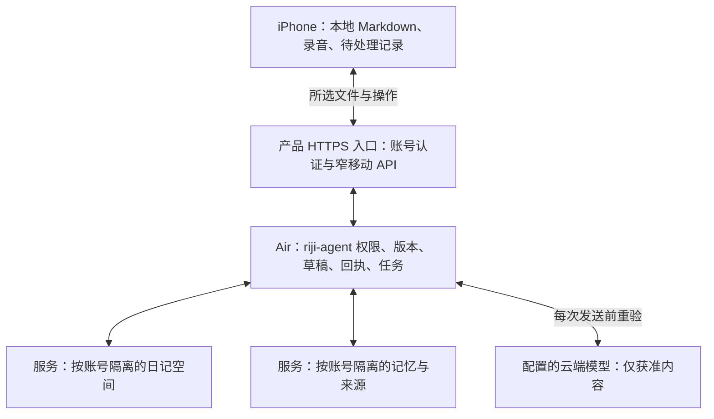

# Riji iOS 技术与设计补充

日期：2026-09-12。状态：设计提案，待用户走查与实施前验证。本文解释 [PRD v2.2-review](../../PRD.md) 的边界和技术取舍；不改变现有生产权限，也不表示新移动接口已经实现。[平台资料核查](platform-research.md)记录官方依据，[近期进展](progress-extract.md)区分本地代码、Air 部署与真实渠道证据。

## 1. 设计默认与权限边界

本轮用户已替代原“每位用户配对自己的 Air”默认：A1 是产品统一提供后台，其他账号有独立资料空间；A2 是手机本地 Markdown，启用后同步到产品账号服务；A6 的私网只作为当前维护者内部环境，不是普通用户的网络要求。A3 仍是人工修改已有正文的独立提案；本轮快捷记录只需受控新增，不依赖开启任意覆写。A4–A5 保留同步范围/语音样本，A7–A8 保留材料范围及本人原日记迁移。

本轮仅更新设计，不进行 iOS 实现、Air 部署、真实日记/账号迁移或对外发布。统一服务的身份、租户隔离和对外接入需新增工程验证，当前个人 Air 部署不能直接视为可供所有人使用的产品后台。

普通用户先本地使用；明确开启账号同步才把所选 Markdown/附件传到产品服务。对其他下载者，这属于向维护者运营的远端服务传输，不可称为只在本人设备。AI 整理/召回另按用途和来源受限处理，模型不获得完整 vault 或原始文件。私人来源、预算、撤权和派生失效规则保持；不得因隐藏服务器 UI 而隐藏服务与模型接收内容的事实，也不能宣称未实现的端到端加密或运营者零可见性。

## 2. iPhone、Air 与模型的分工

| 组件 | 负责的内容 | 关键限制 |
| --- | --- | --- |
| iPhone App | Markdown 阅读、文字与录音先落盘、转写校正、私聊/圆桌/记忆界面、本地待提交记录 | 无法连 Air 时不宣称正式日记已写入或远端权限已撤回；不持有模型密钥 |
| 移动渠道边界（需新增） | 设备身份、能力协商、所选文件同步、App 私人确认页、回执与任务查询 | 从产品认证建立独立账号；原用户另经验证映射其旧资料；只调用受限业务操作，不提供任意路径或 Shell |
| Air 上的 riji-agent | 正式日记写入、版本/权限、Mem0 与来源关系、导师调度、任务账本和审计 | 仍为唯一直接访问权威 vault、草稿与运行数据库的组件 |
| 配置的云端模型 | 接受当前获准的对话与必要上下文，返回回答、整理或提取结果 | 不获得完整文件库；手机入口不切换 provider 或放宽授权 |
| 本机 / Air 语音识别（需新增并验证） | 按实际能力把获准音频转成可校正文字 | 现有语音模块主要是 TTS，不能作为 STT 已交付依据 |

当前 Air 项目服务继续监听 `127.0.0.1:8765`，Mem0 的 `127.0.0.1:38880/38881` 不向手机公开。既有 Tailscale/SSH 仅为维护者内部接入方案；普通下载者通过 App 预置的产品入口访问，不被要求配置私网、主机或模型。

产品对外 HTTPS 入口、认证与限流由维护者部署；接入层只代理经过认证的移动业务接口，不直接公开管理站、Review token、文件系统或数据库。具体托管/网关与 Air 后方连接方式在后续架构任务定案；隐藏配对页不能替代这项工程。本轮不改变监听地址、开放路由器/公网端口、配置 Funnel 或发布服务。
后续部署仍须按 AGENTS / PROJECT_GUIDE 验证 `air` 主机为 MacBook Air，检查 Fleet 心跳与实际进程归属，先测试、备份、同步和受控升级；本附录不授予部署权限、不新增生产端口，也不授权重启共享 Colima。已有 SSH 隧道和本机同号端口不能作为 iPhone 的 Air 地址。

## 3. 产品账号、设备与旧资料关联

账号登录仅在用户主动需要在线身份时出现，默认本机日记不受阻。App 预置可信产品服务入口，认证后拿到独立设备凭证；凭据进 Keychain，不放 URL、二维码、日志、导出包，不把 Review token 当用户账号。退出、撤销或切账号会使对应设备访问失效，离线副本保护规则另行保留。

统一基础设施不等于统一 owner。每个产品账号必须有服务端确定的 principal、资料范围与权限；当前原用户只有在可信验证后才连接其 legacy memory owner。新账号不得映射到维护者的文件库、历史、记忆或初始化账本，也不得仅按昵称合并。日记/录音、模板个性化配置、北极星、复盘、导师私聊/圆桌、后台队列、幂等键、缓存、搜索、导出和推送都须纳入账号隔离。

登录成功恢复原页面和意图；首次智能请求先完成当前范围说明，首次同步要由用户选择本机内容。登录不自动认领或上传其他账号及游客原稿。只在维护者角色的高级连接中保留内部自托管配对，短时请求与可信批准规则不再是普通 onboarding。隐藏入口同时需要服务端角色校验，不能靠不画菜单来授权。
旧飞书私聊仍保留原来的用户、导师、聊天键和权限。用户选择继续一项历史问题时，展示其导师、日期与来源范围，再建立可审阅的范围引用或显式转交。不能按展示名合并，不把所有旧聊天灌入 App 新问题；身份映射成功也不等于已授予跨渠道历史读取。四导师私有观察、未确认候选和完整私聊默认不进入圆桌。

已有 `/api/mentors/v1` 和身份连接路由可复用部分业务入口，但当前身份连接不等于 iOS 设备注册，当前 AI 结果保存的私聊 handoff 不等于 App 内确认。移动接入需新增受限渠道与验收，不能伪造飞书身份或绕过旧渠道校验。依据：[现有导师架构](../../architecture/mentor-dialogue-and-debate.md)、[现有路由](../../../src/riji_agent/mentors/api.py)。

## 4. 能力协商与需要新增的接口领域

下表描述拟议领域契约，不固定 URL，也不声称已经支持。后端返回自身版本、兼容的协议版本及实际启用能力；App 显示可用、未启用、需升级或未知。连接成功不能被解释为所有功能已部署。信息应限制在必要能力，不泄露真实路径、密钥、完整配置或日记内容。

| 领域 | 需要的操作 / 返回信息 | 与现状的关系 |
| --- | --- | --- |
| 账号与设备 | 产品登录、独立账号、设备凭据/撤销、原资料可信关联 | 新增产品认证与隔离；仅原用户可映射旧 owner |
| 能力 | 协议版本、同步、App 确认、人工编辑、私聊历史、自动捕获、日记工具、圆桌个人来源、STT、远程通知 | 新增；按 Air 实际部署和验收门禁返回，不由 App 猜测 |
| 日记与附件 | 所选范围清单、内容版本、下载状态、附件校验、增量变化、删除/权限版本 | 新增受限同步，避免通用任意文件接口 |
| 草稿与提交 | 原文/AI 草稿创建、目标预览、失效原因、本人确认、按操作查回执 | 复用严格写入规则；App 私人确认上下文需新增 |
| 人工修订 | 基于已知版本的编辑预览、冲突双方、确认新修订、恢复版本 | A3 提案；须单独授权与验收，不接入模型工具 |
| 对话与问题 | 列表/历史、明确续聊映射、提交消息、控制场次、选定材料转交、AI 结果 handoff | 复用导师领域逻辑，补移动身份、稳定游标及任务回执 |
| 记忆管理 | 事实/观察与证据、纠正/复核、归档/恢复、删除范围、四用途与处理覆盖 | 复用生命周期规则，补设备认证、缓存变更和操作版本 |
| 录音与转写 | 本机能力结果、获准音频上传、处理位置、任务进度、可校正转写与失败 | STT、上传和录音恢复需新增；Air 无服务则不能提供选择按钮 |
| 任务与数据退出 | 按操作查询、按游标增量取回、通知登记、范围导出、恢复预检 | 部分可复用任务/导出规则；移动契约与恢复保护需新增 |

涉及 `private_journal_tools`、`private_auto_capture`、`roundtable_personal_sources` 的能力须分别验证；不得用一个“AI 已连接”总开关掩盖尚未实现的路径。能力不支持时可查看已有本地资料，但不能提供注定失败的调用按钮。

## 5. 轻量状态契约

一个总“同步成功”不足以描述日记、文件、AI 与记忆的进度。建议按以下独立维度记录，并在 UI 中使用中文状态；名称是候选，不是现有接口字段。

| 对象 | 建议状态 | 状态保证 |
| --- | --- | --- |
| 本地原稿 | 未保存、保存中、已保存在手机、保存失败 | “已保存”仅在本地持久化成功后出现；未同步原稿不作为可清缓存 |
| 文件同步 | 待传输、传输中、已校验、冲突、失败 | “已校验”说明目标已收到匹配版本；不说明模型处理或日记提交成功 |
| 日记提交 | 待预览、待本人确认、已发送待核对、已写入、明确拒绝、结果未明 | 超时不等于失败；相同操作查回执，禁止直接新建另一次追加 |
| AI / 转写任务 | 已接收、排队、处理中、已完成、已停止、明确失败、结果未明 | 只显示实际阶段；无证据不显示假百分比；迟到结果须重验来源与停止代次 |
| 记忆来源 | 待处理、有效、来源已变、已撤权、已抑制、失败 | 手机副本还需附最后同步时间；离线副本不能据以许可云端使用 |
| 权限修改 | 仅本机待同步、Air 已确认、冲突需处理 | 尚未送达不能声称 Air 已停用旧授权；已发给模型的内容不能撤回 |

建议每个回执携带最少的操作标识、资源标识/版本、阶段、更新时间和安全错误类别；能否重试由服务端明确给出。请求携带期望版本和幂等标识；同一标识但不同有效载荷应拒绝。不能靠“HTTP 请求成功”断言所有后续步骤完成。

服务端写入成功后返回可核验的日记版本和结果定位；索引/记忆是后续独立状态。客户端断线重连先获取服务器能力、撤权/删除版本和已有操作结果，再发送积压操作，避免旧缓存把被删除内容重新传回或送给模型。

## 6. Markdown 同步、人工编辑与确认

同步清单以受控文件标识、内容版本、校验摘要（哈希）、类型、修改时间与附件关系描述文件。校验摘要只用于检测变化，不代表上传内容的授权；客户端不能提交任意绝对路径。相同文件标识跨设备稳定，日期与显示标题不是唯一身份。元数据本身也可能包含私人信息，应与正文采用一致的可见范围。

手机首先保存原稿。原文新增的输入区显示准确日期、区块和文字，“保存这段”代表对此版本的明确确认；校验、草稿交换与回执在后台完成，正常情况不要求额外确认页。若确认过期、授权失效，或后端返回内容/目标与原文版本和用户所见不一致，必须刷新并重新显示差异，而非悄悄提交。AI 整理只在用户选择后发送，生成后在同页底部弹层预览改动。确认绑定本人、设备、私人编辑上下文、草稿与预览版本，30 分钟失效且一次使用；改稿、改日期、原文或来源变化均需要新预览。离线时保存待处理草稿，不缓存一个永久可用的确认 token。

每次正式提交在本机先持久化一个稳定操作标识；Air 在同一业务提交边界内记录去重与回执，并执行现有原子写入。响应丢失时用同一标识核对；若服务器无法证明结果，保留“结果未明”并阻止自动追加。不能因换设备、重启 App 或重新点击而重置幂等语义。网络可能重复传输，产品要求最终不重复写入。

A3 若确认纳入首版：人工编辑必须基于本人已看到的版本生成差异，冲突时保留两端内容，选择某版也形成新修订而非静默覆盖。保留未知 frontmatter、模板结构、附件引用与 AI 来源标记。编辑前后来源版本变化需触发既有依据失效逻辑；旧记忆先失去有效依据，新版本按授权重新处理。模型不能使用人工编辑权限。

本机普通 Markdown、附件与内部状态分开存放。Files 中可见的用户目录不放 Keychain 凭证、数据库和内部队列。首版按 A2 使用 App 管理目录并提供导出；外部编辑回流需要版本核对。直接选中 Obsidian iCloud 目录、多个同步器同时编辑同一目录及更广泛原位编辑，均在专项真机验证后再定案。

## 7. 内容类型、摘录与撤权/删除

必须区分本人原话、计划、执行反馈、AI 建议与 AI 综合；长期记忆还需保留事实/观察和导师归属。保存一条 AI 建议到日记不使它成为本人事实；勾选采纳计划不等于已经执行。类型与来源应贯穿移动同步、阅读、搜索、导出和记忆提取。

当前问题的“摘要”实际上是带类型、来源和版本的**有界工作摘录**：现有上限为 48 条 / 18,000 字符，超限后进入 `pending` 并阻止依赖该背景的新讨论，由用户显式纠正或整理后继续。它没有自动模型语义压缩，也不会自动生成跨问题长期用户事实。App 可把入口称为“当前背景”，但必须显示覆盖与待整理状态；不能承诺“AI 会自动压缩全部历史”。四导师私聊上下文也是有界选取，不是全档案无限记忆。依据：[当前工作背景设计](../../architecture/persistent-mentor-roundtable.md#4-工作摘要与记忆)、[进展提取](progress-extract.md)。

撤权与删除建议保留单调递增版本及最小墓碑/抑制标识。Air 先阻止后续生成、投递和恢复，再清理相关正文、索引、背景摘录、派生观察、未发送负载和缓存；在途结果须再次核验。App 下次连线优先取得这些变化，失效的卡片、搜索结果和待发送材料不能继续呈现为当前有效依据。

删除记忆、撤回来源、删除讨论和删除原日记是不同操作。首版 App 不提供删除 Air 日记原件入口；维护者用外部文件工具删除原件时，下次同步使相应来源失效；普通账号的原件/账号空间删除需单独产品契约，不依赖维护主机操作，未同步修订作为冲突保留，不自动复活原件。删除前显示具体范围与依赖；删除记忆默认保留同来源版本的重建抑制。已独立保存的日记、本人导出和系统备份按独立对象说明，不能假称一键物理擦除全部副本。恢复包不得携带活跃凭证或重新授权，不能清空墓碑后复活旧内容。

离线手机无法立即知道远端撤权，也不能立即通知 Air；UI 显示最后同步时间和待同步修改。若用户在手机收紧权限，本机立即停止对应使用，远端只在回执后标为生效。设备撤销同样只保证 Air 拒绝访问，不保证远程擦除已离线手机。

## 8. 录音与中文转写探针

首版先实现录音可靠落盘和可恢复状态，再启用转写。麦克风拒绝时可以继续打字；电话、音频路由改变、锁屏、系统中断和空间不足时保留已成功保存片段，并显示录音实际停止位置。转写失败不得删除原音频，转写重试不得制造重复片段。

目标真机需要先探测 iOS 版本、`SpeechTranscriber.isAvailable`、目标中文 locale 是否受支持、语言资源是否已安装及可否下载。iOS 26 提供 SpeechAnalyzer 不等于所有机型、所有中文环境可离线转写。能力不可用时保留录音，允许改打字；只有已配置并验收的 Air 本地 STT 可作为显式可选项，不能默默上传到云端音频服务。

A5 的 30 分钟样本用于验收，不是最长录音限制。实施者在用户目标机型上使用自拟合成材料，覆盖中文长句、人名/数字、中英混说与安静/噪声环境；检查文本完整性、重复/缺失段、耗电、发热、暂停继续、来电、锁屏、首次语言资源下载及离线重启。失败时仍可回放原音频、校正转写和完成原文保存。是否增加 60 分钟目标、实时文本或词级时间戳，待首轮结果决定。

## 9. 服务故障、后台任务与 APNs

普通界面只区分网络、账号会话、同步和智能服务状态，没有证据时显示未知，服务恢复后查询原任务。Tailscale、Air 可达性、进程、模型登录和证书等细节放维护者诊断；普通用户不被要求检查私网或维护机器。当前内部私网的 VPN 限制仅在维护者环境测试，对外产品入口另测 Wi-Fi / 蜂窝切换、DNS/证书、服务中断与重新连接。[平台依据](platform-research.md)

Air 持久化任务后返回接收回执，并负责后续执行；iOS 前台轮询或增量获取结果，后台只争取系统允许的机会。文件传输可评估后台 URLSession，但用户强制退出会取消相关后台传输；重新打开后按本地操作记录恢复。`BGContinuedProcessingTask` 可用于响应用户动作开始的长处理，不能承诺 App 全天常驻或固定间隔执行。

本地写日记提醒与远程任务完成通知分开。APNs 为 A6 可选增强，需要有效 App ID / 开发者配置、通知授权、设备 token 登记和 Air 到 Apple 的可达性；通知仅携带中性事件提示与必要不透明标识，不包含日记正文、标题或导师内容。接收通知不证明产品服务当前可达，用户仍可进入“结果待下载”；拒绝通知或投递未发生也不影响重新打开查询。静默推送不保证投递，不能作为删除、撤权或同步收敛的唯一机制。

## 10. 实施前门槛

| 门槛 | 负责人与通过条件 |
| --- | --- |
| 产品默认 | 今日正文与统一后台方向已确认；A3 人工改写、A7 分享范围及 A8 原配置仍按对应条件落实 |
| 产品身份 | 用合成账号测试登录、撤销、游客原稿、跨账号文件/记忆/任务隔离；只给已验证原用户关联旧 owner |
| 写入与同步 | 实现者用临时库验证断网、重复、丢回执、原文外部变化、并发编辑、恢复及满磁盘，不触碰真实日记 |
| 类型与生命周期 | 实现者验证 AI 内容不会变成本人事实，删除/撤权跨摘录、索引、缓存、恢复和队列生效 |
| 目标 iPhone | 明确机型 / iOS / 分发方式；完成中文能力探针和至少一段 30 分钟样本，再确定可对外承诺的转写与锁屏行为 |
| 实际 Air 能力 | 在另行授权实施中核对部署版本与能力；不能把最新本地测试结果当作 Air 已升级 |
| 新导师链路 | 分别验证新私聊自动记忆、原文工具检索、个人来源圆桌；未通过能力保持关闭，旧飞书 `group_only` 边界不变 |
| 服务与后台 | 普通账号验证产品入口/蜂窝/服务恢复；维护者另测内部网络与主机；无通知和后台机会也能恢复记录 |

上述门槛完成前，本稿可用于评审和拆分实现 Issue；不用于宣称 iOS 功能、生产迁移或个人数据处理已验收。

## 11. 原日记工作流迁移：模板、复盘与 MIT

用户已明确保留这些原功能，首版范围见主 PRD FR-37–45。迁移的是用户已经在用的模板与工作流，不是把 `personal-growth` manifest 的声明渲染成几个空页面。当前仓库 daily writer 只接受非空操作，实例化只替换 `{{date}}` / `{{title}}`；周月报与定时任务尚是静态能力描述。完整原模板、指标定义与外部工作流需从本人指定来源取得，见[证据与最小验收](reconcile-journal-routine.md)。

新增受控操作需明确区分：空白模板建日、本人内容追加、周报保存、月报保存、指标配置版本变更、MIT 计划确认/更换、MIT 实际反馈。每项绑定 owner、日期或周期、模板/来源/内容版本及幂等编号。周/月目标由服务端的受控类型映射确定，客户端与模型不能提供任意文件路径；不能把周报内容塞入每日 patch 冒充迁移完成。

模板按原文件保存、显示版本，已知日期变量可确定性渲染；未知脚本和插件只记录未支持项，不在手机或后端执行任意代码。已有文件不得重套模板。手机离线建日保留本地创建意图及模板版本；Air 也已建同日文件时先比对合并，保留未同步输入。天气、睡眠、任务、专注等原字段和原数据源逐项核对；没有迁移来源不等于应删除字段或填零。

周期由日记配置的时区与原周口径计算，ISO 周作为缺省建议。报告任务固定周期、可用来源清单与权限版本；跨月周报不能直接作为整月事实，原日记与周报中同一事件/数值按来源身份合并，日期未知的汇总不强拆。AI 分析保持生成类型，事实仍依赖原始来源；报告被本人确认保存不意味着其所有推断成为事实，也不能绕过来源撤回重新提取。

北极星配置沿用原定义与多指标结构，明确口径、单位、目标周期、阶段和版本。现值必须有来源及截止时间；定义缺失和数值未知是不同状态。MIT 记录引用的配置版本、目标日期、具体行动、完成标准、当前确认状态与实际反馈。更换当前 MIT 通过受控追加变更保留旧项；用户的手动整体编辑提案 A3 不应成为实现这个必要功能的前置条件。

自动化入口仅读取本人账号可见的任务及稳定身份，不能枚举维护者和其他账号的任务；迁移账号核对旧任务接管，新账号设置自己的任务。配置变更经过预览、本人提交、Air 回执；手机后台不能承担可靠定时执行。已有任务与新入口共用去重身份，按日期/周期检查已有目标。空白模板创建使用已有或明确批准的策略；AI 复盘/MIT 默认为草稿待确认。配置持续任务时单独确认资料范围、用途和模型接收方，每次运行重新校验；范围或接收方改变后先暂停，不能沿用旧配置扩大授权。漏跑补偿由本人选择具体日期/周期，结果未知先查原任务；不得因为安装 App 自动重开初始化、改动原调度、重做全部历史或启动新的真实任务。

本轮线框的任务成功、指标与日记内容均是示意，真实迁移前还须对照原字段、模板变量、生成规则、触发时间与执行记录。本轮未读取私人日记或远端真实配置，未修改自动化。

## 12. 今日页与简单记录的设计依据

按用户明确要求采用“今天的笔记直接打开、正文就地记录”的产品模式。Obsidian 的 Daily notes 会打开当天笔记、不存在时创建，支持套用已配置模板；编辑模式与 Live Preview 允许直接编辑而不必先切换到单独输入页。这些是参考行为，不等于照搬其插件、任意文件访问或全部编辑能力。[Daily notes](https://obsidian.md/help/plugins/daily-notes)、[编辑与预览](https://obsidian.md/help/edit-and-read)。

本 App 冷启动直接到 B01/A01；C01、C03、C07、D01、D02、D03 是同一日记页面的输入、录音、校正、AI 预览、状态和保存后示意。顶部日记目录收纳历史、搜索、周/月报和北极星，取消单独记录标签。已有效模板直接用于今天本地准备，首次输入或明确保留空白页时落盘；历史补建和模板更换才进入专用设置。跨午夜继续保持原稿日期，离线恢复同日碰撞保留双方内容。

当前原用户的完整模板迁入仍是必做项；其他新账号先用明确的产品初始模板，不以“没有你的原模板”阻塞第一次记录。个性化模板、指标和日常任务按用户自己的设置保留，不能把维护者的模板内容、北极星值或时间计划发给所有账号。

旧 `local` 记忆标记描述服务端的模型使用限制；普通界面使用“不供后续 AI 使用”，并说明记忆保存在账号空间。只有明确选择“只留此 iPhone”的原稿才承诺不上传服务。
