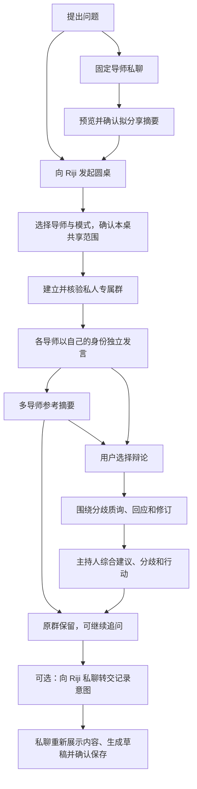

# 导师沟通与多导师辩论 PRD

**后继版本：[常驻导师群、讨论记忆与日记保存 PRD v0.3](PRD-persistent-mentor-roundtable.md)。** 用户于 2026-09-11 确认常驻群、原日记导师主持、同题多次讨论、分层记忆刷新和独立 AI 日记结果。涉及群与讨论生命周期、触发、预算、摘要和保存的条款按 v0.3 执行，替代清单见新版 §8.3；本文保留 v0.2 基线供追溯，其余独立私聊、真实辩论与权限要求继续适用。新需求尚未实现或上线。

**状态：v0.2 基线及后继增量索引。** 用户已确认采用每位导师独立机器人私聊、主持人 Riji 与私人圆桌群，并要求产品需求与技术设计分开、未来可以迁移渠道。本地核心已部署；四位飞书导师已完成独立绑定和虚构问题回复验证，生产群主持和持续讨论仍待验收。已实现范围与剩余工作见[实现记录](../mentor-implementation.md)、[飞书交付记录](../feishu-mentor-air-2026-09-10.md)及[群探针记录](../feishu-roundtable-probe-2026-09-11.md)。

当前基线见[主 PRD](../PRD.md)和[MVP 架构](../architecture/mvp-architecture.md)。Air 上的本地页面可使用讨论核心；原飞书日记入口继续保持私聊限定，生产群能力门槛仍关闭。私人圆桌例外须完成真实接入验收才生效，普通群的禁用边界继续保留。框架、接入方式、数据模型、调度与安全实现见[对应技术设计](../architecture/mentor-dialogue-and-debate.md)，其中与 v0.3 不一致的旧契约待后续适配。

**一句话目标：** 围绕用户的一个真实问题，既能与一位固定导师持续沟通、获得理解与开导，也能听取多位导师的不同判断，让他们针对分歧相互质询，最终形成有依据、保留条件与分歧、可以采取行动的建议。

本地保存日记、记忆和讨论记录；获得授权的问题、材料及讨论内容会发送给配置的回答模型，飞书消息也经过飞书服务。多导师讨论会让材料在更多发言中被使用；选择多个导师不扩大来源权限，也不自动允许把个人资料发进群里。

## 1. 背景、用户与成功结果

现有产品使用单个 Riji Bot 切换导师，提供导师隔离的会话、共享事实和日记检索。下一阶段需要完善围绕问题持续沟通、比较观点和得出判断的体验。把所有角色放在同一个头像下不断切换，不利于辨认“谁在和我说话”，也容易混淆私人沟通与公开给多位导师的材料。

目标用户是当前自托管日记 Agent 的个人使用者。典型任务有三类：心里有困扰，希望先被理解；面对选择，希望看到不同价值取向的建议；几种建议冲突，希望弄清它们为什么不同、各自在什么条件下成立。没有相关日记或尚未授权记忆时，也应能只凭自己提供的背景完成沟通。

本版采用稳定的导师身份与独立私聊入口，多导师沟通进入由用户、主持人及选定导师组成的专属圆桌群。飞书是本期入口，导师身份、问题、讨论与授权的含义应能保留到未来的 Web 或其他聊天入口。

一次成功的沟通应让用户更清楚地说出：“我真正纠结的是什么；有哪些选择；各自的代价是什么；我现在可以先做什么。”不以对话越长、观点越多或导师意见一致作为成功。

## 2. 三种使用模式与入口

| 模式 | 用户意图 | 入口与核心过程 | 用户拿到的结果 |
| --- | --- | --- | --- |
| 单导师沟通 | “我想找一个导师聊聊，帮我理清这件事。” | 对应导师的独立私聊；持续澄清、理解、检索和适度挑战 | 被理解的问题、导师判断和可选下一步 |
| 多导师参考 | “让几位导师分别怎么看。” | 主持人组织私人圆桌群；各导师先独立判断，再比较 | 多个可辨认的视角，以及共识与分歧摘要 |
| 多导师辩论 | “让他们就关键分歧讨论，最后给我建议。” | 同一圆桌群内，独立立场 → 聚焦分歧 → 质询回应 → 综合结论 | 条件明确的建议、未解决分歧和行动方案 |

**术语约定：** “问题”是用户本次要理解或决定的事情；“圆桌”是多导师参考或辩论的一次独立讨论；“主持人 Riji”负责澄清、组织、控制进度与总结，不另扮演权威导师；“一轮辩论”指每位参与导师对本轮焦点最多作出一次回应，不含首次独立立场和最后综合。

**已确认方向 D1（替代原 A1）：** 每位导师使用固定名称、头像和独立机器人私聊；Riji 提供主持和管理入口；圆桌在私人专属群展示。固定导师私聊不在窗口内换成另一位导师。已有 Riji 单 Bot 的导师切换保留兼容，不能要求用户先迁移才能继续原有沟通或记日记。

这些导师都是明确标识的 AI 角色。同一模型可以扮演多位导师，不宣称是真实专家会诊，也不把多个角色的赞同说成多个独立模型验证了事实。

## 3. 第一版范围与后续项

**P0 完整闭环：** 独立导师入口与持续沟通、独立问题和回看、主持人及私人圆桌群、2–4 位导师的参考与辩论、真实质询和立场修订、有条件的综合建议、补充/停止/失败恢复、分享预览、成员与资料权限保护、记录删除与导出，以及回到私聊严格确认的日记衔接。多导师辩论属于第一版，不能只交付多份回答而无限延期。

**后续增强：** 独立 Web 圆桌视图、语音、更多导师或自定义角色、逐导师不同模型、同桌动态邀请/移除导师、自动回访提醒。第一版不提供其他真人参加的圆桌、普通或外部群中的个人资料问答、真实导师接入、角色市场、无限自主辩论或日程/交易等外部行动，也不为本功能扩大日记导入和授权。渠道迁移的产品要求本期确定，其他渠道的完整界面后续交付。

## 4. 用户流程与交互示例

以下均为说明体验的虚构示例，不是用户真实经历，也不预设问题的正确答案。示例指令是拟议交互文案，尚非已实现命令。

### 4.1 在固定导师私聊里沟通

1. 用户打开“温柔回顾者”私聊，说：“我一直拖着一件很重要的事，越拖越内疚，想聊聊。”
2. 导师先回应处境，区分用户想被倾听还是希望推动行动；必要时只问最影响判断的一两个问题，不先发长问卷。
3. 用户补充后，导师围绕同一件事继续交流。已授权且有帮助时引用相关经历；没有证据时不把猜测说成用户一贯的性格。
4. 用户说“先别给办法，陪我理一理”，导师调整节奏；用户说“帮我收个尾”，导师整理关键认识和可选的小行动。
5. 用户选择“请其他导师也看看”时，先看到目的导师、问题和拟转交摘要，可删改后确认。旧私聊不会自动搬进群。

### 4.2 先听多方意见，再决定是否辩论

1. 用户在 Riji 私聊提出：“我该继续投入这个项目，还是及时止损？想听多位导师参考。”
2. Riji 展示导师关注点，用户选定参与者，确认本桌要讨论的问题和允许分享的背景。已经明确给出的选择不再重复询问；涉及从别处转交的材料仍须预览。
3. Riji 建立并核验私人圆桌群，以“Riji 圆桌 01”一类中性名称命名；核验完成前不在群里发送问题、摘要或私人来源信息。建群失败时保留本地准备状态，并在私聊说明可重试的下一步。
4. 各导师以自己的名称和头像发言，给出“建议、依据、代价、成立条件”；主持人归纳共识与分歧。用户无需从同一个机器人的长消息里辨认角色切换。
5. 用户已经获得帮助时可结束；也可说“让他们辩论一下”，在同一圆桌群内沿用原问题和参与者进入辩论，不重新建群或重复分享旧私聊。

### 4.3 直接辩论、中途补充与保存结果

1. 用户向 Riji 提出：“请王阳明、直率教练和未来的我辩论：我要不要接下一个压力很大的新机会？”系统展示参与者、问题、计划轮数及共享范围。
2. 圆桌群准备完成后，各导师先独立发言。主持人归纳真实分歧，例如“是在回避挑战，还是已经超出承受能力”，导师针对这项判断质询和回应。
3. 用户补充：“我现在还有一项必须履行的家庭责任。”系统更新共同前提，说明哪些判断需要重评；尚未展示的旧前提结论不再发布。
4. 用户说“先总结到这里”，系统收束为当前建议及其局限。群保留在原圆桌；之后点名某位导师追问，由该导师回答一次；未点名的明确追问由主持人回答一次，不自动重启全桌。
5. 用户在群里说“把我采纳的结论记下来”，这里只转交记录意图。Riji 在已核验的本人私聊中重新展示具体内容，用户可删改；随后生成日记草稿、展示变更并由用户明确确认。群内不会生成或提交可执行日记草稿。

## 5. 功能需求

本增量使用 `MD-FR-*` 稳定编号。除第 3 节的延期项外，下列要求均属于第一版交付范围。

### 5.1 选择导师与建立问题

**MD-FR-01：看懂并选择固定导师。** 用户可查看导师名称、关注点、表达方式和适用场景，并进入对应独立私聊。第一版复用温柔回顾者、直率教练、未来的我和王阳明导师，不以大量新角色为前置。导师身份在私聊与圆桌中一致；不可用或无法使用相应资料时明确提示，不静默换人。主持人身份与导师身份清楚区分。

**MD-FR-02：把问题与背景说清楚。** 用户可输入自由文本，也可在同一问题下补充目标、现实限制、备选方案及希望获得的帮助。澄清围绕影响判断的缺口；用户不补充也可以继续，但输出标明假设。重要选择中，主持人简短重述本次要回答的问题，用户可随时纠正，不把重述当作用户已确认事实。

**MD-FR-03：模式与窗口明确。** 单导师、多导师参考和辩论有明确入口。导师私聊普通消息由该固定导师回应，不自动发起圆桌或切换身份；想找另一位导师时进入其私聊，转交背景遵循 MD-FR-16。参考不会自动进入辩论。活跃圆桌群的消息按 MD-FR-11 处理，结束后仍留在原桌并按 MD-FR-14 追问，不返回或伪装成另一位默认导师。取消创建保留原沟通。已有 Riji 单 Bot 入口继续支持原导师切换及日记流程。

### 5.2 单导师持续沟通

**MD-FR-04：开导有连续性。** 导师能接住上一轮表达，澄清问题、帮助重新理解处境并在合适时给出建议。用户可要求“只倾听”“直接一点”“给我具体办法”；不能每轮重复背景、固定套用长模板或强行收尾。`[ASSUMPTION A2]` 默认先理解处境，再适度挑战和建议，具体语气服从所选导师及用户当轮要求。

**MD-FR-05：同一导师可续聊，也可另起问题。** 返回导师私聊时可恢复该导师的问题；“新问题”开启独立上下文并明确提示，不自动带入上一问题的聊天或摘要。有效共享事实及当前导师获准观察仍遵循原规则，包括先前普通沟通形成的有效长期记忆。“新问题”不等于遗忘；用户希望移除长期认识时使用既有记忆管理入口。续聊目标有歧义时展示可辨认的记录供选择。创建圆桌不改变原私聊归属，也不改写旧 Riji 入口的默认导师。

**MD-FR-06：导师风格影响判断方式。** 差异体现在关注点、提问和取舍，而非只更换称呼：温柔回顾者关注体验与需要；直率教练关注回避、代价和可执行选择；未来的我关注长期后果；王阳明导师关注动机与行动的一致性。导师可认可彼此，不为戏剧效果刻意反对。思想引用沿用出处要求，“未来的我”不得把设想说成预测。

### 5.3 多导师参考与辩论

**MD-FR-07：创建有边界的专属圆桌。** `[ASSUMPTION A3]` 每桌 2–4 位导师，未指定时推荐 3 位供选择。一桌固定一个主要问题及参与者集合，可以补充背景。`[ASSUMPTION A7]` 一桌对应一个专属私人群，群名中性，不含问题摘要、情绪标签或日记信息；结束后保留群与原记录。更换参与者或主要问题须新建圆桌和新群，预览并确认拟转交摘要；旧群不能复用给新参与者，不能把旧讨论自动交给新导师。

**MD-FR-08：先独立形成观点。** 首次判断只使用本次问题、同一版本的获准共享背景和自己的角色知识，不预先参考其他导师立场，即使其他导师已经展示了发言。每份观点包含核心判断、依据、关键假设、代价与建议。参考模式完成后提供共识与差异摘要，不伪造已经发生的导师回应。

**MD-FR-09：辩论围绕真实分歧。** 主持人选择最影响判断的 1–2 个分歧组织回应。导师指出回应谁的哪项主张，并提供理由、反例或成立条件；被质询者可坚持、修订或撤回，并说明原因。不能只轮流重复建议。若无实质分歧，检查共同假设和可能反例后收束，不强行争吵。

**MD-FR-10：轮数有限，用户掌控进程。** `[ASSUMPTION A4]` 默认最多 2 轮辩论，也可开始时选择 1 轮；开始前显示计划，可提前收束。达到上限即进入综合，第一版不自动加轮或无限讨论“直到达成共识”。深入追问按 MD-FR-14 处理，需要全桌重新讨论时明确新建。

**MD-FR-11：可以补充、追问、提前总结或停止。** 活跃圆桌中的普通补充归本桌，点名追问由指定导师先回应，其他导师不抢答或自动接龙。新增关键事实后明确更新共同前提，尚未展示的旧版本观点不得混入新结论。“先总结”在剩余时间和用量内收束，“停止讨论”停止安排新生成并保留已完成内容。已开始的生成未必能撤回，但停止后的迟到结果不得继续推送或改变结论；重评不能无限延长本桌。

**MD-FR-12：输出可辨认、可回看。** 导师以对应机器人发言，标明阶段和轮次；主持人的状态及摘要与导师观点分开。手机阅读优先展示简洁观点和综合结果，详细论证可按需查看；长内容分段且保持顺序，不能每轮重复整段历史。显示进度、已完成参与者和异常，等待不写成完成。机器人数量不能成为无序抢答、重复通知或无限刷屏的理由。

### 5.4 得出结果与继续使用

**MD-FR-13：综合结论帮助用户判断。** 辩论结束后必须包含：

1. **当前建议：** 在用户目标和已知条件下，优先考虑什么及为什么；信息不足时说明暂不能选择，并指出最有价值的下一步验证。
2. **共识与关键分歧：** 哪些认识一致，哪些分歧仍在，注明归属、取舍及适用条件；不能把多数票当作事实或抹去少数意见。
3. **依据和不确定性：** 区分用户自述、日记/记忆事实、思想资料和模型推断；引用实际来源，说明什么新信息会改变建议。
4. **可执行的下一步：** 提供 1–3 个可选行动，说明怎么开始、何时检查和关注什么信号；不能写成用户已经决定执行。

主持人可以综合比较，不能引入未经讨论的新个人事实，或以“导师都这样说”替代论证。产品展示面向用户的观点、依据和回应，不承诺暴露模型内部思维过程。

**MD-FR-14：原桌保留，结果可追问和回访。** 用户可查看自己以往的问题、模式、导师、状态和结论。原群结束后继续属于同一圆桌：明确追问由指定导师回答一次，未点名则由主持人回答一次；不自动重新启动全桌，不重置旧讨论的上限。追问依然受当前成员、来源与分享权限限制。新结果说明条件变化，保留旧结论当时的条件，不悄悄覆盖历史。新的主要问题或全桌重评须创建新圆桌并确认转交摘要。第一版支持主动回访，不自动创建提醒或执行行动。

**MD-FR-15：群中记录意图回私聊严格确认。** 群内“把这次结论记下来”只形成转交意图，不生成或提交可执行日记草稿。系统在已核验的本人 Riji 私聊中重新展示拟记录内容，允许删改并区分用户采纳的决定和导师建议，再生成草稿、展示日记变更并要求明确确认后按模板追加。尚未核验私聊时，只提示完成本人入口核验，不把内容发给猜测的接收者。导师说“同意”、用户说“有道理”、群内确认或讨论结束均不能触发日记写入。保存成功必须可核验，不能覆盖或重写已有日记。

## 6. 共享范围、记忆与数据生命周期

圆桌需要共享本桌内容，不意味着开放导师过去的私有记录。私聊属于哪些导师、资料可以给谁看，须由用户和已有来源权限共同限定。

| 内容 | 单导师沟通 | 圆桌内 | 圆桌外或以后使用 |
| --- | --- | --- | --- |
| 当前用户问题与补充 | 当前导师可用 | 已明确用于本桌的内容对主持人和选定导师可用 | 仅在原问题续聊；跨上下文按转交规则处理 |
| 日记及共享长期事实 | 按来源、用途与导师授权使用 | 仅使用已授权给本桌、所有参与导师及主持人均获准的相关部分 | 不扩大原范围；来源变化后重新核验 |
| 导师旧私聊、私有观察、未确认候选 | 仅归属导师按原规则使用 | 默认都不注入，包括参会导师自己的旧私聊；候选不得冒充已确认事实 | 参会不将其转成共享事实；转交仅限用户审阅的选定摘要 |
| 本桌发言、质询与综合 | 不自动流入导师私聊历史 | 可见论证及其摘要供本桌讨论 | 本地保存为本桌记录，不自动变成用户事实 |
| 导师思想资料 | 按角色资料权限使用 | 分享有来源的必要引用和论点，不开放整个知识库 | 不改变资料归属与各导师的使用权限 |

**MD-FR-16：跨上下文转交可审阅。** 单导师转圆桌、圆桌转单导师、导师间转交或新桌沿用材料，都先展示目的入口、接收导师及拟分享摘要，由用户删改并确认；也可只使用新输入的问题。确认仅授权所选摘要用于指定讨论，不开放整段旧私聊、私有观察或其他记忆。摘要及导师发言继承来源限制；确认分享不能绕过 `private: true`、`none/local`、撤回授权或未获准的接收方。候选、观察与建议仍标明性质，不能因用户允许转述就当作事实。

**MD-FR-17：讨论不得污染长期记忆。** `[ASSUMPTION A5]` 第一版不对圆桌自动捕获长期记忆；用户可以主动将认可内容通过既有记忆管理或私聊日记流程保存。导师建议、假设、模拟未来和主持人总结不能被抽取为已发生事实或稳定偏好。单导师普通聊天的捕获延续原规则；跨问题只召回有效获准记忆，不把上一问题的完整对话或摘要作为长期事实注入。

**MD-FR-18：保存、删除与发送分别受控。** 讨论记录及续聊所需摘要本地保存，支持查看和删除。删除时移除相应对话、摘要、派生索引和待处理内容，旧任务不能重建；已明确转交到其他讨论、另存为日记/记忆或导出的副本须列明范围，独立管理，不暗示已联动删除。普通运行日志不保存正文。飞书历史、模型接收方留存及用户备份是独立副本，本地删除不承诺同时抹除，也不等于解散飞书群。

**MD-FR-19：生成与展示都重新核验权限。** 发言、等待后重试、综合、回看与续聊，均在向模型或聊天入口实际发送内容前检查当前来源、权限、参与者及共享范围。不得把某导师单独获准材料经其发言转给其他人。来源收紧后，受影响的原文、发言、摘要和旧结论不能继续作为背景或重新推送，相关依据标为失效。无共同可用资料时可在用户知情的范围内只凭本桌问题继续；成员安全核验失败则按 MD-FR-21 暂停。更换模型接收方也要核验授权，不能静默替换。

**MD-FR-20：私人圆桌具有独立、明确的共享授权。** 可使用个人资料的圆桌群只能包含本人、受管主持人 Riji 和本桌选定的受管导师；必须登记为对应圆桌并完成身份与成员核验。资料本来可用于某位导师私聊，不代表可发送给圆桌群：用户须知道共享目的、参与者和材料范围，可查看并撤回本桌授权。创建圆桌或确认分享不能放宽原来源的限制；普通群、未登记群、外部群和含其他真人或非受管机器人的群继续禁止访问个人日记、记忆、讨论内容及其敏感元数据。

**MD-FR-21：成员或可见范围变化立即暂停。** 群成员、与历史可见或访问相关的群设置变化，或当前状态无法可靠核验时，停止生成和群内发送个人内容，暂停尚未展示的结果，并在已核验的本人 Riji 私聊通知原因。确认发生成员或相关设置变化的旧群不再接收新的私人讨论，即使成员或设置随后恢复；用户选择继续时，新建并核验群，再确认转交材料。单纯查询暂时失败且未发现变化时也暂停，须重新完整核验并由用户明确继续。成员检测不能消除已经发送的历史内容被看到的风险，不能承诺已撤回所有副本；异常通知本身不在可疑群暴露问题或来源。

**MD-FR-22：群准备失败时安全恢复。** 建群、加入所选机器人或核验成员失败时，不发布问题、摘要、日记或记忆，也不退回普通群或无提示改用同一机器人扮演所有导师。私聊显示准备进度、失败范围和可重试步骤；重试保留已选问题、导师与有效授权，不重复创建可用圆桌或重复发送材料。部分准备完成但未通过核验的群只使用中性信息。重启后未完成的准备或讨论显示中断，用户确认继续后重新检查当前状态与授权。

**MD-FR-23：更换渠道仍能识别本人、导师和原问题。** 导师、问题、结论、归属及分享范围不以某个飞书群作为唯一意义。未来换到 Web 或其他入口时，用户完成本人身份核验后可继续自己的问题，保持导师隔离和来源限制；新入口不能凭自报身份取得旧记录，转移或增加接收方要重新核验资料授权。第一版提供可读的本地导出，包含用户选择的问题、参与导师、发言、结论、时间与可用来源说明，并标明分享范围及失效依据；不导出凭据、无关私聊或原始日记库。导出不等于自动分享到其他渠道，也不承诺恢复另一渠道的相同界面或历史消息。

## 7. 可靠性、等待与成本边界

**MD-NFR-01：处理有上限，用量可理解。** 开始前显示参与人数、计划轮数，以及多人讨论需要更多处理时间与用量。每桌初始参考与随后至多一次转入辩论共用明确时间与用量上限，重评、重试及综合均包含在内，为收束保留余量；转入辩论时显示累计用量与剩余额度，到限给出部分结果或中断状态。结束后的明确追问另按单导师单次沟通上限处理，不恢复全桌讨论额度，整桌累计用量仍可查看。材料不得按导师、轮次或新问题重复重置已有来源预算，派生摘要也不能成为绕过授权与用量限制的办法。原 A6 的具体工程参数迁至[技术设计](../architecture/mentor-dialogue-and-debate.md)，不作为本 PRD 的实现选型。

**MD-NFR-02：有进度，不阻塞控制。** 正常运行且已接收请求时，目标 3 秒内显示接收或排队；耗时阶段的简短状态更新间隔目标不超过 30 秒，避免多个机器人重复通知。停止、补充和提前总结不能等整场辩论结束后才处理。后台记忆不应阻塞前台沟通，圆桌也不能长期占用其他私聊的全部处理机会。

**MD-NFR-03：部分失败明确降级。** 某导师失败时标明阶段及失败状态，不代写其立场。已完成意见可成为“部分结果”，至少两位导师独立发言完成才可称多导师参考，发生真实质询及回应后才可称已有辩论。用户可重试失败步骤，但受当前授权和剩余上限约束。额度、认证或模型不可用时不静默切换接收方；综合失败则展示真实完成内容及失败说明，不包装为完整结论。

**MD-NFR-04：重复与恢复不重复生成。** 同一用户操作不重复创建圆桌或发布有效发言；网络中断、重启及恢复后显示完成内容与中断状态，等待用户继续。结果未知的处理不盲目重复。补充、停止、删除及迟到结果有可理解的先后关系。一个圆桌群只有一桌，其他独立导师私聊仍可使用；新建请求不得覆盖现有讨论或误用其群。

**MD-NFR-05：开导保持尊重和诚实。** 不把一次情绪固定为人格判断，不羞辱、操控或制造对导师的依赖；用户要求停止挑战时调整。沿用原导师专业边界，高风险求助不以圆桌辩论制造诊断或确定答案。没有来源就说明缺口，同一模型多个角色赞同不能提高事实可信度。

## 8. 成功指标与验证方法

下列是首轮试用目标，不是已测结果。

| 指标 | 口径与目标 |
| --- | --- |
| 单导师帮助感 | 用户自选 5 次困扰试用，至少 4 次认为“被理解，并更清楚问题或下一步”；反馈自愿、本地记录 |
| 多导师增益 | 另选 5 次同题对比，至少 4 次认为圆桌带来有用的新视角、条件或反例，不以回答更长为优点 |
| 身份与消息清晰度 | 上述试用中用户能辨认谁在发言、所处阶段、到哪里继续私聊和保存日记，无身份混淆导致的误分享或误确认 |
| 辩论有效性 | 有实质分歧样本至少出现一组明确质询与对应回应；结论保留依据、条件和未解决分歧，无分歧样本允许提前结束 |
| 核心边界 | 第 9 节确定性验收通过；越权分享、自动写日记、导师观点冒充用户事实均为 0 次 |
| 时间与用量 | 每桌可核对计划和实际过程、等待、用量及最终状态，没有到限、停止或撤权后的后台续跑和迟到推送 |

同时观察“太长、重复、没被理解”及等待导致退出的反馈。不优化强制共识率、导师改口次数、用户同意率或日记保存率；增加使用时长和依赖感不是产品目标。确定性测试验证边界，真实模型试用验证开导与论证质量，两者不能替代。

## 9. 验收场景

| ID | 场景 | 必须观察到的结果 |
| --- | --- | --- |
| MD-AC-01 | 打开导师私聊、连续追问，转到另一导师后再返回 | 名称头像与身份固定，恢复正确问题；没有窗口内换人或另一导师私聊/观察泄露 |
| MD-AC-02 | 要求只倾听，随后要求具体办法 | 同一问题连续回应、节奏调整；不强迫行动或重复背景 |
| MD-AC-03 | 新问题；无日记、无记忆或未获授权 | 上题聊天/摘要不自动带入；有效获准长期记忆仍可用，只凭本次背景也能沟通 |
| MD-AC-04 | 选择参考或明确发起辩论 | 参与者和模式清楚；参考不自动辩论，各导师首次判断不参考其他导师立场 |
| MD-AC-05 | 2 位、4 位、少于 2 位和超过 4 位导师 | 支持范围可完成；超范围先提示调整或改为单导师，不启动不合规圆桌 |
| MD-AC-06 | 有分歧、无分歧或始终无法共识 | 有定向质询回应；无分歧检查假设后收束；不强行统一意见 |
| MD-AC-07 | 新事实推翻前提或点名追问 | 指定导师回应、更新共同前提；旧版本迟到结论不混入新结果，其他导师不自动接龙 |
| MD-AC-08 | 先总结、停止、达到上限及结束后追问 | 有界收束；停止后无新生成或迟到推送；原群追问仅由指定导师或主持人回答一次，不重启全桌 |
| MD-AC-09 | 导师或综合失败，重试时额度/权限变化 | 保留真实完成内容，标明部分/失败；不伪造发言、不静默更换模型接收方 |
| MD-AC-10 | 圆桌尝试使用旧私聊、私有观察、候选或仅某导师获准来源 | 默认不进入共享背景、发言或综合，包括参会导师自己的旧私聊；思想资料仍受原权限约束 |
| MD-AC-11 | 单导师转圆桌、转另一导师或换参与者 | 预览目的与选定摘要；修改确认后只分享选定内容，取消不转交，新增参与者进入新群 |
| MD-AC-12 | 讨论、重试、续聊或投递前撤权、改源 | 原文及相关衍生内容不再发送到模型或群；依据失效可见，不按导师或重试重置限制 |
| MD-AC-13 | 导师说“你已经决定离职”，用户未确认 | 不作为用户事实写入长期记忆；圆桌自动捕获关闭，建议与决定可区分 |
| MD-AC-14 | 群内要求记日记、群内确认、私聊模糊赞同、过期或重复确认 | 群仅转交意图，无可执行草稿；已核验 Riji 私聊重新展示并生成草稿，只有有效明确确认才追加一次 |
| MD-AC-15 | 活跃群补充、结束后追问、重复操作、重启或迟到结果 | 消息仍归原桌；结束不切默认导师，无重复群/发言或覆盖，显示中断可续，停止后无新推送 |
| MD-AC-16 | 删除后续聊、后台重试、搜索或回看 | 原记录及摘要、索引、待处理内容不能被恢复或重新召回；独立副本范围清楚 |
| MD-AC-17 | 非白名单、其他用户、普通/未登记/外部群请求个人讨论与日记 | 拒绝个人资料访问，不泄露问题标题、参与者、结论或来源；受控圆桌必须另过专属授权 |
| MD-AC-18 | 手机阅读长讨论及综合结果 | 机器人身份、阶段和顺序清楚，有进度和控制入口；结论含建议、分歧、条件、来源及下一步 |
| MD-AC-19 | 独立导师入口与已有 Riji 单 Bot 并存 | 新入口身份固定；旧入口原导师切换、隔离会话和严格日记确认继续可用，不强迫迁移 |
| MD-AC-20 | 日记可用于私聊，但尚未授权本桌群共享 | 群只收到本桌明确授权材料；私聊权限不自动变为群权限，撤回后停止使用与投递受影响内容 |
| MD-AC-21 | 陌生真人/机器人入群、成员离开、历史可见设置变化或核验失败 | 暂停个人内容生成和发送，在本人 Riji 私聊通知；陌生成员离开不自动恢复旧群，迁往新核验群；不声称已消除历史披露 |
| MD-AC-22 | 建群、拉机器人或成员核验部分失败，再重试或重启 | 未核验群不含个人问题或来源元数据；本地准备可恢复，不重复创建可用群或无提示改变展示方案 |
| MD-AC-23 | 结束后新问题、换导师集合或新参与者要看旧记录 | 旧群保留归原桌，新圆桌用新群且群名中性；只有确认的转交摘要进入新桌，无旧群复用或自动开放历史 |
| MD-AC-24 | 从群请求记日记，但 Riji 私聊未核验或接收者不匹配 | 不向猜测对象发送正文；先完成本人核验，再私聊重展内容与预览，群内确认不生效 |
| MD-AC-25 | 导出选定讨论，以及模拟未来渠道续聊与未核验身份访问 | 可读导出只含所选范围并保留归属和来源状态，无凭据或原始日记库；本人核验后语义可延续，未核验身份不能取得旧记录 |

## 10. 依赖与交付顺序

复用现有导师、受限检索、来源管理、共享记忆和严格日记确认能力；[Issue #39](https://github.com/doublew6/riji-agent/issues/39)与[Issue #40](https://github.com/doublew6/riji-agent/issues/40)的实际完成及生产验收状态须在实现领取时核对，不能把文档或本地代码当作上线证据。圆桌可先使用合成背景及用户当前问题验证，不依赖全量历史记忆完成。

对应[技术设计](../architecture/mentor-dialogue-and-debate.md)负责说明现状差距、渠道身份、受控群、来源继承、运行与恢复，以及框架选型的依据。产品体验不因具体框架改变，旧单 Bot 的兼容不应放宽新圆桌的共享边界。

建议按以下交付阶段拆分独立 Issue；本次仅修订 PRD 和技术设计，不创建真实机器人或群，不发布应用、不部署：

1. 固定导师私聊、独立问题、历史续聊，以及原 Riji 入口兼容。
2. 主持人与专属群准备、身份和成员核验、共享预览，以及中断和失败保护。
3. 独立参考、真实辩论、轮次与综合，补充/停止/结束后追问。
4. 私聊日记衔接、记录删除与导出、权限回归和真实模型试用。
5. 根据验证结果完成下一阶段评审，再按项目流程在 Air 部署并验收。

功能须可关闭，关闭后保留原单导师、记忆和严格日记确认能力；已开始的圆桌显示中断或关闭，不继续后台发送。部署只面向 Air，沿用备份、测试与验收要求，本次文档工作不执行部署。

## 11. 已确认方向、草案假设与待定项

D1 已获用户同意；下列建议值用于形成可评审范围，不代表所有细化已确认。

| 标记 | 本版结论或建议 | 状态与复核时点 |
| --- | --- | --- |
| A1 → D1 | 每位导师独立机器人私聊，Riji 主持，私人圆桌群；保留旧单 Bot 兼容 | 原单 Bot 默认假设已解决，用户确认新方向 |
| A2 | 先理解处境，再适度挑战和建议；用户当轮要求优先 | 建议；首轮评审与真实沟通校准 |
| A3 | 每桌 2–4 位导师，推荐 3 位；复用现有 4 位导师 | 建议；拆分实现 Issue 前复核 |
| A4 | 最多 2 轮，可选 1 轮，不自动加轮 | 建议；实现前与真实模型样本验证 |
| A5 | 圆桌不自动捕获长期记忆，由用户主动保存 | 建议；数据与记忆评审时确认 |
| A6 | 具体处理上限迁至技术设计；PRD 保留有界处理与可理解用量目标 | 工程参数不在本 PRD 定稿 |
| A7 | 一桌一专属群、中性群名，结束保留；换问题或参与者建立新桌新群 | 建议；体验和群能力验证后确认 |

实现前还需验证手机上进度、详细论证和历史入口的具体展示，以及可用的机器人身份、群准备与成员变化保护能否完整满足本稿。平台能力不足时明确列出差距并调整方案，不把模拟结果写成已验证，也不以未完成界面设计为由省略删除、停止、身份核验或分享预览。
